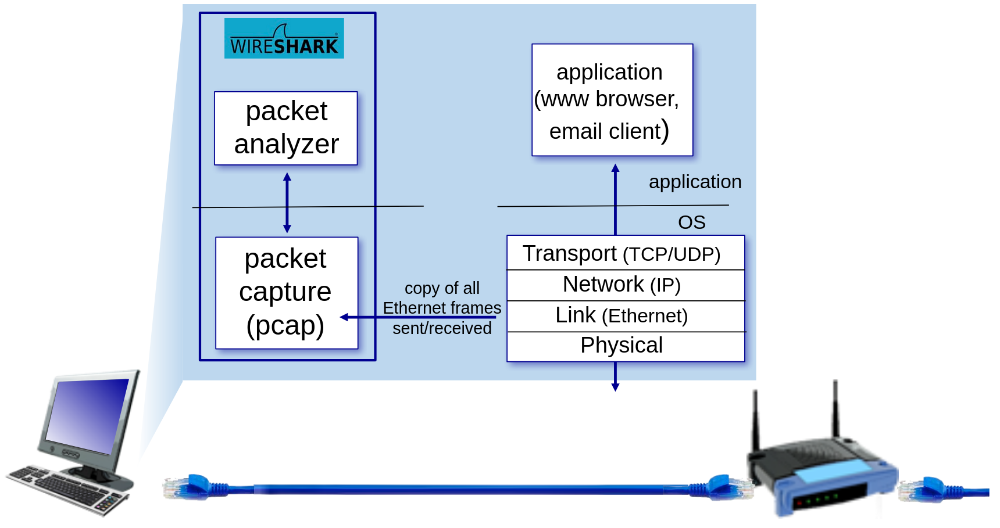

# Laboratory practice 2

## Prerequisites
- [Wireshark](https://www.wireshark.org/)

Understanding network protocols is best achieved by observing them in action—watching message exchanges, exploring protocol details, and testing their behavior. This can be done in simulations or on real networks like the Internet. In the Wireshark labs for this course, you’ll use your own computer to run applications, see protocols interact with others across the Internet, and learn by direct hands-on experience.

A **packet sniffer** is a tool that captures messages sent or received by your computer, showing the contents of their protocol fields. It is passive—it only observes traffic, never sending packets itself, and works by receiving copies of packets handled by your applications and protocols.

[Figure 1](#figure1) shows a packet sniffer, which adds software to your computer. It has two parts: a capture library that copies every link-layer frame (Ethernet or WiFi) sent or received, and tools to display them. Since all higher-layer protocols (HTTP, TCP, DNS, etc.) are encapsulated in link-layer frames, capturing these frames reveals all messages exchanged by your computer’s applications and protocols.

<figure id="figure1" style="text-align: center;">
  
  <figcaption>Figure 1: packet sniffer structure</figcaption>
</figure>

The second component of a packet sniffer is the packet analyzer, which displays the contents of all fields within a protocol message. In order to do so, the packet analyzer must “understand” the structure of all messages exchanged by protocols. For example, suppose we are interested in displaying the various fields in messages exchanged by the HTTP protocol in Figure 1. The packet analyzer understands the format of Ethernet frames, and so can identify the IP packet within an Ethernet frame. It also understands the IP packet format, so that it can extract the TCP segment within the IP packet. Finally, it understands the TCP segment structure, so it can extract the HTTP message contained in the TCP segment. Finally, it understands the HTTP protocol and so, for example, knows that the first bytes of an HTTP message will contain the string `GET`, `POST`, or `HEAD`.

We’ll use Wireshark, a free packet analyzer for Windows, Mac, and Linux. It captures link-layer frames but refers to all captured data as “packets,” letting us view messages across different protocol layers.

In order to run Wireshark, you’ll need to have access to a computer that supports both Wireshark and the libpcap or WinPCap packet capture library. The libpcap software will be installed for you, if it is not installed within your operating system, when you install Wireshark.

The [Wireshark FAQ](https://www.wireshark.org/faq.html) has a number of helpful hints and interesting tidbits of information, particularly if you have trouble installing or running Wireshark.

It has a large user base and well-documented support, including a [user-guide](http://www.wireshark.org/docs/wsug_html_chunked/).

## Task 1

Analyze captured network traffic to understand headers at different protocol layers (Ethernet, IP, TCP/UDP, etc.). Follow the instructions and examine the headers of the selected frames at all layers. You can use [help guide](./analyze_frames.pdf) that contains the structure of the headers. Replace the value with the corresponding protocol/flag name, if possible.

1. Examine packet no. 2 in [trace-26](./pcaps/trace-26.pcap):

    Layer 2 header:

    | Field           |  Value           |
    |-----------------|------------------|
    | Destination MAC |                  |
    | Source MAC      |                  |
    | Length / Type   |                  |

2. Examine packet no. 6 in [trace-12](./pcaps/trace-12.pcap):
   
    a) Layer 2 header:

    | Field           |  Value           |
    |-----------------|------------------|
    | Destination MAC |                  |
    | Source MAC      |                  |
    | Length / Type   |                  |

    Frame length:

    b) Layer 3 header:

    | Field           |  Value           |
    |-----------------|------------------|
    | Version         |                  |
    | IHL             |                  |
    | Total Length    |                  |
    | Time to Live    |                  |
    | Protocol        |                  |
    | Header Checksum |                  |
    | Source Addr     |                  |
    | Destination Addr|                  |

    c) Layer 4 header:

    | Field           |  Value           |
    |-----------------|------------------|
    | Source Port     |                  |
    | Destination Port|                  |
    | Sequence Number |                  |
    | Acknowledgment Number |                  |
    | Header Length   |                  |
    | Checksum        |                  |

3. Examine packet no. 26 in [trace-12](./pcaps/trace-12.pcap):
   
    a) Layer 2 header:

    | Field           |  Value           |
    |-----------------|------------------|
    | Destination MAC |                  |
    | Source MAC      |                  |
    | Length / Type   |                  |

    Frame length:

    b) Layer 3 header:

    | Field           |  Value           |
    |-----------------|------------------|
    | Version         |                  |
    | IHL             |                  |
    | Total Length    |                  |
    | Time to Live    |                  |
    | Protocol        |                  |
    | Header Checksum |                  |
    | Source Addr     |                  |
    | Destination Addr|                  |

    c) Layer 4 header:

    | Field           |  Value           |
    |-----------------|------------------|
    | Source Port     |                  |
    | Destination Port|                  |
    | Sequence Number |                  |
    | Acknowledgment Number |                  |
    | Header Length   |                  |
    | Checksum        |                  |

4. Examine packet no. 908 in [trace-12](./pcaps/trace-12.pcap):
   
    a) Layer 2 header:

    | Field           |  Value           |
    |-----------------|------------------|
    | Destination MAC |                  |
    | Source MAC      |                  |
    | Length / Type   |                  |

    Frame length:

    b) Layer 3 header:

    | Field           |  Value           |
    |-----------------|------------------|
    | Version         |                  |
    | IHL             |                  |
    | Total Length    |                  |
    | Time to Live    |                  |
    | Protocol        |                  |
    | Header Checksum |                  |
    | Source Addr     |                  |
    | Destination Addr|                  |

    c) Layer 4 header:

    | Field           |  Value           |
    |-----------------|------------------|
    | Source Port     |                  |
    | Destination Port|                  |
    | Length          |                  |
    | Checksum        |                  |

    c) Layer 5 header:

    | Field           |  Value           |
    |-----------------|------------------|
    | QR              |                  |

5. Find the response corresponding to packet no. 908 and examine its contents:
   
    a) Layer 2 header:

    | Field           |  Value           |
    |-----------------|------------------|
    | Destination MAC |                  |
    | Source MAC      |                  |
    | Length / Type   |                  |

    Frame length:

    b) Layer 3 header:

    | Field           |  Value           |
    |-----------------|------------------|
    | Version         |                  |
    | IHL             |                  |
    | Total Length    |                  |
    | Time to Live    |                  |
    | Protocol        |                  |
    | Header Checksum |                  |
    | Source Addr     |                  |
    | Destination Addr|                  |

    c) Layer 4 header:

    | Field           |  Value           |
    |-----------------|------------------|
    | Source Port     |                  |
    | Destination Port|                  |
    | Length          |                  |
    | Checksum        |                  |

    c) Layer 5 header:

    | Field           |  Value           |
    |-----------------|------------------|
    | QR              |                  |

6. Examine packet no. 2 in [trace_ip_nad_20_B](./pcaps/trace_ip_nad_20_B.pcap):

    a) Layer 2 header:

    | Field           |  Value           |
    |-----------------|------------------|
    | Destination MAC |                  |
    | Source MAC      |                  |
    | Length / Type   |                  |

    Frame length:

    b) Layer 3 header:

    | Field           |  Value           |
    |-----------------|------------------|
    | Version         |                  |
    | IHL             |                  |
    | Total Length    |                  |
    | Time to Live    |                  |
    | Protocol        |                  |
    | Header Checksum |                  |
    | Source Addr     |                  |
    | Destination Addr|                  |
    |-----------------|------------------|
    | Type            |                  |
    | Code            |                  |

    c) Find the response corresponding to packet no. 2 and examine its contents:

    | Field           |  Value           |
    |-----------------|------------------|
    | Version         |                  |
    | IHL             |                  |
    | Total Length    |                  |
    | Time to Live    |                  |
    | Protocol        |                  |
    | Header Checksum |                  |
    | Source Addr     |                  |
    | Destination Addr|                  |
    |-----------------|------------------|
    | Type            |                  |
    | Code            |                  |

7.  Examine packet no. 7 in [trace-27](./pcaps/trace-27.pcap):

    a) Layer 2 header:

    | Field           |  Value           |
    |-----------------|------------------|
    | Destination MAC |                  |
    | Source MAC      |                  |
    | Length / Type   |                  |

    Frame length:

    b) Layer 3 header:

    | Field           |  Value           |
    |-----------------|------------------|
    | Version         |                  |
    | Next Header     |                  |
    | Hop Limit       |                  |
    | Source Addr     |                  |
    | Destination Addr|                  |


## Task 2

We’ll investigate the Ethernet protocol and the ARP protocol. Let’s begin by capturing a set of Ethernet frames to study. To do this, of course, you’ll need access to a wired Ethernet connection for your PC or Mac – not necessarily a common scenario these days, given the popularity of wireless WiFi and cellular access. If you’re unable to run Wireshark on a live Ethernet connection, you can download a packet trace [lp2-ethernet](./lp2-ethernet.pcapng) that was captured while following the steps below.

Do the following:
- First, make sure your browser’s cache of previously downloaded documents is empty.
- Start up Wireshark and enter the following URL into your browser: [http://www.freefood.sk/menu/#fiit-food](http://www.freefood.sk/menu/#fiit-food)
- Stop Wireshark packet capture.

First, find the packet number (the leftmost column in the upper Wireshark window) of the **HTTP GET** message that was sent from your computer to [http://freefood.sk](http://freefood.sk/), as well as the beginning of the HTTP response message sent to your computer by [freefood.sk](http://freefood.sk/).

Let’s start by looking at the Ethernet frame containing the HTTP GET message. Expand the Ethernet II information in the packet details window.

In answering the questions below, you can use either your own live trace, or use the Wireshark captured packet file [lp2-ethernet](./lp2-ethernet.pcapng).

1. What is the 48-bit Ethernet address of your computer?
2. What is the 48-bit destination address in the Ethernet frame?  Is this the Ethernet address of [freefood.sk](http://freefood.sk)? What device has this as its Ethernet address?
3. What is the hexadecimal value for the two-byte Frame type field in the Ethernet frame carrying the HTTP GET request?  What upper layer protocol does this correspond to?
4. How many bytes from the very start of the Ethernet frame does the ASCII “G” in “GET” appear in the Ethernet frame? Do not count any preamble bits in your count, i.e., assume that the Ethernet frame begins with the Ethernet frame's destination address.

Next, answer the following questions, based on the contents of the Ethernet frame containing the first byte of the HTTP response message.

5. What is the value of the Ethernet source address? Is this the address of your computer, or of [freefood.sk](http://freefood.sk)? What device has this as its Ethernet address?
6. What is the destination address in the Ethernet frame?  Is this the Ethernet address of your computer?
7. Give the hexadecimal value for the two-byte Frame type field. What upper layer protocol does this correspond to?
8. How many bytes from the very start of the Ethernet frame does the ASCII “O” in “OK” (i.e., the HTTP response code) appear in the Ethernet frame? Do not count any preamble bits in your count, i.e., assume that the Ethernet frame begins with the Ethernet frame's destination address.
9. How many Ethernet frames (each containing an IP packet, each containing a TCP segment) carry data that is part of the complete HTTP “OK 200 ...” reply message?

**ARP Caching**

Recall that the ARP protocol typically maintains a cache of IP-to-Ethernet address translation pairs on your computer.  The arp command (in both DOS, MacOS and Linux) is used to view and manipulate the contents of this cache. Since the arp command and the ARP protocol have the same name, it’s understandably easy to confuse them. But keep in mind that they are different - the arp command is used to view and manipulate the ARP cache contents, while the ARP protocol defines the format and meaning of the messages sent and received, and defines the actions taken on ARP message transmission and receipt.

Let’s take a look at the contents of the ARP cache on your computer.
```shell
arp -a
```
10. How many entries are stored in your ARP cache?
11. What is contained in each displayed entry of the ARP cache?

In order to observe your computer sending and receiving ARP messages, we’ll need to clear the ARP cache, since otherwise your computer is likely to find a needed IP-Ethernet address translation pair in its cache and consequently not need to send out an ARP message. In order to run this command on a machine you’ll need root privileges or use sudo.

```shell
arp -d -a
```

**Observing ARP in action**

Do the following:
- Clear your ARP cache, as described above and make sure your browser’s cache is cleared of previously downloaded documents.
- Start up the Wireshark packet sniffer.
- Enter the following URL into your browser: [http://www.freefood.sk/menu/#fiit-food](http://www.freefood.sk/menu/#fiit-food)
- Stop Wireshark packet capture. 

If you don’t have root privileges and can’t run Wireshark on a Windows machine, you can skip the trace collection part of this lab and use the trace file discussed earlier.

Let’s start by looking at the Ethernet frames containing ARP messages. Answer the following questions:

12.  What is the hexadecimal value of the source address in the Ethernet frame containing the ARP request message sent out by your computer?
13.  What is the hexadecimal value of the destination addresses in the Ethernet frame containing the ARP request message sent out by your computer? And what device(if any) corresponds to that address (e.g,, client, server, router, switch or otherwise...)?
14.  What is the hexadecimal value for the two-byte Ethernet Frame type field.  What upper layer protocol does this correspond to?
15.  How many bytes from the very beginning of the Ethernet frame does the ARP opcode field begin?
16.  What is the value of the opcode field within the ARP request message sent by your computer?
17.  Does the ARP request message contain the IP address of the sender?  If the answer is yes, what is that value?
18.  What is the IP address of the device whose corresponding Ethernet address is being requested in the ARP request message sent by your computer?

Now find the ARP reply message that was sent in response to the ARP request from your computer.

19. What is the value of the opcode field within the ARP reply message received by your computer?
20. Finally (!), let’s look at the answer to the ARP request message! What is the Ethernet address corresponding to the IP address that was specified in the ARP request message sent by your computer (see question 18)?
    
We’ve looked the ARP request message sent by your computer running Wireshark, and the ARP reply sent in reply. But there are other devices in this network that are also sending ARP requests that you can find in the trace.

21. Why are there no ARP replies in your trace that are sent in response to these other ARP request messages?  

## Task 3

In this part of the lab, we will learn how to write filters in Wireshark. Use the [Wireshark Cheat Sheet](./Wireshark-Cheat-Sheet.pdf) as a quick reference for composing filters.

1. Display only ARP packets:
2. Display only TCP segments on port 80: 
3. Display HTTP packets from the source IP address 192.168.1.33:
4. Display only packets that contain SYN flag (beginning of a TCP connection):
5. Display only HTTP POST requests:
6. Display all HTTP GET requests sent to the IP address 86.110.225.178:
7. Display packets with the source MAC address 00:02:CF:AB:A2:4C:
8. Display all non-HTTP communications:
