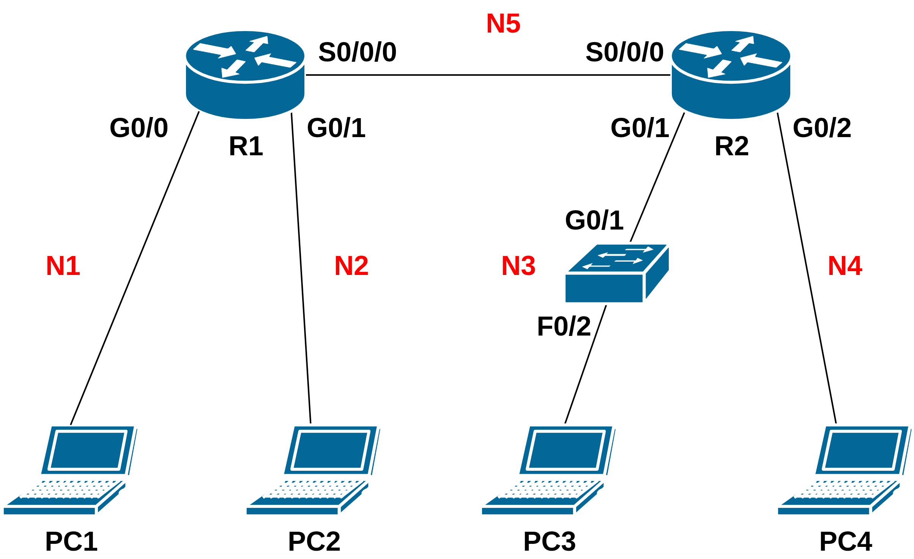

# Laboratory practice 3

## Task 1 - Logical Network Design in Cisco Packet Tracer

### Objective:
Your task is to design and configure a network based on the provided topology using Cisco Packet Tracer. You will apply **VLSM (Variable Length Subnet Masking)** to create an efficient addressing scheme and configure **static routing** to ensure full communication between all devices in the network.

### Network Requirements:
- Network assigned by ISP: 172.21.128.0/17
- Subnets to be created:
  - Network N1 – 60 PCs
  - Network N2 – 12 PCs
  - Network N3 – 5000 PCs
  - Network N4 – 2046 PCs

### Addressing Rules
1. Use **VLSM** to minimize address waste.
2. **Router** Ethernet interfaces must always have the **first valid address** in the subnet.
3. The addresses of serial interfaces are always the **first two valid addresses** in the given subnet.
   - Router R1 always uses the lower IP address, and R2 uses the next higher one.
4. PCs are assigned as follows:
   - PC1 → 2nd valid address in its subnet
   - PC2 → 4th valid address in its subnet
   - PC3 → 255th valid address in its subnet
   - PC4 → 257th valid address in its subnet
   - 
### Practical Steps
1. **Plan the subnetting:**
   - Use VLSM to divide 172.21.128.0/17 into subnets based on the given host requirements.
   - Clearly document each subnet’s network address, mask, and usable IP range.
2. **Build the topology** in Packet Tracer according to the given topology in [Figure1](#figure1):
   - Use Ethernet connections between routers and PCs/switches.
   - Use a serial connection between routers.
3. **Assign IP addresses** to all devices according to your addressing plan.
4. **Configure static routing** on all routers so that every device in the network can communicate with every other device.
5. **Verify connectivity using** the ping command between all PCs.

## Topology
<figure id="figure1" style="text-align: center;">
  
  <figcaption>Figure 1: Topology</figcaption>
</figure>

## 🧮 VLSM Subnet Planning Table

| **Network** | **Hosts Needed** | **Subnet Mask (/Prefix Length)** | **Subnet Mask (Decimal)** | **Network Address** | **Usable IP Range** | **Broadcast Address** | **Router Interface IP** | **PC IPs** |
|--------------|------------------|--------------------------|----------------------------|---------------------|---------------------|------------------------|-------------------------|-------------|
| N1 | | | | | | | | |
| N2 | | | | | | | | |
| N3 | | | | | | | | |
| N4 | | | | | | | | |
| N5 | | | | | | | | |