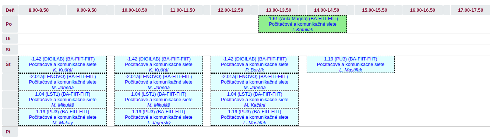
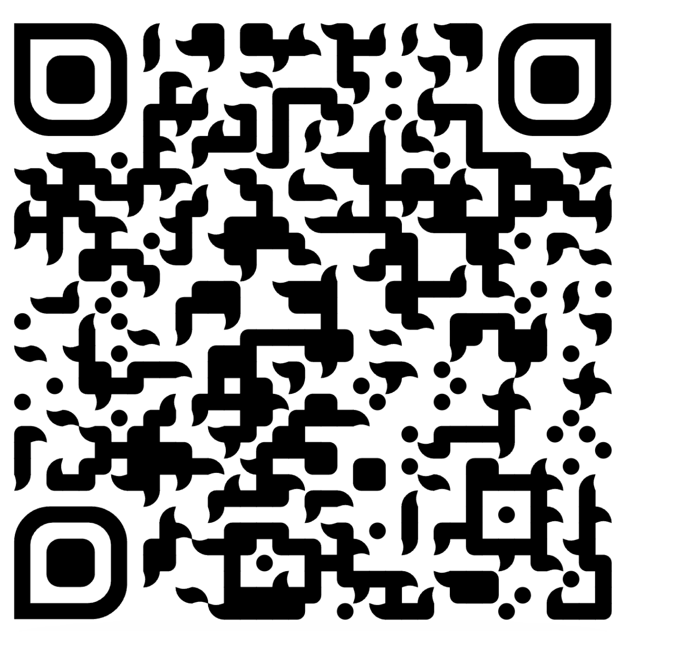

# Computer and Communication Networks : Course Organization

---
layout: default
---

# Team

  
  
prof. Ing. Ivan Kotuliak, PhD.

  
Garant / Prednášajúci

  
<a href="mailto:ivan.kotuliak@stuba.sk">ivan.kotuliak@stuba.sk</a>

 

  

    
    
Ing. Lukáš Mastiľak, PhD.

    
Vedúci cvičení / Prednášajúci

    
<a href="mailto:lukas.mastilak@stuba.sk">lukas.mastilak@stuba.sk</a>

  

  

    
    
doc. Ing. Kristián Košťál, PhD.

    
Senior cvičiaci

    
<a href="mailto:kristian.kostal@stuba.sk">kristian.kostal@stuba.sk</a>

  

  

    
    
Ing. Matej Janeba

    
Senior cvičiaci / Zodpovedný za zadanie

    
<a href="mailto:matej.janeba@stuba.sk">matej.janeba@stuba.sk</a>

  

  

    
    
Ing. Matúš Mikuláš

    
Senior cvičiaci / Zodpovedný za CCNA kurzy

    
<a href="mailto: matus.mikulas@stuba.sk"> matus.mikulas@stuba.sk</a>

  

 

  

    
Bc. Patrik Boržík

    
Junior cvičiaci(OPP)

    
<a href="mailto:xborzik@stuba.sk">xborzik@stuba.sk</a>

  

  

    
Bc. Tomáš Jágerský

    
Junior cvičiaci(OPP)

    
<a href="mailto:xjagerskyt@stuba.sk">xjagerskyt@stuba.sk</a>

  

  

    
Bc. Martin Kačáni

    
Junior cvičiaci(OPP)

    
<a href="mailto:xkacani@stuba.sk">xkacani@stuba.sk</a>

  

  

    
Bc. Matúš Makay

    
Junior cvičiaci(OPP)

    
<a href="mailto:xmakay@stuba.sk">xmakay@stuba.sk</a>

  

---

# Timetable

---

# Podmienky na absolvovanie predmetu

|               | **Body** | **Min.** |
|---------------|------|------|
| Semester      | 50   |      |
| Skúška        | 50   |      |
| **Spolu**     | **100**  |   56    |

----

# Podmienky na absolvovanie predmetu

| **Klasifikačná stupnica** | **Hodnotenie** | 
|---------------|------|
| <100 - 92>      | A   |
| <91 - 83>       | B   |
| <82 - 74>       | C   |
| <73 - 65>       | D   |
| <64 - 56>       | E   |
| <55 - 0>       | FX   |

---

# Podmienky na absolvovanie predmetu

| **Semester**      | **Body** | **Min.** |
|---------------|------|------|
| Zadanie - prvá časť      | 5    |  2,5     |
| Zadanie - druhá časť     | 15   |  7     |
| Test-analýza, subnetting | 15   |  7,5   |
| Test-troubleshooting     | 15   |  7,5   |
| **Spolu**                | 50   |      |

---

# Podmienky na absolvovanie predmetu

| **Skúška**       | **Body** | **Min.** |
|---------------|------|------|
| AIS časť      | -   |  50%    |
| Písomná časť  | -  |  50%    |
| **Spolu**     | 50   |      |

---

# Harmonogram

| Week | Lecture | Prerequisites for laboratory practice | Checkpoint |
|-------|------|------|-|
| 1.    | Podmienky, Úvod do sietí | [Getting Started with Cisco Packet Tracer](https://teams.microsoft.com/l/message/19:8f1ebf5266ca4ba89a80534596911416@thread.tacv2/1758543921724?tenantId=25733538-6b16-4aa3-8ed6-297eb79b8e06&groupId=ce1f0209-00aa-4ad5-8448-8248bc3fcc0c&parentMessageId=1758543921724&teamName=FIIT%20PKS_B%20-%202025%2F26&channelName=Exercises&createdTime=1758543921724) |      |
| 2.    | Linková vrstva   | [Network Frame Analysis (video)](https://drive.google.com/file/d/1vityK8UtP-296iOVYId-_p-qnFaIBTMK/view?ts=64dcaf9f) | |
| 3.    | Predstavenie zadania + Sieťová vrstva  | [Subnetting (video)](https://drive.google.com/file/d/1mLHNj-5seiWVfcY2U9qzWvR66G4qZYS3/view?usp=drive_link)     | |
| 4.    | Transportná vrstva - UDP, Úvod do TCP    |      | |
| 5.    | Transportná vrstva - TCP | | Test - analýza rámcov a subnetting |
| 6.    | Aplikačná vrstva - služby | | Odovzdanie a preberanie 1. časti zadania |
| 7.    | IPv6   |   | |
| 8.    | Fyzická vrstva, Prístupové metódy na linkovej vrstve  | | |
| 9.    | Smerovacie algoritmy   |  | Test - Troubleshooting |
| 10.   | QUIC |      | |
| 11.   | Mobilné a bezdrotové siete | | Odovzdanie, domimplementácia a preberanie 2. časti zadania |
| 12.   | Bezpečnosť v sieťach     | | Preberanie druhej časti zadania |

---

# Course materials

  <a href="https://github.com/fiit-ba/PKS_B-course.git" target="_blank" rel="noopener">
    🔗 https://github.com/fiit-ba/PKS_B-course.git
  </a>

 
 

  <a href="https://teams.microsoft.com/l/team/19%3AKJ4EsR3qV-_c4xuT_Ncwdw15YpUFWjjgruTca0PoM5g1%40thread.tacv2/conversations?groupId=ce1f0209-00aa-4ad5-8448-8248bc3fcc0c&tenantId=25733538-6b16-4aa3-8ed6-297eb79b8e06" target="_blank" rel="noopener">
    💬 MS Teams
  </a>

---

# Communication channels

<v-click>

  
<strong>Používajte primárne MS Teams na komunikáciu!!!</strong>

</v-click>

<v-click>

  
Každý musí mať funkčný účet na MS Teams.

</v-click>

<v-click>

  
Pýtajte sa čo najviac otázok v <strong>public kanáloch</strong>. Odpoveď môže byť užitočná aj pre vášho kolegu.

  
Odpoveď môžete očakávať najneskôr do <strong>48 hodín v pracovných dňoch</strong>. Počas víkendov je poskytovanie odpovedí dobrovoľné.

</v-click>

<v-click>

  
Kontaktujte cvičiaceho prostredníctvom súkromného kanála výhradne v prípade záležitostí osobného charakteru. Otázky týkajúce sa zadania medzi takéto záležitosti nepatria.

</v-click>

<v-click>

  
<strong>Predvytvorené kanály:</strong>

  <ul>
    <li><strong>General</strong> – pre otázky, ktoré nepatria do obsahu žiadneho iného kanála</li>
    <li><strong>QA assignment</strong> – pre otázky na zadanie (sleduje kolega Matej)</li>
    <li><strong>CCNA course</strong> – pre všetky otázky a informácie, ktoré sa týkajú CCNA kurzov (sleduje kolega Matúš)</li>
  </ul>

</v-click>

---

# Recommended literature

1. [UC Berkley. Introduction to the Internet: Architecture and Protocols](https://textbook.cs168.io/)

2. [KUROSE, James F.; ROSS, Keith W. Computer networking: A top-down approach 9th edition](https://gaia.cs.umass.edu/kurose_ross/index.php)

3. [PETERSON, Larry L.; DAVIE, Bruce S. Computer Networks: A Systems Approach](https://book.systemsapproach.org/index.html#)  
---

# Cisco Networking Academy FIIT STU v Bratislave

Možnosť získať teoretické a praktické skúsenosti z oblasti sietí 

Kompletne vynovené moderné vybavenie sieťových laboratórií (switche, routre, servery, PCs…)

Cesta k medzinárone uznávanej certifikácií CCNA a jej ďalším stupňom 

Viacero typov kurzov vedených skúsenými inštruktormi

**Ponuka odborných kurzov:**
- CCNA full certificate:
  - CCNA 1 - Introduction to Networks
  - CCNA 2 - Switching, Routing and Wireless Essentials
  - CCNA 3 - Enterprise Networking, Security, and Automation
- Cyberops - Cybersecurity
---

# Cisco Networking Academy FIIT STU v Bratislave

**Čo to znamená pre vás ?**

V prípade úspešného absolvovania skúšky CCNA 1:
- zisk certifikácie CCNA 1 (prvý krok k veľkému certifikátu CCNA)
- automatické absolvovanie skúšky z predmetu PKS 
    - za predpokladu **úspešného získania zápočtu!**
    - funguje ako zdvojnásobenie bodov zo semestra

Možnosti:
- CCNA plný kurz 
- CCNA pre študentov PKS 
- Existujúci CCNA certifikát

Odkazy:
- [Web - Cisco Networking Academy FIIT STU v Bratislave](http://netacad.fiit.stuba.sk)
- [Linkedin - Cisco Networking Academy FIIT STU](https://www.linkedin.com/company/cisco-networking-academy-fiit-stu)

---

# Cisco Networking Academy FIIT STU v Bratislave

Naskenujte QR kód s odkazom na Google formulár:
- tu sú všetky dôležité informácie a kontakty
- informácie budú tiež zverjenené na MS Teamse v kanáli **CCNA course**

---

# Akademická bezúhonnosť

  
Nečestné konanie študenta pri akejkoľvek študijnej povinnosti, plagiátorstvo, preukázateľné zistené odpisovanie, použitie nedovolených pomôcok a iných praktík nie je povolené, takto získaný výsledok sa neuznáva a následne hodnotenie predmetu je <strong>FX</strong>.

  
Dôsledok nečestného správania -> <strong>DISCIPLINÁRKA!!! </strong>

--- 

# Čo je absolutne zakazané ?

- Písať kód na počítači niekoho iného.
- Zverejňovať kód riešení akéhokoľvek zadania na verejnom mieste (napr. verejné Git úložisko a pod.). Toto platí aj po skončení semestra.
- Odovzdáť alebo prezentovať kód riešenia projektu, ktorý ste sami nenapísali, alebo kód projektu iného študenta v akejkoľvek forme.
- Nechávať svoj kód na nebezpečnom mieste tak, aby si ho mohli iní študenti zobrať a použiť (aj keď sa to stane bez vášho vedomia).
- Používať automatické generátory kódu ako ChatGPT, GitHub Copilot alebo iné podobné nástroje bez označenia častí kódov, ktoré boli pomocou nich generované.
