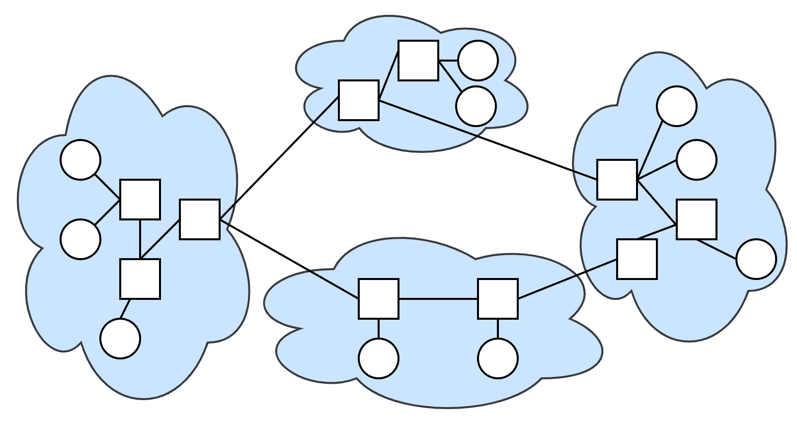
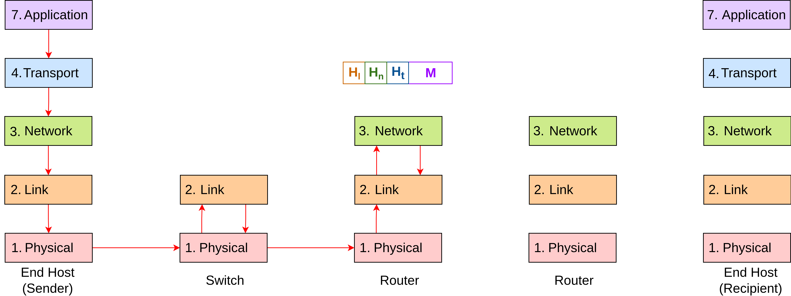

# Computer and Communication Networks : Course intro

Lecture 1

---
layout: default
---

# Content overview

- What is the Internet?
- Layers of the Internet
- Protocol Header
- Multiple Headers (Endpoints Only)
- Multiple Headers (With Routers)
- Network Architecture Models
- Narrow Waist, Demultiplexing
- End-to-End Principle

---
layout: section
---

# What is the Internet?

---
layout: default
---

# What is the Internet?

Billions of connected devices capable of communication.

Basic components of Internet:

- **Hosts:** end devices (pc, laptop, server, IoT sensor...)
- **Packet switches:** forward packets (chunks of data), e.g., routers (globally), switches (locally)
- **Communication links:** fiber. copper, radio, satellite
- **Networks:** collection of devices, routers, links: managed by an organization
  
The Internet is "network of networks" - interconnected Internet Service Providers (ISPs).

The Internet enables data exchange between end systems worldwide.

We'll focus on the infrastructure that ties these devices together, not the applications (e.g., Google, Facebook).

Postal system analogy: focus on sending infrastructure, not letter contents.

---

# Why Study the Internet?

#### The Internet has and is transforming everything!

- The way we do business. *(Retail, advertising, cloud computing.)*
- The way we have relationships. *(Twitter, chat.)*
- The way we learn. *(Wikipedia, ChatGPT, AR/VR.)*
- The way we govern. *(E-voting, censorship, cyber-warfare.)*
- The way we cure diseases. *(Digital health, remote surgery.)*

---

# Internet Design Challenges

<v-click>

### Challenge: *The Internet is **federated**.*
</v-click>
<v-click>

- No single operator. Over 100,000 different network operators!
  - SANET, Deutsche Telekom, AT&T, China Telecom, etc.

- Operators most cooperate to form a global network.

- Must consider business incentives.
  - Rivals might not want to share private information.

- Complicates innovation.
  - Operators have to run the same software to talk to each other.
  - If you have a brand-new feature, but nobody else has it, it's useless.
</v-click>

---

# Internet Design Challenges

<v-click>

### Challenge: *The Internet is **scalable**.*
</v-click>
<v-click>

- Billions of users, accessing trillions of web pages.
</v-click>
&nbsp;

<v-click>

### Challenge: *The Internet is **constantly evolving**.*

</v-click>
<v-click>

- Demand is constantly increasing!
</v-click>
&nbsp;

<v-click>

### Challenge: *The Internet is **diverse**.*
</v-click>
<v-click>

- Some users download more data than others.
- Some devices are higher-capacity than others.
</v-click>
&nbsp;

<v-click>

### Challenge: *The Internet is **asynchronous**.*

- We're constrained by the speed of light.
- Any data we receive is already dated.
</v-click>

---

# Internet Design Challenges

<v-click>

### Challenge: *The Internet must **handle failures at scale**.*
</v-click>
<v-click>

- Sending a message requires many components (wires, network devices, software).
- Asynchrony: Might take a long time to hear the bad news.
- The Internet was the first system that had to handle failure at scale!
</v-click>
<v-click>

</v-click>

---

# Challenges of the Internet - Recap

- ### Federation
- ### Scale
- ### Evolution
- ### Diversity
- ### Asynchrony
- ### Fault Tolerance

---

# Why Is the Internet Interesting?

Designing the Internet required new ways of thinking.
    
- The design of the Internet influenced how we design modern systems!

We have no theoretical model or performance benchmark.

- The Internet is not "optimal" according to any metric.
- But it balances lots of different goals very well.
- Need to think about practical trade-offs.

Writing code that works is not enough.

- Code must respect companies' business incentives. *(Federation.)*
- Code must run at enormous scale. *(Scale, fault-tolerance.)*
  
---

# What is protocol?

- Protocol: A specification on how to communicate with each other.

  - Syntax: Format of messages. What do the 1s and 0s mean?
  - Semantics: What actions should I take in response to certain messages?

- **Protocols** define the **format**, **order** of **messages sent** and **received** among network entities, and **actions taken** on message transmission, receipt.

- All communication activity in Internet governed by protocols.

- The Internet is all about designing protocols.

- Goal: enable efficient, reliable, or secure communication, depending on the protocol’s design.

---

# What is protocol? - Example

Protocol for asking a question in lecture?
  - Raise your hand.
  - Wait for speaker to call on you.
  - Ask your question after speaker calls on you.
  - If speaker doesn't see you after some time, say "Excuse me!"

Designing a good protocol is harder than it first seems!
  - The IETF (Internet Engineering Task Force) standardizes and publishes protocols in RFC (Request For Comments) documents.

---
layout: three-slots
---

# What is protocol? - layered model

::left::

- Each layer has its own protocol.
- There are multiple protocols on a single layer.
- Each layer has its own responsibility.
- Each layer represents an abstraction of a certain level of communication (e.g., physical transmission, reliability, data delivery, information presentation).
- Each layer hides the implementation details of the lower layers.

::right::
 

---
layout: section
---

# Layers of the Internet

---
layout: default
---

# Layer 1 – Moving Bits Across Space

We need some physical technology to move data across space.
- Postal analogy: Mailman, Pony Express, carrier pigeon, etc.

We need some physical technology to move bits across space.
- Voltages on electrical wire.
- Light signals on optical fiber.
- Wireless radio waves.

L1 defines physical interfaces, electrical/optical properties and signaling.

Connector format, e.g., RJ45.

Won't go into detail in this class.

*Note: [Are pigeons faster than Internet?](https://en.wikipedia.org/wiki/IP_over_Avian_Carriers)*

---

# Layer 2 – Local Networks

Postal analogy: Use our physical technology to connect everybody in the local town.

Forming a local network:

- Use physical technology to create a link between machines.
- Use links to connect all machines in a local area.
- Machines can exchange packets: A group of bits representing a message.

---

# Layer 3 – Connecting Local Networks

Postal analogy: How do we connect houses from different towns?

- Adding new links between every pair of houses is inefficient.

---

# Layer 3 – Connecting Local Networks

Postal analogy: How do we connect houses from different towns?

- Solution: Introduce a post office in each town.
- Just connect the two post offices.

---

# Layer 3 – Connecting Local Networks

To send a letter to the other town:

- You send the packet to...
- Your local post office, which sends the packet to...
- The other town's post office, which sends the packet to...
- The final destination.

---

# Layer 3 – Characteristics (Network of Networks)

With enough post offices, we can connect all the towns in the world!

The Internet is a network of networks.

- Each operator runs its own local network.
- The local networks connect to each other to form the Internet.

---

# Layer 3 – Characteristics (Hosts vs. Switches)

◯ - End hosts are the machines communicating over the Internet.

        - Analogy: Houses.
        - Examples: Your laptop, your phone, Google's server.

□ - Switches (aka routers) receive packets and forward them toward their destination.

        - Analogy: Post offices.

---

# Layer 3 – Characteristics (Layers of Abstraction)

Modularity: In our design, we decomposed the system into layers of abstraction.

* Each layer relies on services from the layer below.
* Each layer provides services to the layer above.

Abstraction is very powerful.

* Layer 3 designer doesn't have to think about voltages on the wire.
* A change in Layer 2 protocols doesn't affect the other layers.

---

# Layer 3 – Characteristics (Global Delivery)

A packet can take multiple hops to reach its destination.
 
 - Each router needs to forward the packet closer to its destination.

---

# Layer 3 – Characteristics (Global Delivery)

A packet can travel across multiple networks to reach its destination.

- Each local network along the way could use a different Layer 2 protocol.

Links: wired link, optical link, wireless link

---

# Layer 3 – Characteristics (Best-Effort)

Layer 3 offers a best-effort service model.

- Packets are limited in size.
- Packets could get lost, reordered, corrupted, etc.
- The network will try its best to deliver your packet, but no guarantee.
- The network won't tell you if the delivery failed.

We need to build more layers if we want to guarantee packet delivery.

---

# Layer 4 – Reliability

- Postal analogy: Ministry, Big enterprise

**Transport** layer builds on top of Layer 3 (global packet delivery).
- Adds extra mechanisms (e.g. re-sending lost packets) for reliable packet delivery.
- Splits up large data into packets to send them. Reassembles received packets.
- Instead of individual packets, can think about **flows** (aka **connections**): A stream of packets exchanged between two endpoints.

---

# Layer 7 – Application

**Application** layer builds services (e.g. websites, video streaming) on top of Layer 4.

- This design lets us build different services, all on the same infrastructure.

*Note: Layers 5 and 6 are now obsolete.*

---
layout: section
---

# Protocol Header

---
layout: default
---

# Why Do We Need Headers?

Suppose A wants to send an image to B.

  - A forms a packet with the bits of the image. (May need to split image into multiple packets.)
  - A sends the packet to the next router.
  - The router has no idea what these bits are for!

The packet needs some extra metadata, to tell us what to do with the packet.

  - Analogy: Letter needs to be put in an envelope. Envelope describes what to do with the letter.

---

# Common Header Fields

The packet header contains metadata describing how the data should be sent.

Some common fields in a header:

  - Destination address: Required to deliver the packet.
  - Source address: Useful if the recipient wants to send replies back.

The actual data in the packet is called the payload.

---

# Headers are Standardized

Everybody needs to agree on the format of the header.

  - "First 8 bits are the source, next 8 bits are the destination..."
  - If we use a different format, others won't understand the header.

  
---
layout: section
---

# Multiple Headers
# (Endpoints Only)

---
layout: default
---

# Postal Analogy

1. CEO Alice wants to send a message to CEO Bob.
2. Alice writes a letter.

---

# Postal Analogy

3. Alice passes the letter down to her secretary.
4. Her secretary puts the letter in an envelope.

---

# Postal Analogy

5. Her secretary passes the letter down to the mailman.
6. The mailman puts the envelope in a box.

---

# Postal Analogy

7. The packet travels through the postal system, to Bob's building.  

---

# Postal Analogy

8. The mailman unwraps the box, revealing the envelope inside.
9. The mailman passes the envelope up to the secretary.

---

# Postal Analogy

10. The secretary unwraps the envelope, revealing the letter inside.
11. The secretary passes the letter up to Bob.

---

# Postal Analogy
As we move to lower layers, we wrap additional headers around the packet.

As we move to higher layers, we peel off headers, revealing the inner headers.

    
    
    

---

# Postal Analogy

Each person only cares about the headers at their layer.

- Mailman reads the green header, ignores all the payload inside.

Each person communicates with its peers at the same layer.

- Alice's secretary writes the blue header, for Bob's secretary to read.
- A protocol at a specific layer only makes sense to people at that layer.

---

# Services, Layering and Encapsulation

---

# Services, Layering and Encapsulation

    
    
    
    
    
    
    
    
    

---
layout: section
---

# Multiple Headers
# (With Routers)

---
layout: default
---

# Postal Analogy

The letter might hop across multiple post offices.

Each post office unwraps the box, revealing the envelope inside.

Then, it puts the letter in a new box, destined for the next post office.

    
    
    
    
    
    
    
    
    
    
    
    
    
    
    

        📝
        Note: Intermediate post offices only modify the orange header.
    

    

        📝
        Note: But only the endpoints care about the higher-layer headers.
    

---

# Postal Analogy

Recall: Different layers use different addressing schemes.

Each addressing scheme only makes sense to the protocol at that layer.

    
    

        Layer 2 header: Destination is the next intermediate post office.
    

    

        Layer 3 header: Destination is always the actual endpoint.
    

    

        Layer 4 header: A and B identify specific people in the endpoint (inside the building).
    

---

# Layers at Switches, Routers and End Hosts

End hosts implement all the layers.

- Must take message, and wrap headers all the way down to bits on the wire.

Routers only implement Layers 1–3.

- Must parse the packet (1, 2) and forward to the next router for global delivery (3).
- Routers don't support reliable delivery (4).
- Routers don't care about the application data (7).

Switches only implement Layers 1-2 (traditional)

- Must forward frames based on MAC addresses (Layer 2).
- Do not inspect Layer 3 packets or application data.
- Can help segment a network to reduce collisions and improve efficiency.

*Note: Almost all modern switches operate at Layer 3, but details are beyond the scope of this course.*

---

# Layers at Switches, Routers and End Hosts

---

# Encapsulation: an end-end view

    
    
    
    
    
    
    
    
    
    
    
    
    
    
    
    
    
    
    
    
    
    
    

---

# Switch

Switch don't care about Layer 3 and Layer 7.

Switch parses Layers 1–2 to determine where to forward the packet.

Switch preserves the Layer 2 header when forwarding between ports.

Switch does not participate in global delivery, just local delivery.

---

# Router

Routers don't care about Layer 4 and Layer 7.

Router parses Layers 1–3 to determine where to forward the packet.

Router unwraps Layer 2 header, and adds a new Layer 2 header for the next hop.

---

# Physical layer

---
layout: section
---

# Network Architecture Models

---
layout: default
---

# ISO/OSI and TCP/IP Model

---

# ISO/OSI reference model

Two layers not found in  Internet protocol stack!

- **presentation**: allow applications to interpret meaning of data, e.g., encryption, compression, machine-specific conventions

- **session**: synchronization, checkpointing, recovery of data exchange

Internet stack “missing” these layers!

These services, if needed, must be implemented in application.

---
layout: three-slots
---

# Summary: Layers of the Internet

::left::

- The Internet is built with layers of abstraction.

- Headers are added as the packet moves down the stack, and unwrapped as the packet moves up the stack.

- Hosts parse headers for Layers 1–7.

- Routers parse headers for Layers 1–3.

::right::

  

  

    L2 header: Destination is the next intermediate router.
  

  

    L3 header: Destination is always the end host.
  

  

    L4 header (port): Identifies specific application on the end host.
  

---
layout: section
---

# Narrow Waist, Demultiplexing

---
layout: default
---

# Protocols at Different Internet Layers

Multiple protocols exist at each layer.

- End hosts can agree on the L4 and L7 protocols they want to use.
- Routers on each link can agree on the L1 and L2 protocols they want to use.

    
    

---

# Protocols at Different Internet Layers

The narrow waist: IP (Internet Protocol) is the only protocol at Layer 3.

- All hosts and routers understand IP.
- This unifies the Internet and enables federation.

---

# Demultiplexing

When you receive a packet, you pass it up the stack, to higher-layer protocols.

- How did IP know to pass up to TCP, not UDP?
- How did TCP know to pass up to HTTP, not SMTP?

---

# Demultiplexing at Layer 3

Demultiplexing:

- Add a new header field that tells us what the next (higher) layer protocol is.
- Allows the IP code to pass the rest of the packet to the appropriate L4 code.

---

# Demultiplexing at Layer 4

Demultiplexing also works at Layer 4.

- Each running application on your computer is associated with a port number.
- When L4 receives a packet, it uses the port number to pass the packet to the corresponding applica

---

# Ports at Layer 4

Port numbers help us distinguish between applications on the same computer.

- IP address (Layer 3) for all the applications is the same.
- But each connection is associated with a different port number.

Analogy: Room numbers.

- You and your housemate both have the same street address.
- If someone sends a letter to your house, who is it for?
- Distinguish by assigning room numbers to each housemate.

  

  

    <- Demultiplex: Which L4 protocol?
  

  

    <- Demultiplex: Which L7 application?
  

---

# Ports at Layer 4

Both end hosts in a connection have a port number.

- A private client (e.g. your computer) can use a randomly-generated port number.
- A public server (e.g. YouTube) must use a fixed, well-known port number.

Analogy: Room numbers.

- Pick any number for your bedroom. No one cares.
- Public room numbers (e.g. in Soda Hall) must be fixed and well-known.

  

  

    Outgoing packet: Bob picks a random port number, but sends to YouTube's fixed port, 80.
  

  

    Incoming reply: YouTube replies to Bob's chosen port. Bob's computer passes the packet to the correct application (Firefox, not Slack).
  

---

# Caution – Terminology Conflict

In networking, there are two different things, both called "ports."

- If it's unclear, we will specify "logical port" or "physical port."

    
    

        Logical port: A number identifying an application. Exists in software.
    

    
    

        Physical port: The hole you plug a cable into. Exists in hardware.
    

---

# Implementing Layers in the End Host

Layers 1 and 2 are implemented in hardware, on the network interface card (NIC).

Layers 3 and 4 are implemented in software, in the operating system.

Layer 7 is the applications running in software.

---

# Implementing Layers in the End Host

Demultiplexing helps the operating system pass packets to the correct application.

---

# Implementing Layers in the End Host

Logical ports identify the attachment point between the application and the OS.

---
layout: section
---

# End-to-End Principle

---

# The End-to-End Question

Recall: Layer 3 (Internet) is best-effort.

- Routers implement Layers 1–3 only.
- Only end hosts implement Layer 4 (reliability).

Why did we choose this design?

Should we implement reliability in the network?

---

# Running Example – Simple Reliability Protocol

We haven't discussed Layer 4 protocols yet, so let's use a super-simple protocol.

- Alice wants to send 10 packets to Bob (in any order).
- Alice numbers the packets 1 through 10 and sends them.
- Bob can either:
  - Receive all 10 packets and declare success, or
  - Detect that some packets were lost, and declare failure.
  - Bob cannot declare success when packets are lost.

---

# Solution 1 – Reliability in the Network

Solution 1 – Reliability in the network:

- Each router checks if it got all 10 packets.
- If success, send the 10 packets to the next hop.
- If failure, report the failure to the next hop.

Bob trusts whatever the last packet says. He doesn't count the packets himself.

---

# Solution 1 – Reliability in the Network

Surprising fact: Solution 1 cannot guarantee correctness.

- Suppose R3 is buggy and always reports success.
- Bob doesn't check, so he trusts R3's report...even if it's wrong.

---

# Solution 2 – Reliability at End Hosts

Solution 2 – Reliability at end hosts:

- Routers are best-effort. They might drop packets (and not report it).
- Bob checks if he got all 10 packets.

---

# Which Solution is Better?

Solution 1 (only routers check) cannot be made correct.

- To make it correct, the end host would have to check too... which is basically Solution 2.

Solution 2 (only end hosts check) can be correct by itself.

Solution 2 is strictly better!

- End hosts must check either way.
- End hosts checking alone is already sufficient.
- Router checks in solution 1 are unnecessary: Extra complexity for the network.

**End-to-end principle**: Certain application features (e.g. reliability) must be implemented at the end host for correctness.

---

# References
1. KAO, Peyrin. CS 168 Textbook: Introduction to the Internet: Architecture and Protocols. [online]. University of California, Berkeley, 2024 [accessed 2025-09-03]. Available from: https://textbook.cs168.io/
2. KUROSE, James F. and ROSS, Keith W. Computer Networking: a Top Down Approach – authors' website. [online]. University of Massachusetts Amherst, 2025 [accessed 2025-09-03]. Available from: https://gaia.cs.umass.edu/kurose_ross/index.php

  

## License

This presentation is based on materials by **[Peyrin Kao / UC Berkeley]**  
Licensed under [CC BY-SA 4.0](https://creativecommons.org/licenses/by-sa/4.0/).

This presentation is also licensed under [CC BY-SA 4.0](https://creativecommons.org/licenses/by-sa/4.0/).
