# Computer and Communication Networks: Link

Lecture 2

---
layout: default
---

# Content overview

- Recap
- Link Layer
- Measuring Link Performance
- Ethernet
- Header analysis across layers
- ARP: Connecting Layers 2 and 3
- Ethernet Switch

---
layout: default
---

# Recap: the Internet?

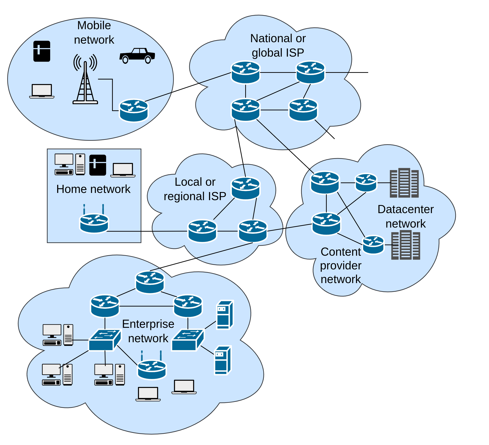

---
layout: three-slots
---

# Recap: layered model

::left::

- Each layer has its own protocol.
- There are multiple protocols on a single layer.
- Each layer has its own responsibility.
- Each layer represents an abstraction of a certain level of communication (e.g., physical transmission, reliability, data delivery, information presentation).
- Each layer hides the implementation details of the lower layers.

::right::

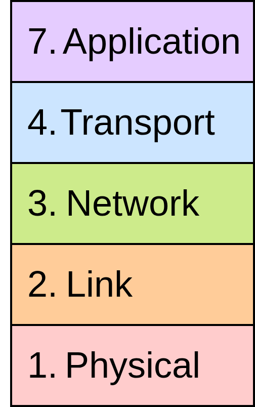
---

# Recap: packets

Packet is composed of:

  - Header
  - Data

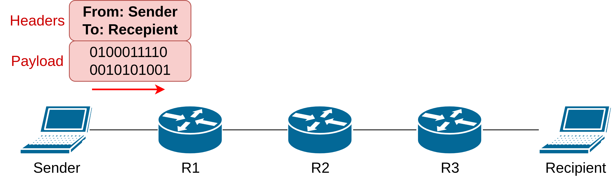

---
layout: section
---

# Link layer

Every network conversation, no matter how complex, comes down to one physical link between two directly connected devices. Let's start there.

---
layout: three-slots
---

# Link layer: introduction

::left::

- Nodes -> hosts, routers
- Links -> communication channels that connect adjacent nodes along communication path
    - Wired , wireless
    - Local Area Network (LAN)

- Layer-2 packet -> frame, encapsulates datagram

**Link Layer has responsibility of transferring datagram from one node to physically adjacent node over a link.**

::right::

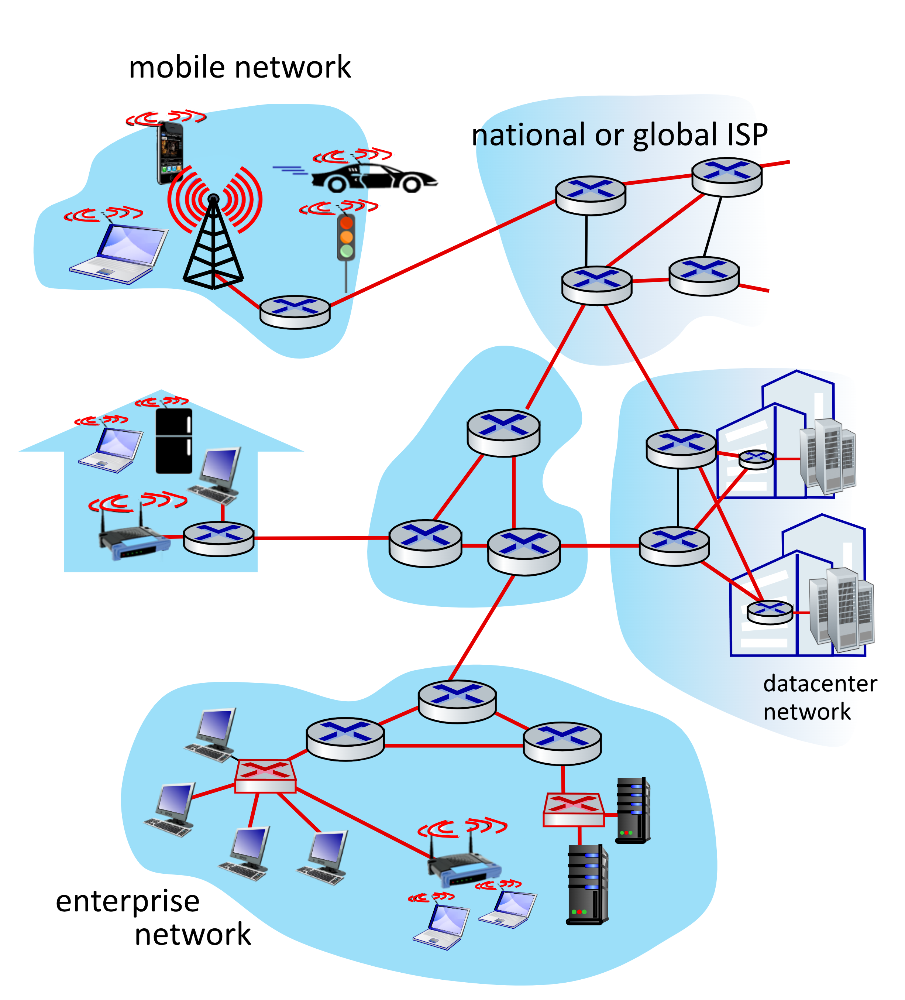

---
layout: three-slots
---

# Link layer: services 1

::left::
<v-click>

- **Framing, link access:**
  - Encapsulate datagram into frame, adding header, trailer
  - Channel access if shared medium
  - **MAC** addresses in frame headers identify source, destination.
</v-click>
<v-click>

- **Reliable delivery between adjacent nodes:**
  - We revisit this again in the Transport Topic.
  - Seldom used on low bit-error link (fiber, some twisted pair)
  - Wireless links: high error rates
</v-click>

::right::

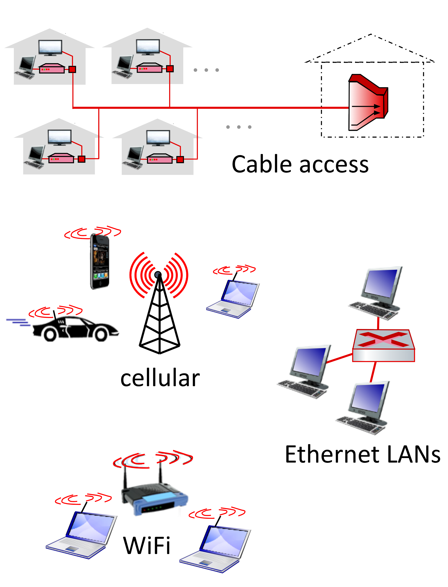

---
layout: three-slots
---

# Link layer: services 2

::left::
<v-click>

- **Flow control:**
  - Pacing between adjacent sending and receiving nodes
</v-click>
<v-click>

- **Error detection:**
  - Errors caused by signal attenuation, noise
  - Receiver detects errors, signals retransmission, or drops frame.
</v-click>
<v-click>

- **Error correction:**
  - Receiver identifies and corrects bit error(s) without retransmission.
</v-click>
<v-click>

- **Half-duplex and full-duplex:**
  - With half duplex, nodes at both ends of link can transmit, but not at same time.
</v-click>
::right::

---
layout: three-slots
---

# Host link-layer implementation

::left::

- In each-and-every host
- Link layer implemented on-chip or in network interface card (NIC)
  - Implements link, physical layer
- Attaches into host’s system buses
- Combination of hardware, software, firmware

::right::

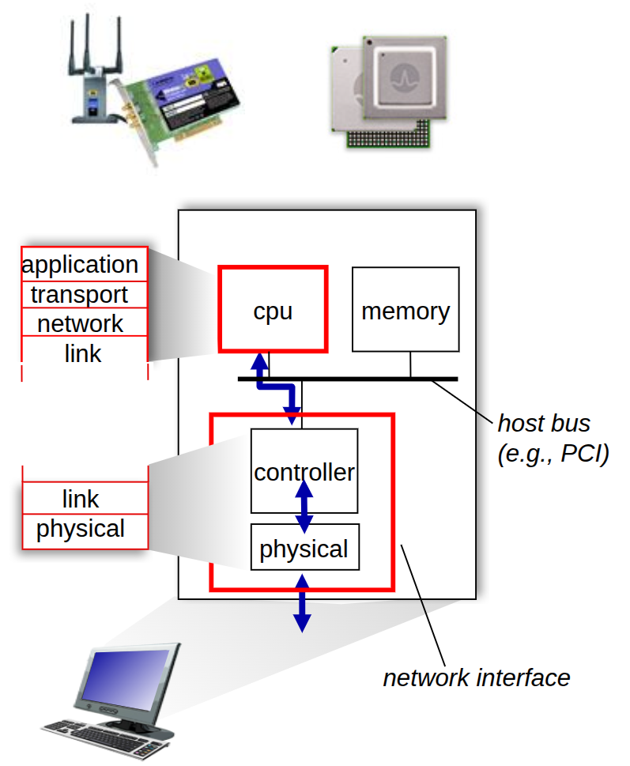

---
layout: three-slots
---

# Interfaces communicating

    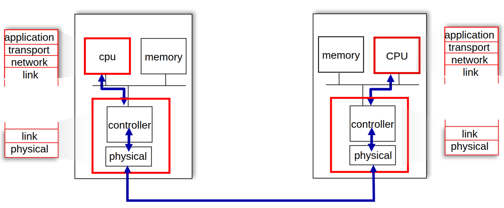
    

        &darr; |packet|
    

    

        &darr; |Hl|packet|
    

    

        |Hl|packet| &rarr;
    

    

        |packet| &uarr;
    

::left::

Sending side:
- Encapsulates packet in frame
- Adds error checking bits, reliable data transfer, flow control, etc.

::right::

Receiving side:
- Looks for errors, reliable data transfer, flow control, etc.
- Extracts packet, passes to upper layer at receiving side

---
layout: section
---

# Measuring link performance

How fast can a link really go? Let's find out, first for one link, then for a full path.

---

# Properties of a link

A link connects two devices. Two important properties of a link are:

- **Bandwidth:** maximum number of bits per second that can be transmitted on the link (bps)
  - "Width" of the link
- **Propagation delay:** time it takes a bit to travel along the link, measured in seconds
  - **Distance / propagation speed**
  - Depends on the medium: radio/vacuum ~3.0 × 10⁸ m/s (speed of light), physical medium (fiber or copper) ~2.0 × 10⁸ m/s (roughly 2/3 c)
  - Even within "physical medium," the exact speed varies by cable type (e.g. coax vs. twisted pair): two links of the same length aren't guaranteed to have the same propagation delay
  - "Length" of the link

**These two are independent.** A 1 Gbps and a 1 Mbps link of the same length have exactly the same propagation delay.

---

# Packet delay

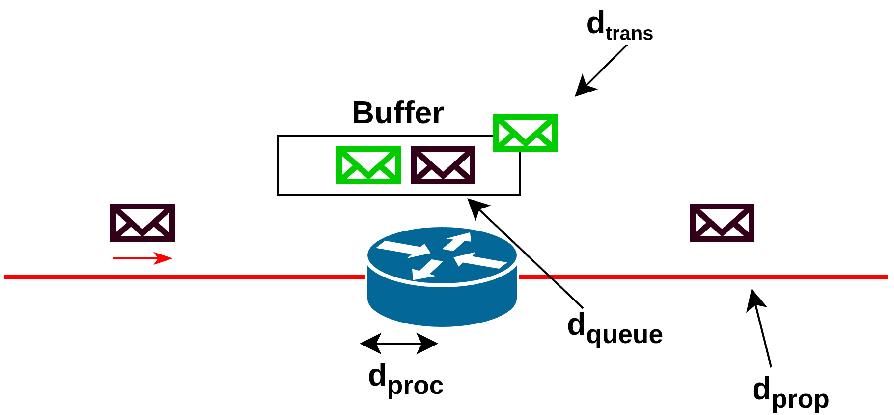

How long it takes a packet to travel from one node to the next.

**What are the sources of packet delay?**
  - Nodal processing (dproc)
  - Queueing delay (dqueue)
  - Transmission delay (dtrans)
  - Propagation delay (dprop)

**dnodal = dproc + dqueue + dtrans + dprop**

---
layout: three-slots
---

# Packet delay: four sources

::left::

**Nodal processing:**
  - Check bit errors
  - Determine output link
  - Typically < microsecs

**Queueing delay:**
  - Time waiting at output link for transmission
  - Depends on congestion level of node

::right::

**Transmission delay:**
  - How long it takes to put all the packet's bits into the pipe.
  - **dtrans = Packet Size / Bandwidth**

**Propagation delay:**
  - **dprop = Length of physical link / Propagation speed** (~2x108 m/sec)
  - dtrans ≠ dprop: they measure different things

---

# Packet delay: timing diagram 1

Suppose we have a link with:
- Bandwidth = 1 Mbps *(1,000,000 bits per second.)*
- Propagation delay = 1 ms *(0.001 seconds.)*

*Note: We measure in bits per second, not bytes!*

*Note: We assume processing and queueing delay are negligible for now!*

How long does it take to send a 100-byte *(800-bit)* packet?
- From the time the first bit is sent
- To the time the last bit is received

Let's draw a timing diagram to help.

---

# Packet delay: timing diagram 2

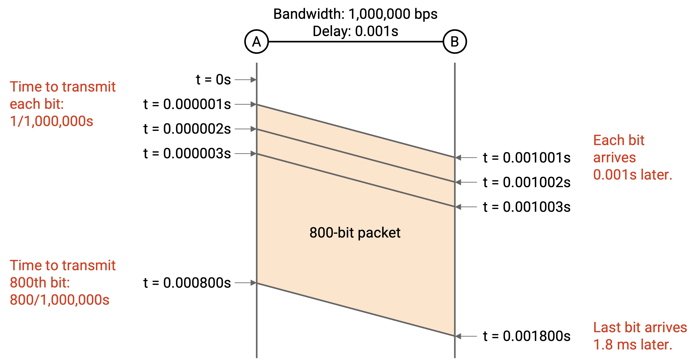

----

# Packet delay: timing diagram 3

Packet Delay    =       Transmission Delay		+    Propagation Delay

Packet Delay    =  (Packet Size / Bandwidth) 	+    Propagation Delay

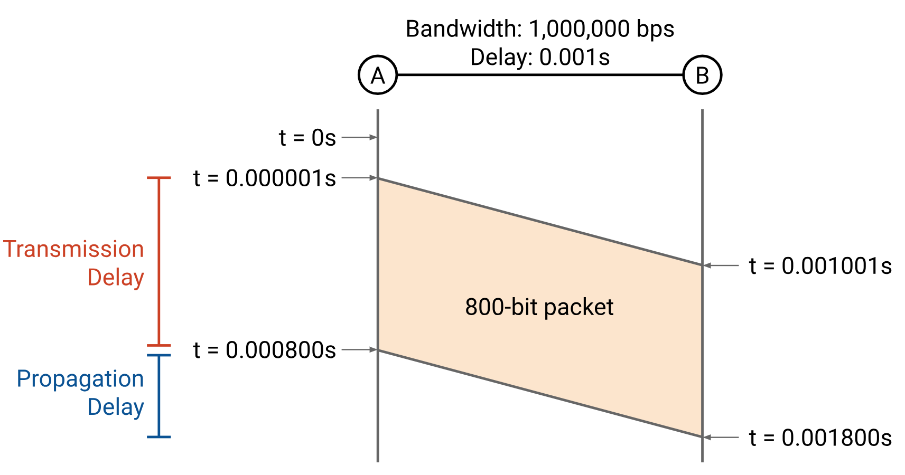

---

# Link tradeoffs

**Which link is better?** It depends on what you're sending.

- Link 1: 10 Mbps, 10 ms propagation delay
- Link 2: 1 Mbps, 1 ms propagation delay

| Packet size | Link 1 | Link 2 | Lower delay |
|---|---|---|---|
| 10 bytes | ~10 ms | ~1 ms | Link 2 |
| 10,000 bytes | ~18 ms | ~81 ms | Link 1 |

- Small packet: transmission delay is negligible compared with propagation delay
- Large packet: transmission delay can dominate

*Note: 25 MB over 10 Mbps takes about 20 seconds to transmit, while 1 ms of propagation delay adds only 0.001 seconds.*

---

# Pipe diagram: same link, frozen in time

The pipe diagram is an alternate view of the link.

- Shows the bits on the link at a frozen moment in time

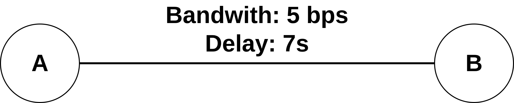

  

    
    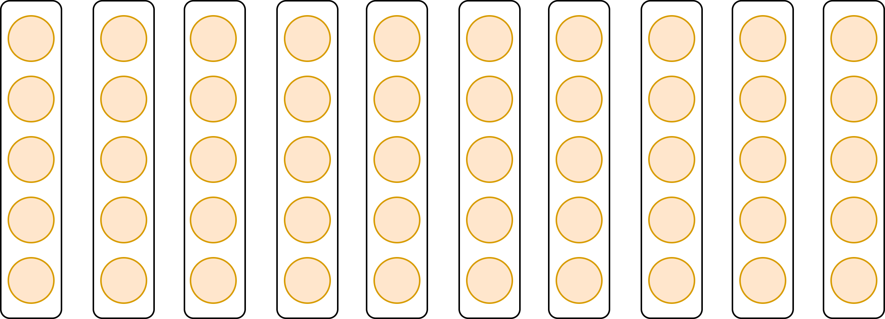
    
    
    
  

  

    t = {{ $clicks === 1 ? 0 : $clicks === 2 ? 4 : $clicks === 3 ? 8 : $clicks === 4 ? 17 : 0 }}s
  

---

# Bandwidth-delay product

Think of the link as a hollow pipe. In this analogy:

- **Pipe cross-section -> bandwidth**: how many bits enter per unit time
- **Pipe length -> propagation delay**: how long bits travel
- **Pipe volume -> bandwidth-delay product**: how many bits can be in flight on the link at once

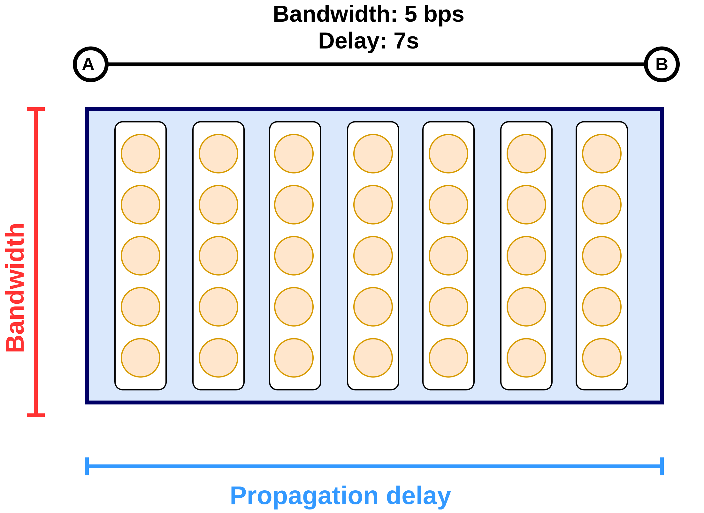

---

# From one link to end-to-end

So far, everything was one link: bandwidth, propagation delay, packet delay, bandwidth-delay product.

Real paths go through many links and nodes. We'll look at:
- **Latency**: total delay across the whole path
- **Bandwidth**: no longer a single number, but limited by the slowest link
- **Throughput**: what you actually achieve, usually lower than bandwidth
- **RTT**: the round-trip version, what `ping` actually measures
- **Jitter**: why delay isn't always the same for every packet
- **Packet loss**: why some packets don't arrive at all

---

# Latency and bandwidth

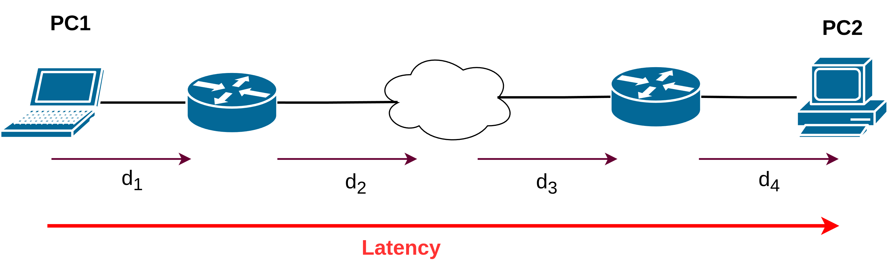

**Latency** is how long data takes to travel from source to destination.
- Add up every hop's delay along the way
- Each hop contains four sources of delay (mentioned earlier).
- Latency = Σᵢ (dproc,i + dqueue,i + dtrans,i + dprop,i)

**Bandwidth:** the maximum rate at which data can travel end-to-end.
- Not a sum: it's the **minimum** across all links on the path
- The slowest link is the **bottleneck**.
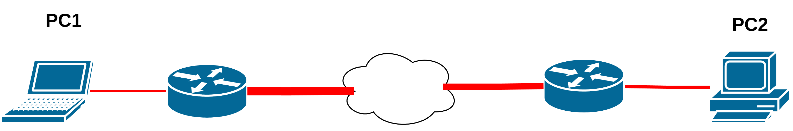

---

# Throughput

Bandwidth is the capacity of a path or link. Throughput (bits/time unit) is the rate at which bits are actually sent from sender to receiver.

- Instantaneous: rate at a given point in time
- Average: rate over a longer period of time

Throughput ≤ bottleneck capacity, but equality isn't guaranteed. Congestion, retransmissions, or simply not generating enough traffic to fully utilize the path can keep throughput below what the network could support.

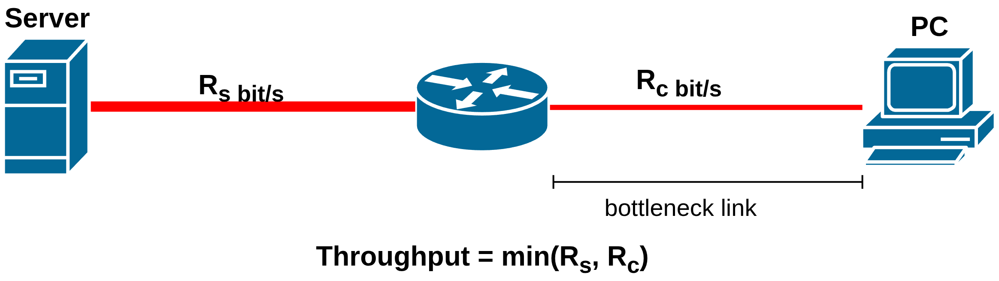

---

# Round-trip time (RTT)

Time from sending a request to receiving the corresponding response.

- Often measured in milliseconds (ms)
- `ping` commonly measures RTT using ICMP Echo Request/Reply.
- Paths can be asymmetric: the return trip doesn't have to take the same time as the way there.
- Analogy: sending a letter to a friend and waiting for their reply.

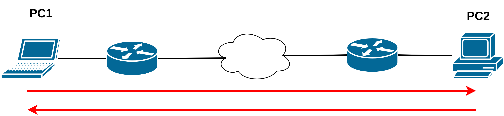

**Why does it matter?**
- User experience, network efficiency, real-time applications

---

# Jitter

Variability of latency between packets.

  - Simple example: |d1 - d2|, where d1 and d2 are the delays of two consecutive packets
  - *Note: "Jitter" is a commonly used but potentially ambiguous term. RFC 3393 defines the more precise metric IP Packet Delay Variation (IPDV) for describing variation in packet delay.*

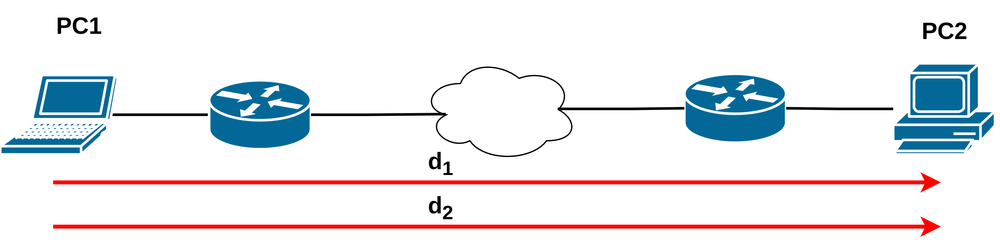

----

# Packet loss

**Packet loss:** a packet that never reaches the receiver
  - Happens when a queue is full, the packet gets discarded with no transmission error involved
  - Measured as a rate: **(lost packets / sent packets) × 100%**

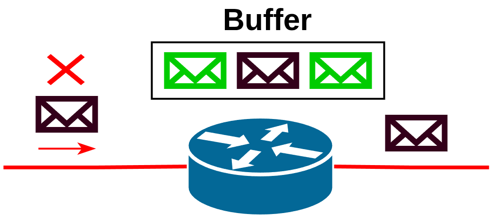

**Corruption:** bits altered during transmission
  - FCS can detect many transmission errors, but detecting isn't fixing.
  - A corrupted packet gets discarded too, so from a higher layer's view, corruption and loss often look the same: the data just doesn't show up.

---
layout: section
---

# Ethernet

---

# Multiple access links

So far, we've assumed that every link connects exactly two machines. In reality, a single wire can connect multiple computers.

<v-click>
Two types of links:
</v-click>
<v-click>

- **Point-to-point**
  - Point-to-point link between switch and host
</v-click>
<v-click>

- **Broadcast (shared wire or medium)**
  - Old-school Ethernet, 802.11 wireless LAN, 5G, satellite
</v-click>
<v-click>
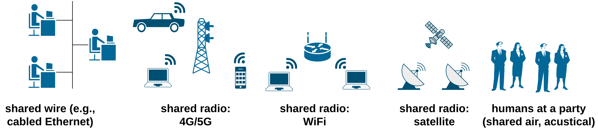
</v-click>

---

# Shared media

Many machines using the same wire (single shared broadcast channel):
- Multiple machines transmitting at once: signals interfere or collide
- Analogy: people talking simultaneously on a group call.

<v-click>

***Who determines when a node can transmit?***
</v-click>
<v-click>

  - No central authority: nodes decide themselves via a **distributed algorithm**, called a **multiple access protocol**
  - Ethernet's version is called **CSMA/CD**, coming up shortly.
  - Other technologies solve this problem differently (e.g. Wi-Fi uses CSMA/CA), more on multiple access protocols in a later lecture.
</v-click>

    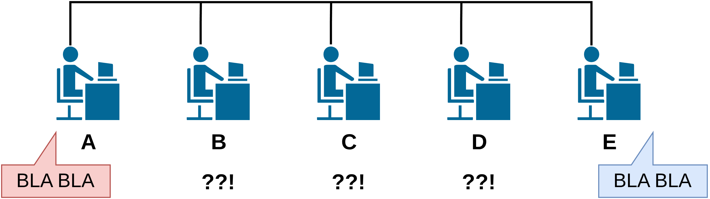

---

# Ethernet: first, what is it?

- **Ethernet is a family of Layer 2 technologies for wired LANs:** a shared frame format and addressing scheme, implemented over different cabling (copper, fiber) and speeds.
- Machines only need each other's Layer 2 addresses to communicate directly.
  - Ethernet itself requires no routing or addressing beyond the local network.
  - Higher layers (e.g. IP) may still use their own addressing on top: that's a separate concern.
  - Analogy: if we're in the same room, we can talk without using the postal system.

That simplicity is a big part of why it won:

- Widely adopted early, and still the dominant LAN standard today
- Simple, cheap
- Kept up with the speed race: 10 Mbps to 800 Gbps, with 1.6 Tbps standardization underway
- Single-chip solutions support multiple speeds (e.g., Broadcom BCM5761).

---
layout: three-slots
---

# Ethernet: physical topology

::left::
- **Bus:** popular through mid 90s
  - All nodes share the same **collision domain** (the set of nodes whose frames can collide with each other).
- **Star(switched):** prevails today
  - Active link-layer 2 switch in center
  - Each "spoke" is its own collision domain (nodes do not collide with each other).
- **Other topologies** (ring, tree) existed historically: largely obsolete today.

::right::
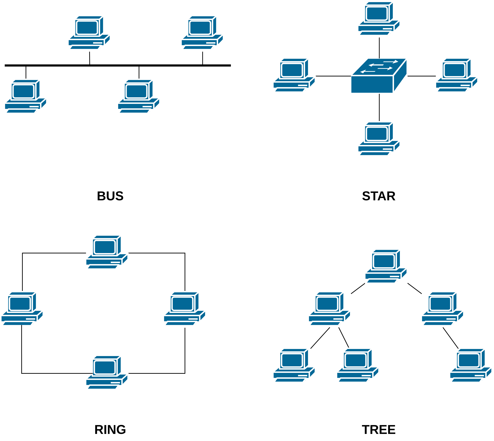

---

# MAC addresses (format)

- Every machine on the LAN needs its own identity, whatever the topology.
- Each interface has unique 48-bit MAC address.
- E.g.: 1A:2F:BB:76:09:AD (hexadecimal (base 16) notation (each "numeral" : [0..9, A..F] represents 4 bits))

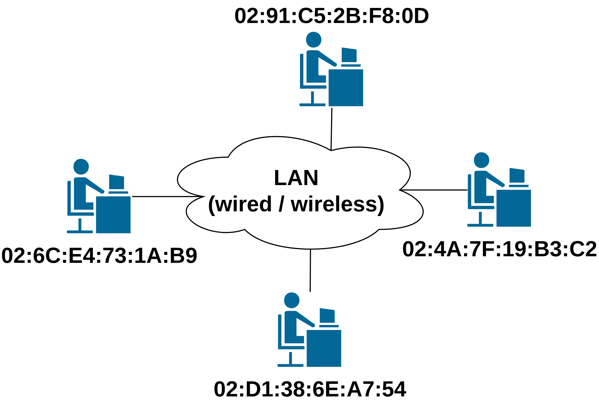

---

# MAC addresses (local and portable)

- MAC (or LAN or physical or Ethernet) address:
  - Function: **used locally to get a frame from one interface to another physically-connected interface (within the same LAN)**
  - 48-bit, factory-assigned and burned into NIC ROM
    - Allocation administered by IEEE; manufacturer buys a portion of the address space to guarantee uniqueness.
    - Modern devices (phones, laptops) may randomize it per network for privacy.
- Analogy:
  - MAC address: like a birth number (identifies one specific person)
  - IP address: like a postal address
- MAC flat address, portability:
  - An interface keeps its MAC address even if you move it to a different LAN.
  - Other addressing schemes, like IP, work differently, more on that later.

---

# Ethernet: types of LAN communication

- A MAC address usually names one machine, but not always:
  - **Unicast:** send a frame to a single recipient
  - **Broadcast:** send a frame to everyone on the local network
  - **Multicast:** send a frame to everyone in a specific group
    - Machines in the local network can join groups.

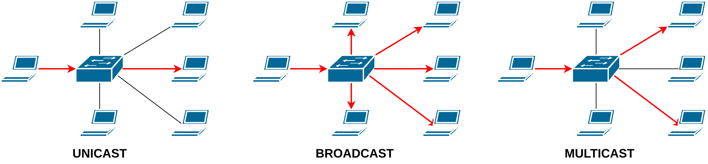

---

# Ethernet frame structure I.

(Field Lenght in Bytes)

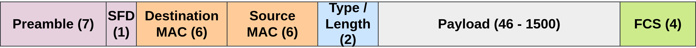

<v-click>

- **Preamble** -> 7 bytes of alternating 10101010, used to synchronize receiver/sender clock rates
</v-click>
<v-click>

- **SFD (start frame delimiter)** -> 1 byte, 10101011, marks "frame starts now" (some sources count preamble+SFD together as an 8-byte preamble)
</v-click>
<v-click>

- **Destination MAC** -> 6 bytes destination MAC address
  - If adapter receives frame with matching destination address, or with broadcast address (e.g., ARP packet), it passes data in frame to network layer protocol.
  - Otherwise, adapter discards frame.
</v-click>
<v-click>

- **Source MAC** -> 6 bytes source MAC address
</v-click>

---

# Ethernet frame structure II.

(Field Lenght in Bytes)

<v-click>

- **Type/length** -> 2 bytes, meaning depends on the value:
  - **≤ 1500 (0x05DC)** -> length (payload size, IEEE 802.3)
  - **≥ 1536 (0x0600)** -> type (higher-layer protocol, Ethernet II)
  - Values 1501–1535 are unused, keeping the two interpretations unambiguous.
</v-click>
<v-click>

- **Payload** -> data
</v-click>
<v-click>

- **FCS (Frame Check Sequence)** -> 4-octet (32-bit) cyclic redundancy check (CRC) that lets the receiver detect corrupted frames
  - Covers dest MAC through payload, excluding the preamble/SFD and itself
</v-click>

---

# Ethernet: unreliable, connectionless

- FCS lets you detect a bad frame, but detecting isn't the same as fixing it.
- **Connectionless:** no handshaking between sending and receiving NICs
- **Unreliable:** receiving NIC doesn’t send ACKs or NAKs to sending NIC
  - Data in dropped frames recovered only if initial sender uses higher layer rdt (e.g., TCP), otherwise dropped data lost.
---

# CSMA/CD

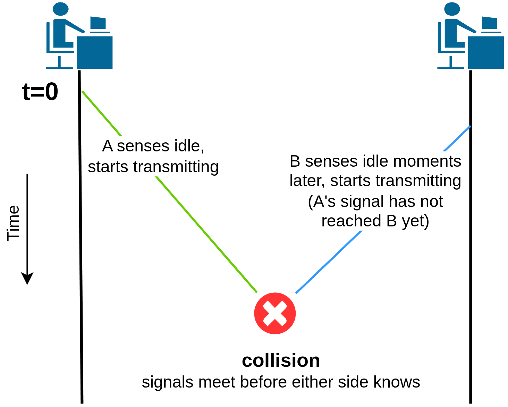

In a shared collision domain, who transmits when?

- **CSMA (carrier sense multiple access):** listen before transmitting
  - Channel idle -> transmit; channel busy -> wait
- **CSMA/CD** adds collision detection: keep listening while transmitting.
  - Hear something different than what you're sending -> collision
  - Stop immediately, send a short **jam signal**, then back off and retry
    after a random wait (longer wait after repeated collisions)

Collisions can still happen even with carrier sense: propagation delay means
two nodes can both sense "idle" and start transmitting before either one's
signal reaches the other.

*Notes: This only applies to shared, half-duplex Ethernet, today's switched
full-duplex Ethernet doesn't need it, more on that in the standards slide.*

---

# Ethernet: minimum frame size

For CSMA/CD to work, a sender must still be transmitting when a collision could be detected.

- The transmission time must be long enough for a collision to propagate back to the sender while it is still transmitting.
- Otherwise, a sender could finish and move on, never learning that a collision happened.

This leads to a **minimum frame size**: 64 bytes.

- Classic 10 Mbps Ethernet: 51.2 µs slot time -> 512 bits -> **64 bytes**
- Shorter frames are padded to reach this minimum.
- Fast Ethernet (100 Mbps) kept the same 64-byte minimum, but had to reduce the maximum collision-domain diameter, since transmitting the same 64 bytes now took 10x less time.
- Gigabit Ethernet increased the slot time to 4096 bit times (512 bytes) for half-duplex operation, using carrier extension to keep collision detection meaningful without changing the normal 64-byte minimum frame size.

---

# Ethernet: receiver flow

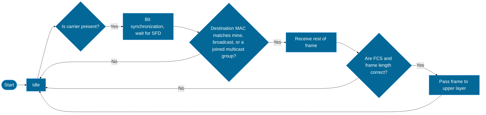
```mermaid
%%{init: {
  "look": "classic",
  "theme": "default",
  "themeVariables": { "fontSize": "24px", "lineColor": "#000000" },
  "themeCSS": ".edgeLabel { font-size: 22px; } .flowchart-link { stroke-width: 3px; } marker path { fill: #000000 !important; stroke: #000000 !important; } .marker { fill: #000000 !important; }"
}}%%
flowchart LR
    A(["Start"]) --> B["Idle"]
    B --> C{"Is carrier present?"}
    C -- Yes --> D["Bit synchronization, wait for SFD"]
    D --> E{"Destination MAC matches mine, broadcast, or a joined multicast group?"}
    E -- No --> B
    E -- Yes --> F["Receive rest of frame"]
    F --> G{"Are FCS and frame length correct?"}
    G -- No --> B
    G -- Yes --> H["Pass frame to upper layer"]
    H --> B

    classDef default fill:#036897,stroke:#3399FF,color:#FFFFFF
```

---

# Ethernet: transmitter flow

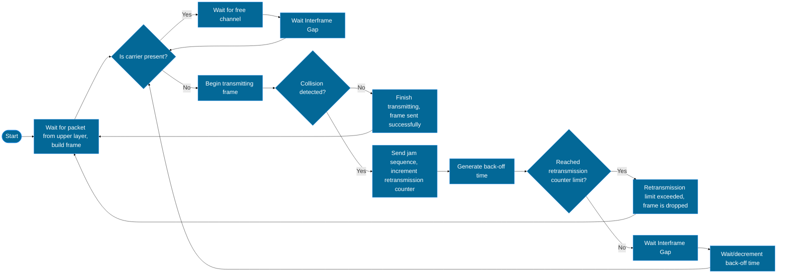
```mermaid
%%{init: {
  "look": "classic",
  "theme": "default",
  "themeVariables": { "fontSize": "24px", "lineColor": "#000000" },
  "themeCSS": ".edgeLabel { font-size: 22px; } .flowchart-link { stroke-width: 3px; } marker path { fill: #000000 !important; stroke: #000000 !important; } .marker { fill: #000000 !important; }"
}}%%
flowchart LR
    A(["Start"]) --> B["Wait for packet from upper layer, build frame"]
    B --> C{"Is carrier present?"}
    C -- Yes --> D["Wait for free channel"]
    D --> E["Wait Interframe Gap"]
    E --> C
    C -- No --> F["Begin transmitting frame"]
    F --> G{"Collision detected?"}
    G -- No --> H["Finish transmitting, frame sent successfully"]
    H --> B
    G -- Yes --> J["Send jam sequence, increment retransmission counter"]
    J --> K["Generate back-off time"]
    K --> L{"Reached retransmission counter limit?"}
    L -- Yes --> M["Retransmission limit exceeded, frame is dropped"]
    M --> B
    L -- No --> N["Wait Interframe Gap"]
    N --> O["Wait/decrement back-off time"]
    O --> C

    classDef default fill:#036897,stroke:#3399FF,color:#FFFFFF
```

---

# Ethernet: 802.3 standards

- Defines the MAC sublayer and Physical Layer: many different PHY standards, a common MAC architecture and frame format
  - CSMA/CD was used for shared/hub-based Ethernet.
  - Modern switched full-duplex Ethernet still uses the same MAC addressing and frame format, but CSMA/CD is not needed.
- Speeds from 10 Mbps to 800 Gbps, with 1.6 Tbps standardization underway
  - Different physical-layer media: fiber, copper
  - The 64-byte minimum frame size remains part of the Ethernet MAC frame format across Ethernet speeds.
    - Originally required by CSMA/CD collision-detection timing (10 Mbps through half-duplex Gigabit)
    - Modern full-duplex Ethernet has no collisions to detect, but keeps the same frame format.

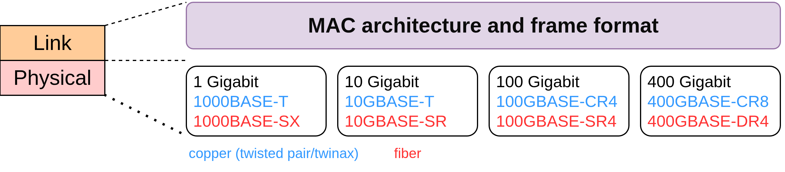

---

# Ethernet: two frame types, one wire

Same physical layout, same fields, one difference: how the NIC reads the field at byte 19-21

- **Ethernet II** (top): value > 1500, interpreted as **type**: tells the NIC which higher-layer protocol follows (e.g. 0x0800 = IPv4, 0x0806 = ARP)
- **IEEE 802.3** (bottom): value <= 1500, interpreted as **length**: the payload size. Which protocol follows is identified separately, by an LLC header inside the payload (details beyond this course).
- Both formats coexist on the same wire, at the same speeds: the NIC decides which one it's looking at from this single field.

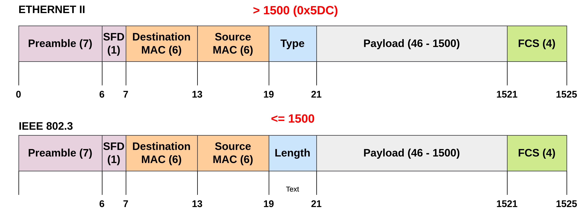

---
layout: section
---

# Header analysis across layers

We've seen the Ethernet frame format in the abstract. Now let's see it in a real, captured packet, and follow it up through the layers.

---

# Network addressing

- **Port** -> directs the data to the specific application or service on that device (more in lecture 4).
- **IP address** -> routes data across networks to reach the correct device (more in lecture 3).
- **MAC address** -> handles communication within a local network by identifying physical devices.

We'll see all three, layer by layer, in the packet that follows.

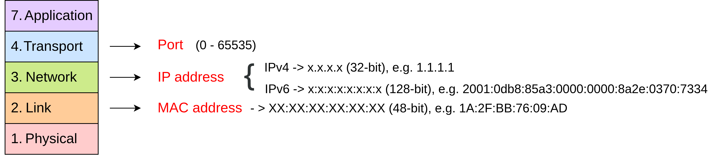

---
layout: three-slots
---

# Header layer 2

<v-click>
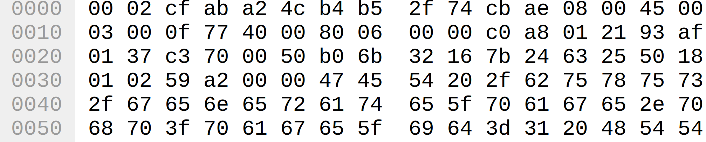

</v-click>

::left::

<v-click>

<Tint color="red" :n="1">Destination MAC Address: <strong>00:02:cf:ab:a2:4c</strong></Tint>
<Highlight :top="23" :left="69" :w="190" color="red" :n="1" />

<Tint color="red" :n="2">Source MAC Address: <strong>b4:b5:2f:74:cb:ae</strong></Tint>
<Highlight :top="23" :left="118" :w="200" color="red" :n="2" />

<Highlight :top="23" :left="170" :w="60" color="red" :n="3" />

<Tint color="red" :n="3">Type / Length field:</Tint>
<ValueBranch color="red" :items="[
  { value: '> 1500', label: 'Ethernet II (type)', active: true },
  { value: '≤ 1500', label: 'IEEE 802.3 (length)' },
]" />
</v-click>

::right::
<v-click>

<Tint color="red" :n="3">Type field value:</Tint>
<ValueBranch color="red" :items="[
  { value: '0x0800', label: 'IPv4', active: true },
  { value: '0x0806', label: 'ARP' },
  { value: '0x86DD', label: 'IPv6' },
]" />
<Highlight :top="23" :left="170" :w="60" color="red" :n="3" />
</v-click>

---
layout: three-slots
---

# Header layer 3

::left::

<v-click>

<Tint color="red" :n="1">IP version: <strong>4</strong>; IHL (Internet Header Length): <strong>5</strong> &times; 32-bit words</Tint>
<Highlight :top="23" :left="186" :w="30" color="red" :n="1" />

<Tint color="red" :n="2">Type of service</Tint>
<Highlight :top="23" :left="194" :w="30" color="red" :n="2" />

<Tint color="red" :n="3">Total Length: Number bytes in packet, <strong>768</strong></Tint>
<Highlight :top="27.2" :left="69" :w="60" color="red" :n="3" />

<Tint color="red" :n="4">Identification: used for fragmentation and reassembly of IP packets, <strong>0x0f77</strong></Tint>
<Highlight :top="27.2" :left="85" :w="60" color="red" :n="4" />

<Tint color="red" :n="5">Flags and Fragment Offset</Tint>
<Highlight :top="27.2" :left="102" :w="60" color="red" :n="5" />

<Tint color="red" :n="6">Time to live: <strong>0x80 (128)</strong></Tint>
<Highlight :top="27.2" :left="118" :w="30" color="red" :n="6" />
</v-click>

::right::
<v-click>

<Highlight :top="27.2" :left="126" :w="30" color="red" :n="7" />

<Tint color="red" :n="7">Protocol field value:</Tint>
<ValueBranch color="red" :items="[
  { value: '0x01', label: 'ICMP' },
  { value: '0x06', label: 'TCP', active: true },
  { value: '0x11', label: 'UDP' },
]" />

<Tint color="red" :n="8">Header Checksum</Tint>
<Highlight :top="27.2" :left="137" :w="60" color="red" :n="8" />

<Tint color="red" :n="9">Source Address: <strong>192.168.1.33</strong></Tint>
<Highlight :top="27.2" :left="153" :w="127" color="red" :n="9" />

<Tint color="red" :n="10">Destination Address: <strong>147.175.1.55</strong></Tint>
<Highlight :top="27.2" :left="186" :w="60" color="red" :n="10" />
<Highlight :top="31.5" :left="69" :w="60" color="red" />
</v-click>

---
layout: three-slots
---

# Header layer 4

::left::
<v-click>

<Tint color="red" :n="1">Source Port: <strong>50032</strong></Tint>
<Highlight :top="31.5" :left="85.5" :w="60" color="red" :n="1" />

<Tint color="red" :n="2">Destination Port field value:</Tint>
<ValueBranch color="red" :items="[
  { value: '0x0016 (22)', label: 'SSH' },
  { value: '0x0035 (53)', label: 'DNS' },
  { value: '0x0050 (80)', label: 'HTTP', active: true },
  { value: '0x01BB (443)', label: 'HTTPS' },
]" />
<Highlight :top="31.5" :left="101.5" :w="60" color="red" :n="2" />
</v-click>

::right::
<v-click>

<Tint color="red" :n="3">Sequence Number: <strong>2959815190</strong></Tint>
<Highlight :top="31.5" :left="118" :w="135" color="red" :n="3" />

<Tint color="red" :n="4">Acknowledgement Number: <strong>2065982245</strong></Tint>
<Highlight :top="31.5" :left="153" :w="125" color="red" :n="4" />

<Tint color="red" :n="5">Header Length(4) / Reserved(6) / Flags(6): <strong>5 / 000000 / 011000</strong></Tint>
<Highlight :top="31.5" :left="186" :w="60" color="red" :n="5" />

<Tint color="red" :n="6">Window Size: <strong>258</strong></Tint>
<Highlight :top="35.7" :left="69" :w="60" color="red" :n="6" />

<Tint color="red" :n="7">Checksum: <strong>0x59a2</strong></Tint>
<Highlight :top="35.7" :left="85.5" :w="60" color="red" :n="7" />
</v-click>

---
layout: section
---

# ARP (Address Resolution Protocol): connecting layers 2 and 3

---
layout: default
---

# Connecting layers 2 and 3: filling in addresses

Recall: In the packet we just saw, the Type field told us what protocol follows, ARP is one of those protocols, seen directly at Layer 2 (EtherType 0x0806).

But before a frame can even be built, both layers need to fill in their own addresses:
- Layer 3 fills in the IP addresses.
- Then, Layer 2 needs to fill in the MAC addresses.

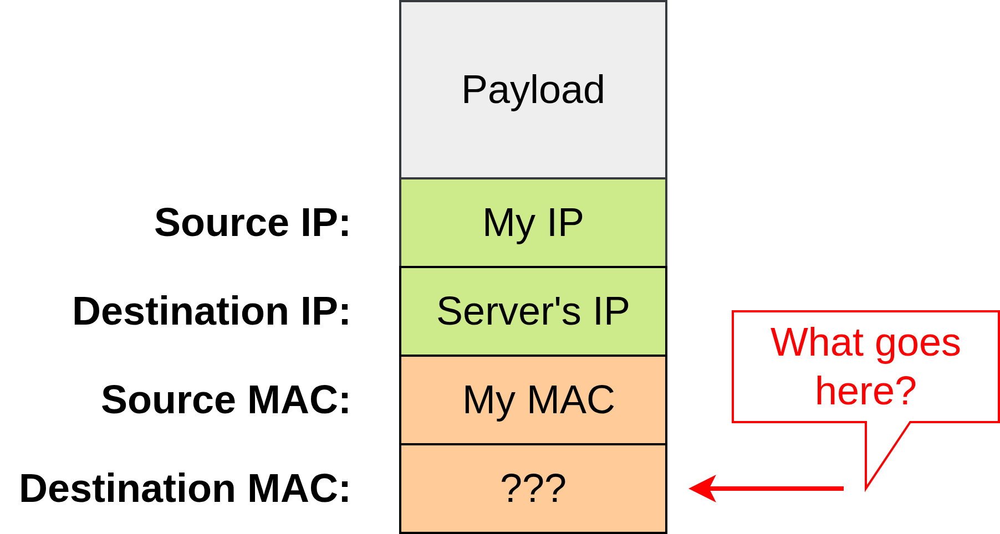

---

# Connecting layers 2 and 3: local or not?

If the destination IP is in our local network (how we determine this exactly comes later, with subnet masks):
- Find the destination's MAC address, and send to destination on Layer 2.

If the destination IP is not in our local network:
- Find the router's MAC address, and send to the router on Layer 2.
- Router can forward our packet toward the destination.

---

# Connecting layers 2 and 3: why not just broadcast?

How do we send packets to the destination (local) or the router (non-local)?

- We could broadcast: Put **FF:FF:FF:FF:FF:FF** as destination MAC.
  - But now, everybody else has to process this packet.
  - Need extra bandwidth to send the packet to everyone on local network

- We really want to unicast the packet to the right MAC address.
  - We need some way to translate IP addresses to MAC addresses.

---

# ARP: steps (how it works)

**ARP** translates Layer 3 IP addresses to Layer 2 MAC addresses.
- Example: Alice knows Bob's IP address is 1.2.3.4. She wants to know Bob's MAC address.

Steps of the protocol:
1. Alice checks her cache to see if she already knows Bob's MAC address.
2. If Bob's MAC address is not in the cache, Alice broadcasts:
"What is the MAC address of 1.2.3.4?"
3. Bob responds by unicasting to Alice:
"My IP is 1.2.3.4 and my MAC address is ca:fe:f0:0d:be:ef." Everyone else does nothing.
4. Alice caches the result (typically for a few minutes, then it expires).

---

# ARP: steps (visualized)

Alice knows Bob's IP address is 1.2.3.4. She wants to learn Bob's MAC address.

  

  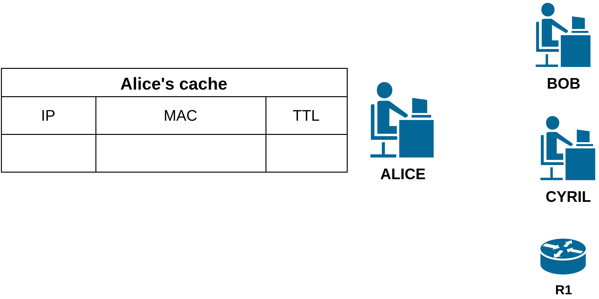
  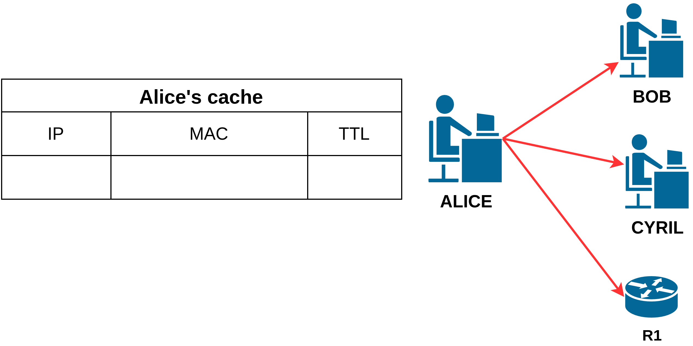
  
  = 4" src="./images/l2-arp-steps4.png"
       class="absolute inset-0 w-full h-full object-contain rounded-xl"/>

  
<strong>1.</strong> Alice checks her cache to see if she already knows the MAC address corresponding to <strong>1.2.3.4</strong>. Since her cache is empty, she must make a request to find out.

  
<strong>2.</strong> Alice asks everyone else on the local network: "What is the MAC address of <strong>1.2.3.4</strong>?"

  
<strong>3.</strong> Bob responds: "My IP is <strong>1.2.3.4</strong> and my MAC address is <code>ca:fe:f0:0d:be:ef</code>." Everybody else ignores the request.

  
= 4"><strong>4.</strong> Alice adds Bob's MAC address to her cache. This mapping can be cached for some time (TTL).

---

# ARP: request and reply

ARP runs directly on Layer 2 (not IP).

| | Source MAC | Destination MAC |
|---|---|---|
| **ARP request** *(broadcast)* | Alice's MAC | `FF:FF:FF:FF:FF:FF` |
| **ARP reply** *(unicast)* | Bob's MAC | Alice's MAC |

*Note: You can also broadcast an unsolicited reply, called a* **gratuitous ARP**:

*"My IP is 1.2.3.4, and my MAC is ca:fe:f0:0d:be:ef...even though no one asked."*

*Note: ARP has no authentication. Anyone on the LAN can claim any IP address. This is called* **ARP spoofing**, *and it's how attackers redirect traffic (e.g. for man-in-the-middle attacks).*

---

# ARP: Wireshark

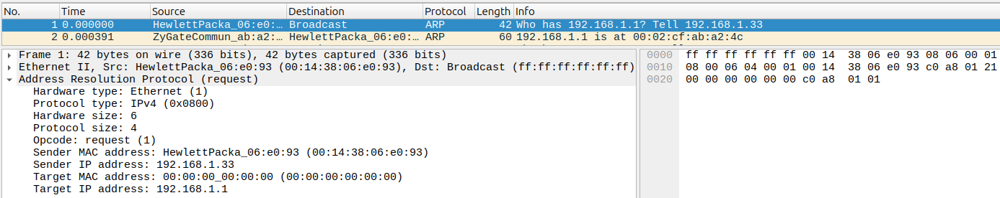
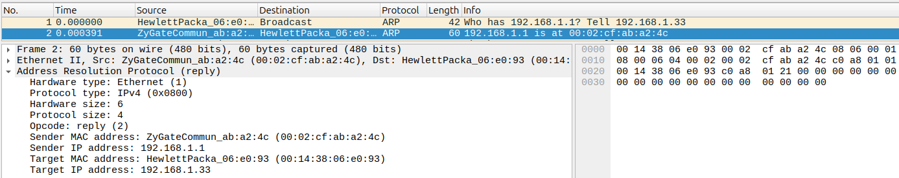

<v-click>

*Note: We'll use ARP again when routing across subnets, later in this course.*
</v-click>

---
layout: section
---

# Ethernet switch

---

# Ethernet switch

Switch is a **link-layer** device:

- Takes an **active** role
  - Store, forward Ethernet (or other type of) frames
  - Examine incoming frame’s MAC address, **selectively** forward  frame to one-or-more outgoing links when frame is to be forwarded on segment
- **Transparent**: hosts unaware of presence of switches
- **Plug-and-play**, self-learning
  - Basic operation needs no configuration
  - Managed switches offer more control as networks grow more complex

---

# Switch: multiple simultaneous transmissions

- Hosts have dedicated, direct connection to switch
- Switches buffer packets
  - This is where queueing delay comes from, and why jitter happens (remember those from earlier)
- Ethernet protocol used on each incoming link:
  - Each link is its own collision domain, but since each is full-duplex and point-to-point, collisions do not occur
- Switching: A-to-A' and B-to-B' can transmit simultaneously, without collisions
  - But A-to-A' and C-to-A' cannot happen simultaneously

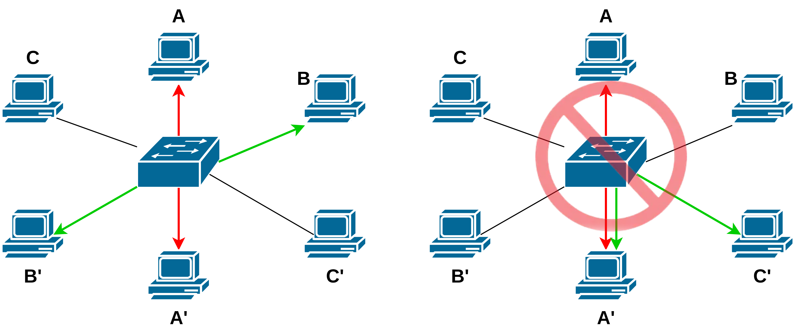

---

# Switch: self-learning

- Switch learns which hosts can be reached through which interfaces.
  - When frame received, switch "learns"  location of sender: incoming LAN segment.
  - Records sender/location pair in switch table

    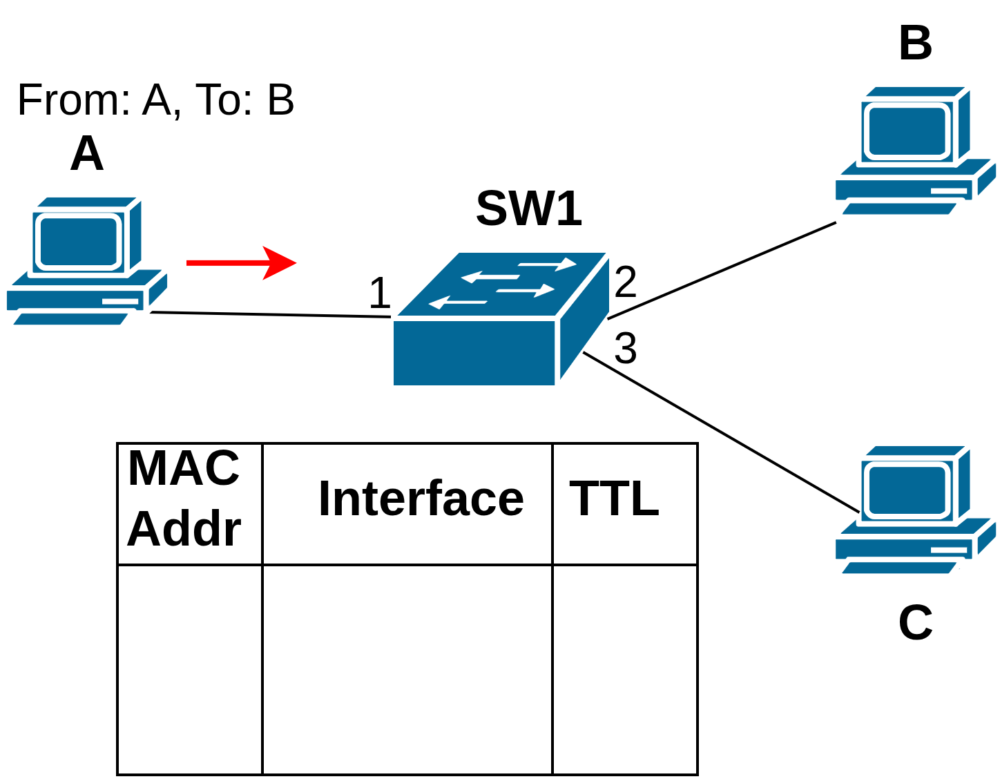
    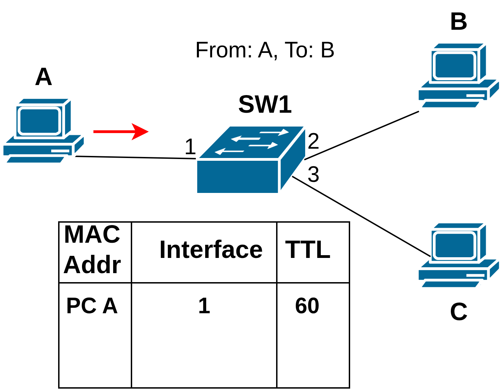

---
layout: three-slots
---

# Switch: forwarding process

Forwarding is **destination-based**: Use the destination to decide the next-hop.
 - If the destination exists in the table: forward to corresponding next-hop.
 - If the destination is not in the table: flood out of all ports (except incoming port).

::left::
<v-click>
Case 1: No entry for B (destination) in table

Flood the packet to all ports (except incoming port).
</v-click>

    
    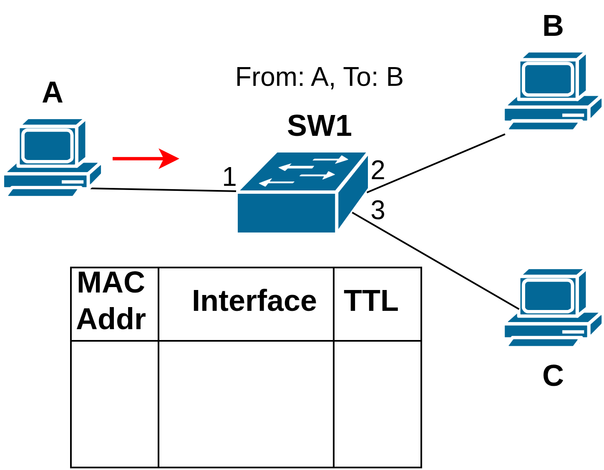
    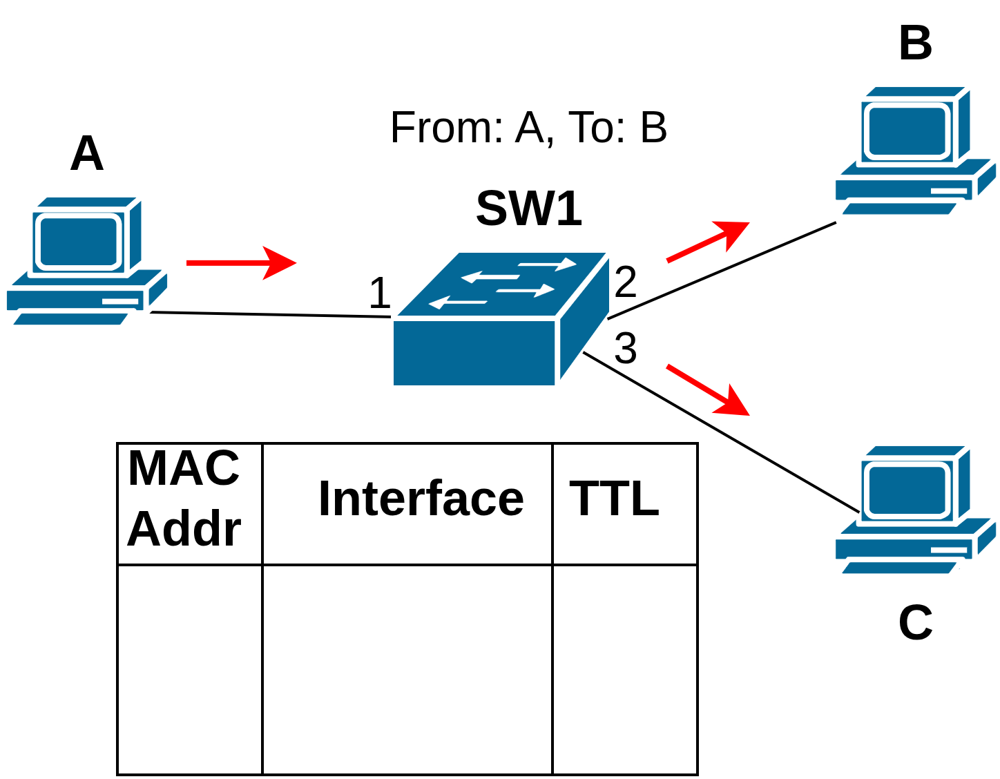

::right::
<v-click>
Case 2: Entry for B (destination) is in table.

Use table entry to forward to next-hop.
</v-click>

    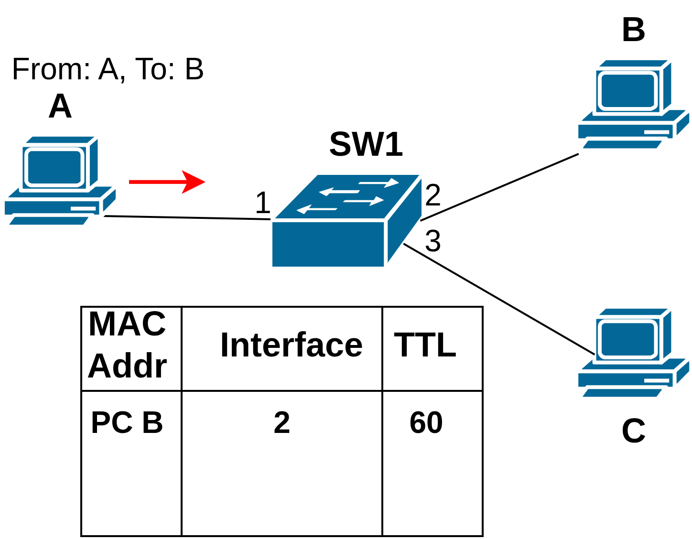
    
    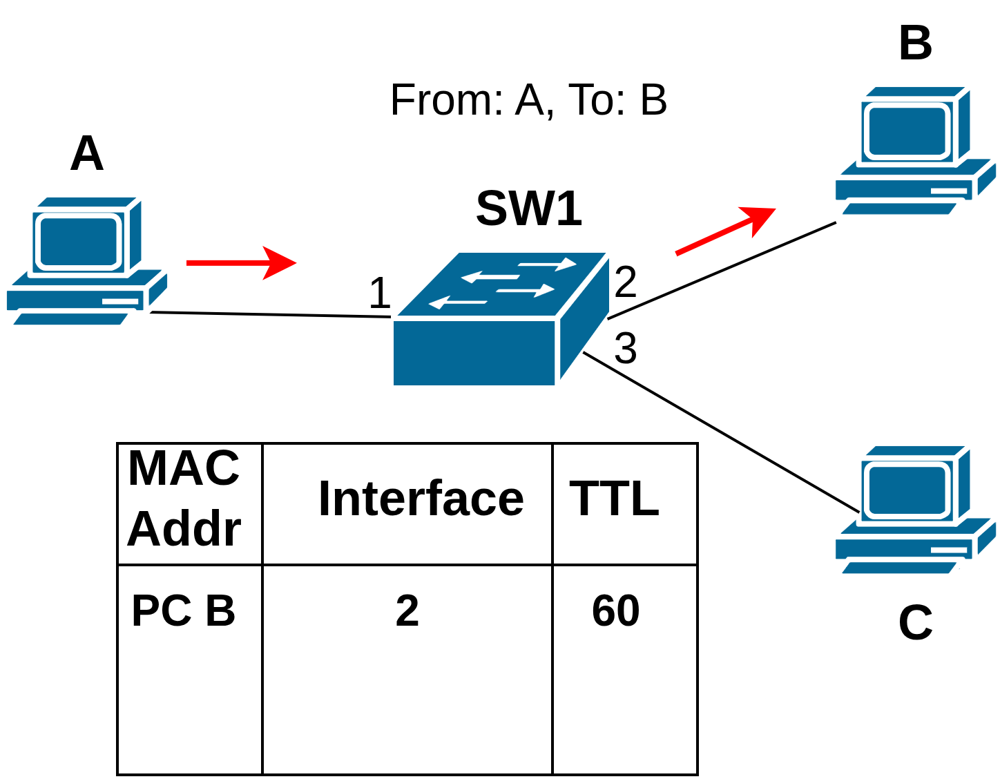

---

# Interconnecting switches

Self-learning switches can be connected together:

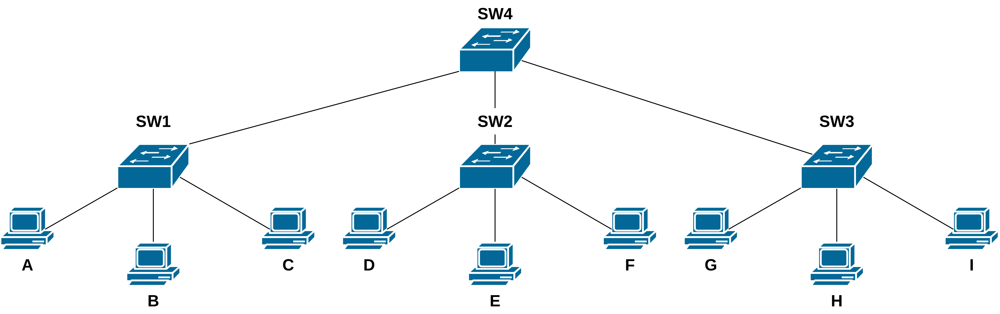

<v-click>

**Sending from A to G: how does SW1 know to forward frame destined to G via SW4 and SW3?**
</v-click>
<v-click>
Self learning! (works exactly the same as in single-switch case!)
</v-click>

---
layout: three-slots
---

# Next lecture

::left::

- Network Layer
- IP Protocol

::right::

---

# References
1. KAO, Peyrin. CS 168 Textbook: Introduction to the Internet: Architecture and Protocols. [online]. University of California, Berkeley, 2024 [accessed 2025-09-03]. Available from: https://textbook.cs168.io/
2. KUROSE, James F. and ROSS, Keith W. Computer Networking: a Top Down Approach – authors' website. [online]. University of Massachusetts Amherst, 2025 [accessed 2025-09-03]. Available from: https://gaia.cs.umass.edu/kurose_ross/index.php
 

## License
This presentation incorporates material from two sources:
- Portions adapted from **[Peyrin Kao / UC Berkeley]**, licensed under [CC BY-SA 4.0](https://creativecommons.org/licenses/by-sa/4.0/).
- Some slides and figures adapted from **J.F. Kurose and K.W. Ross**,  *Computer Networking: A Top-Down Approach*. © 2010–2025 J.F. Kurose and K.W. Ross. All rights reserved. Used for educational purposes with attribution.

Text and formatting were refined with AI assistance; all technical content was reviewed and verified by the author.
