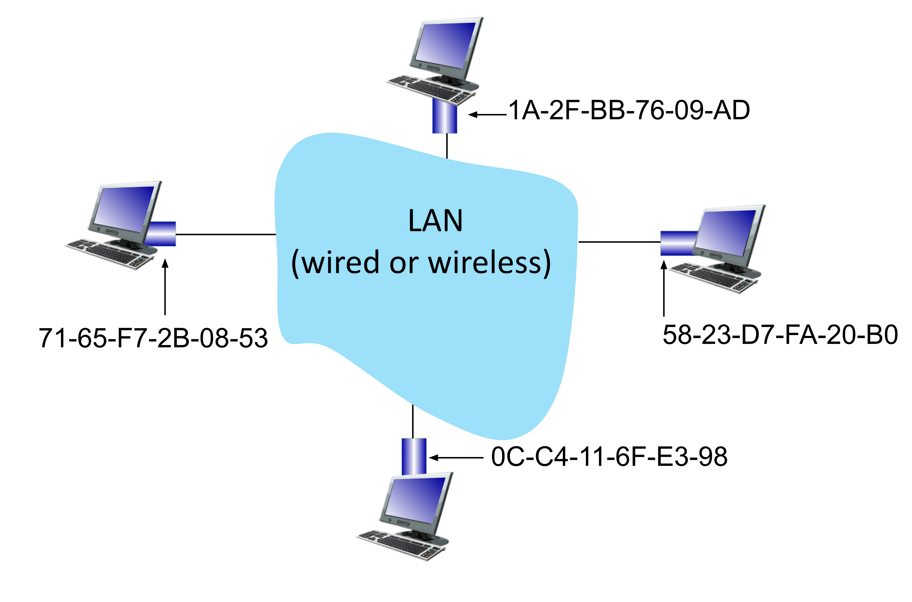
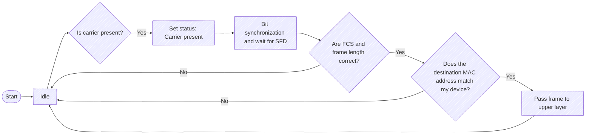
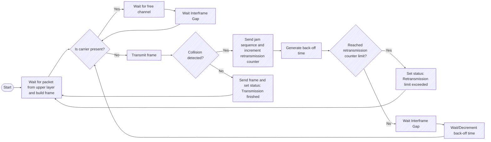
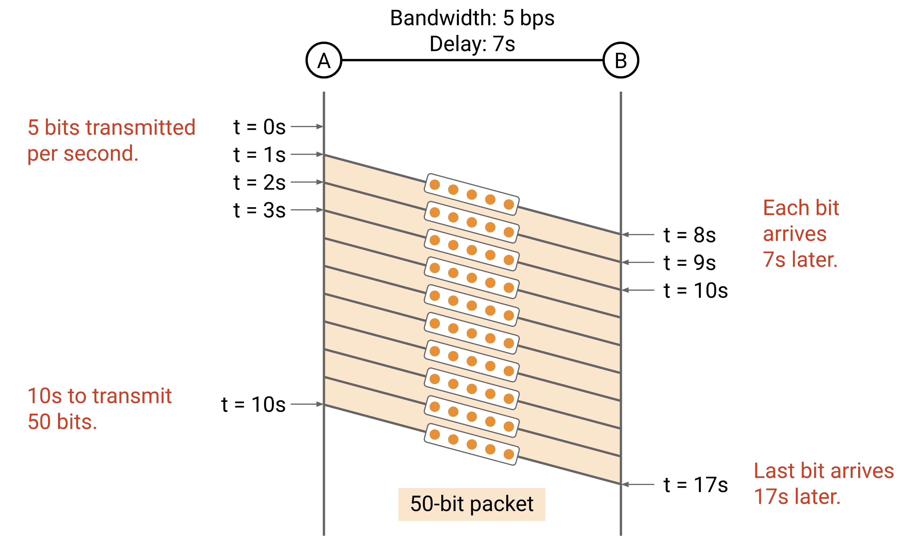

# Computer and Communication Networks : Link

Lecture 2

---
layout: default
---

# Content overview

- Link Layer
- Ethernet
- Header analysis across layers
- ARP: Connecting Layers 2 and 3
- Network Performance Parameters
- Ethernet Switch

---
layout: section
---

# Link Layer

---
layout: three-slots
---

# Link Layer: introduction

::left::

- nodes -> hosts, routers
- links -> communication channels that connect adjacent nodes along communication path
    - wired , wireless 
    - LANs

- layer-2 packet -> frame, encapsulates datagram
  
**Link Layer has responsibility of transferring datagram from one node to physically adjacent node over a link.**

::right::
 

---
layout: three-slots
---

# Link Layer: services

::left::
<v-click>

- **framing, link access:**
  - encapsulate datagram into frame, adding header, trailer
  - channel access if shared medium
  - “MAC” addresses in frame headers identify source, destination (different from IP address!)
</v-click>
<v-click>

- **reliable delivery between adjacent nodes:**
  - we revisit this again in the Transport Topic
  - seldom used on low bit-error link (fiber, some twisted pair)
  - wireless links: high error rates
</v-click>

::right::
 

---
layout: three-slots
---

# Link Layer: services

::left::
<v-click>

- **flow control:**
  - pacing between adjacent sending and receiving nodes
</v-click>
<v-click>

- **error detection:**
  - errors caused by signal attenuation, noise
  - receiver detects errors, signals retransmission, or drops frame
</v-click>  
<v-click>

- **error correction:**
  - receiver identifies and corrects bit error(s) without retransmission
</v-click>
<v-click>

- **half-duplex and full-duplex:**
  - with half duplex, nodes at both ends of link can transmit, but not at same time
</v-click>
::right::
 

<!--
Error detection in the link layer is usually more sophisticated and is implemented in hardware. Error correction is similar to error detection, except that a receiver not only detects when bit errors have occurred in the frame but also deter- mines exactly where in the frame the errors have occurred (and then corrects these errors). 
-->
---
layout: three-slots
---

# Host link-layer implementation

::left::

- in each-and-every host
- link layer implemented on-chip or in network interface card (NIC) 
  - implements link, physical layer
- attaches into host’s system buses
- combination of hardware, software, firmware

::right::

<!--
The Ethernet capabilities are either integrated into the motherboard chipset or implemented via a low-cost dedicated Ethernet chip. For the most part, the link layer is implemented on a chip called the network adapter, also sometimes known as a network interface controller (NIC). The network adapter implements many link layer services including framing, link access, error detection, and so on. Thus, much of a link-layer controller’s functionality is implemented in hardware. For example, Intel’s 700 series adapters [Intel 2020] implements the Ethernet protocols; the Atheros AR5006 [Atheros 2020] controller implements the 802.11 WiFi protocols. 

Figure shows that while most of the link layer is implemented in hardware, part of the link layer is implemented in software that runs on the host’s CPU. The software components of the link layer implement higher-level link-layer functionality such as assembling link-layer addressing information and activating the controller hardware. On the receiving side, link-layer software responds to con- troller interrupts (for example, due to the receipt of one or more frames), handling error conditions and passing a datagram up to the network layer. Thus, the link layer is a combination of hardware and software.
-->
---
layout: three-slots
---

# Interfaces communicating

    
    

        &darr; |packet|
    

    

        &darr; |Hl|packet|
    

    

        |Hl|packet| &rarr;
    

    

        |packet| &uarr;
    

::left::

sending side:
- encapsulates packet in frame
- adds error checking bits, reliable data transfer, flow control, etc.

::right::

receiving side:
- looks for errors, reliable data transfer, flow control, etc.
- extracts packet, passes to upper layer at receiving side

---
layout: three-slots
---

# Network addressing

- **Port** -> directs the data to the specific application or service on that device (more in lecture 4).
- **IP address** -> routes data across networks to reach the correct device (more in lecture 3).
- **MAC address** -> handles communication within a local network by identifying physical devices.

---

# MAC addresses

- each interface has unique 48-bit MAC address
- e.g.: 1A-2F-BB-76-09-AD (hexadecimal (base 16) notation (each “numeral” - [0..9, A..F] represents 4 bits)), on figure you can see MAC address

---

# MAC addresses

- MAC (or LAN or physical or Ethernet) address: 
  - function: **used “locally” to get frame from one interface to another physically-connected interface (same subnet, in IP-addressing sense)**
  - 48-bit MAC address (for most LANs) burned in NIC ROM, also sometimes software settable
- MAC address allocation administered by IEEE
- manufacturer buys portion of MAC address space (to assure uniqueness)
- analogy:
  - MAC address: like birth number
  - IP address: like postal address
- MAC flat address: portability 
  - can move interface from one LAN to another
  - recall IP address not portable: depends on IP subnet to which node is attached
---

# Multiple access links

So far, we've assumed that every link connects exactly two machines. In reality, a single wire can connect multiple computers.

<v-click>
Two types of “links”:
</v-click>
<v-click>

- **point-to-point**
  - point-to-point link between Ethernet switch and host
</v-click>
<v-click>

- **broadcast (shared wire or medium)**
  - old-school Ethernet, upstream HFC in cable-based access network, 802.11 wireless LAN, 5G, satellite
</v-click>
<v-click>

</v-click>
--- 

# Shared Media

Many machines using the same wire (single shared broadcast channel):
- If multiple machines transmit at the same time, signals will interfere or collide.
- Analogy: People talking simultaneously on a group call.

<v-click>

Who determines when a node can transmit?
</v-click>
<v-click>

**Multiple Access protocol (distributed algorithm)**
</v-click>
<v-click>

*Note: More on multiple access protocols in a later lecture.*
</v-click>

    

---
layout: section
---

# Ethernet

---

# Ethernet

- as the first widely adopted technology for Local Area Networks (LANs), remains the dominant standard today
- simpler, cheap
- kept up with speed race: 10 Mbps – 400 Gbps 
- single chip solutions support multiple speeds (e.g., Broadcom  BCM5761)
- machines in the same LAN can exchange messages directly at Layer 2
  - no need for IPs, routers, forwarding, etc.
  - analogy: If we're in the same room, we can talk without using the postal system.
---
layout: three-slots
---

# Ethernet: physical topology

::left::
- **bus:** popular through mid 90s
  - all nodes in same collision domain (can collide with each other)
- **star(switched):** prevails today
  - active link-layer 2 switch in center
  - each “spoke” runs a (separate) Ethernet protocol (nodes do not collide with each other)
- **ring**
- **tree**

::right::

--- 

# Ethernet: types of LAN communication

Ethernet supports three types of communication:
- **Unicast:** Send a packet to a single recipient.
- **Broadcast:** Send a packet to everyone on the local network.
- **Multicast:** Send a packet to everyone in a specific group.
  - Machines in the local network can join groups.

---

# Ethernet frame structure

(Field Lenght in Bytes)

<v-click>

- **preamble** -> used to synchronize receiver, sender clock rates
  - 7 bytes of 10101010 followed by one byte of 10101011 (SFD)
</v-click>
<v-click>

- **SFD** -> start frame delimiter
</v-click>
<v-click>

- **destination MAC** -> 6 bytes destination MAC address
  - if adapter receives frame with matching destination address, or with broadcast address (e.g., ARP packet), it passes data in frame to network layer protocol
  - otherwise, adapter discards frame
</v-click>
<v-click>

- **source MAC** -> 6 bytes source MAC address
</v-click>
---

# Ethernet frame structure

<v-click>

- **type/length** -> 2 bytes that determine whether it is an IEEE 802.3 or Ethernet II frame
  - **type** -> indicates the higher-layer protocol (used in Ethernet II)
  - **length** -> specifies the length of the payload (used in IEEE 802.3)
</v-click>
<v-click>

- **Payload** -> data
</v-click>
<v-click>

- **FCS** ->  Frame Check Sequence is a 4-octet (32-bit) cyclic redundancy check (CRC) that allows the receiver to detect corrupted data within the entire frame
</v-click>

---

# Ethernet: unreliable, connectionless

- **connectionless:** no handshaking between sending and receiving NICs

- **unreliable:** receiving NIC doesn’t send ACKs or NAKs to sending NIC
  - data in dropped frames recovered only if initial sender uses higher layer rdt (e.g., TCP), otherwise dropped data lost
---

# Ethernet: Receiver activity diagram

---

# Ethernet: Transmitter activity diagram

---

# 802.3 Ethernet standards: link & physical layers

- many different Ethernet standards
  - common MAC protocol and frame format
    - MAC protocol is CSMA/CD for shared/hub-based Ethernet
    - Modern switched full-duplex Ethernet still uses the same MAC addressing and frame format, but CSMA/CD is not needed
  - different speeds: 10 Mbps, ... 100 Mbps, 1Gbps, 10 Gbps, 40 Gbps, 100 Gbps, 400 Gbps (and beyond).
    - different physical layer media: fiber, cable

<!--
This is an international standard for Local and Metropolitan Area Networks (LANs and MANs), employing
CSMA/CD as the shared media access method and the IEEE 802.3 (Ethernet) protocol and frame format for
data communication. This international standard is intended to encompass several media types and
techniques for a variety of MAC data rates. 802.3 defines MAC protocol and format of frames.
On the same 802.3 physical layer, two types of frames can exists: 802.3 + LLC and Ethernet II.
-->
---

#  Ethernet frame types

---
layout: section
---

# Header analysis across layers

---

# Network addressing

- **Port** -> directs the data to the specific application or service on that device (more in lecture 4).
- **IP address** -> routes data across networks to reach the correct device (more in lecture 3).
- **MAC address** -> handles communication within a local network by identifying physical devices.

---
layout: three-slots
---

# Header Layer 2

<v-click>

</v-click>

::left::

<v-click>

Destination MAC Address: **00:02:cf:ab:a2:4c**

</v-click>
<v-click>

Source MAC Address: **b4:b5:2f:74:cb:ae**

</v-click>

<v-click>

</v-click>

::right::
<v-click>

</v-click>

---
layout: three-slots
---

# Header Layer 3

<v-click>

</v-click>

::left::

<v-click>

IP version: **4**

IHL(Internet Header Length): Number 32-bit words, value = **5**

</v-click>
<v-click>

Type of service

</v-click>

<v-click>

Total Length: Number bytes in packet, **768**

</v-click>

<v-click>

Identification: used for fragmentation and reassembly of IP packets, **0x0f77**

</v-click>

<v-click>

Flags and Fragment Offset

</v-click>
<v-click>

Time to live: **0x80 (128)**

</v-click>
::right::
<v-click>

</v-click>
<v-click>

Header Checksum

</v-click>
<v-click>

Source Address: **192.168.1.33**

</v-click>
<v-click>

Destination Address: **147.175.1.55**

</v-click>

---
layout: three-slots
---

# Header Layer 4

<v-click>

</v-click>

::left::
<v-click>

Source Port: **50032**

</v-click>
<v-click>

</v-click>

::right::
<v-click>

Sequence Number: **2959815190**

</v-click>
<v-click>

Acknowledgement Number: **2065982245**

</v-click>
<v-click>

Header Length(4) / Reserved(6) / Flags(6): **5 / 000000 / 011000**

</v-click>
<v-click>

Windows Size: **258**

</v-click>
<v-click>

Checksum: **0x59a2**

</v-click>

---
layout: section
---

# ARP (Address Resolution Protocol): Connecting Layers 2 and 3

---
layout: default
---

# Connecting Layers 2 and 3

Recall: Packet gets passed down the stack, picking up more headers.
- Layer 3 fills in the IP addresses.
- Then, Layer 2 needs to fill in the MAC addresses.

---

# Connecting Layers 2 and 3

If the destination IP is in our local network:
- Find the destination's MAC address, and send to destination on Layer 2.

If the destination IP is not in our local network:
- Find the router's MAC address, and send to the router on Layer 2.
- Router can forward our packet toward the destination.

---

# Connecting Layers 2 and 3

How do we send packets to the destination (local) or the router (non-local)?

- We could broadcast: Put FF:FF:FF:FF:FF:FF as destination MAC.
  - But now, everybody else has to process this packet.
  - Need extra bandwidth to send the packet to everyone on local network.

- We really want to unicast the packet to the right MAC address.
  - We need some way to translate IP addresses to MAC addresses.

---

# ARP – Steps

**ARP** translates Layer 3 IP addresses to Layer 2 MAC addresses.
- Example: Alice knows Bob's IP address is 1.2.3.4. She wants to know Bob's MAC address.

Steps of the protocol:
1. Alice checks her cache to see if she already knows Bob's MAC address.
2. If Bob's MAC address is not in the cache, Alice broadcasts:
"What is the MAC address of 1.2.3.4?"
3. Bob responds by unicasting to Alice:
"My IP is 1.2.3.4 and my MAC address is ca:fe:f0:0d:be:ef." Everyone else does nothing.
4. Alice caches the result.

---

# ARP – Steps

Alice knows Bob's IP address is 1.2.3.4. She wants to learn Bob's MAC address.

  
  
  
  

---

# ARP

ARP runs directly on Layer 2 (not IP).

*Note: You can also broadcast an unsolicited response:*

*"My IP is 1.2.3.4, and my MAC is ca:fe:f0:0d:be:ef...even though no one asked."*
---

# ARP - Wireshark (Request -> Response)

---
layout: section
---

# Network Performance Parameters

---

# Properties of Links

A link connects two devices.

Properties of a link:
- **Bandwidth:** Number of bits sent/received per unit time.
  - "Width" of the link.
  - Measured in bits per second (bps).
- **Propagation delay:** Time it takes a bit to travel along the link.
  - "Length" of the link.
  - Measured in seconds.

- **Bandwidth-delay product:** Bandwidth × delay.
  - "Capacity" of the link.
---

# Measuring Packet Delay with Timing Diagrams

Suppose we have a link with:
- Bandwidth = 1 Mbps. *(1,000,000 bits per second.)*
- Propagation delay = 1 ms. *(0.001 seconds.)*

*Note: We measure in bits per second, not bytes!*

How long does it take to send a 100-byte *(800-bit)* packet?
- From the time the first bit is sent,
- To the time the last bit is received.

Let's draw a timing diagram to help.

---

# Measuring Packet Delay with Timing Diagrams

The packet delay is the time it takes for an entire packet to be sent, starting from the time the first bit is put on the wire, to the time the last bit is received at the other end. 

---

# Measuring Packet Delay with Timing Diagrams

Packet Delay    =       Transmission Delay		+    Propagation Delay

Packet Delay    =  (Packet Size / Bandwidth) 	+    Propagation Delay

---

# Link Tradeoffs

Which link is better? It depends.
- Link 1:	Bandwidth 10 Mbps	Propagation Delay = 10 ms
- Link 2:	Bandwidth 1 Mbps	Propagation Delay = 1 ms

10-byte packet: Link 2 is better.
- ~10 ms with Link 1.	
- ~1 ms with Link 2.
- For small packet, transmission delay is negligible. Propagation delay dominates.

10,000-byte packet: Link 1 is better.
- ~18 ms with Link 1.	
- ~81 ms with Link 2.
- For large packet, transmission delay dominates.
---

# Timing Diagrams and Pipe Diagrams

---

# Timing Diagrams and Pipe Diagrams

The pipe diagram is an alternate view of the link.

- Shows the bits on the link at a frozen moment in time.

  <!-- Image container -->
  

    <!-- Background pipe rectangle (centered) -->
    
    <!-- Moving pipe images -->
    
  

  <!-- Title under images -->
  

    t = {{ $clicks <= 1 ? 0 : $clicks - 1 }}s
  

---

# Pipe Diagrams

Pipe diagram shows the bits on the link at a frozen moment in time.
- **Height = bandwidth.** How many bits we can put in the pipe per unit time.
- **Width = propagation delay.** How long it takes for bits to travel through the pipe.
- **Area = bandwidth-delay product.** How many bits fit in the pipe at a given instant.

---

# Pipe Diagrams

Shorter propagation delay: Pipe length is shorter.

  <!-- Image container -->
  

    <!-- Background pipe rectangle (centered) -->
    
    <!-- Moving pipe images -->
    
  

  <!-- Title under images -->
  

    t = {{ $clicks <= 1 ? 0 : $clicks - 1 }}s
  

---

# Pipe Diagrams

Higher bandwidth: Pipe height is taller.

  <!-- Image container -->
  

    <!-- Background pipe rectangle (centered) -->
    
    <!-- Moving pipe images -->
    
  

  <!-- Title under images -->
  

    t = {{ $clicks <= 1 ? 0 : $clicks - 1 }}s
  

---

# Pipe Diagrams – Transmission Delay

The width of the packet in the pipe represents the transmission delay.

- How long it takes to put all the bits in the pipe.
- More bandwidth = taller pipe = more bits in pipe per unit time = narrower packet in pipe.

  <!-- Image container -->
  

    <!-- Background pipe rectangle (centered) -->
    
    <!-- Moving pipe images -->
    
  

  <!-- Title under images -->
  

    t = {{ $clicks <= 1 ? 0 : $clicks - 1 }}s
  

---

# Pipe Diagrams – Transmission Delay

The width of the packet in the pipe represents the transmission delay.

- How long it takes to put all the bits in the pipe.
- More bandwidth = taller pipe = more bits in pipe per unit time = narrower packet in pipe.

  <!-- Image container -->
  

    <!-- Background pipe rectangle (centered) -->
    
    <!-- Moving pipe images -->
    
  

  <!-- Title under images -->
  

    t = {{ $clicks <= 1 ? 0 : $clicks - 1 }}s
  

---

# Pipe Diagrams – Transmission Delay

The width of the packet in the pipe represents the transmission delay.

- How long it takes to put all the bits in the pipe.
- More bandwidth = taller pipe = more bits in pipe per unit time = narrower packet in pipe.

---

# Latency , Jitter, Round Trip Time(RTT)

**Latency** - corresponds to how long it takes a message to travel from one end of a network to the other.

**Jitter** - variability of latency (𝐽𝑖𝑡𝑡𝑒𝑟 = |𝒕𝟏 − 𝒕𝟐|).

**RTT** - total time it takes for a packet to go from the sender to the receiver and back again (PING).

---
layout: section
---

# Ethernet Switch

---

# Ethernet Switch

Switch is a **link-layer** device:

- takes an **active** role
  - store, forward Ethernet (or other type of) frames
  - examine incoming frame’s MAC address, **selectively** forward  frame to one-or-more outgoing links when frame is to be forwarded on segment
- **transparent**: hosts unaware of presence of switches
- **plug-and-play**, self-learning
  - switches do not need to be configured

---

# Switch: multiple simultaneous transmissions

- hosts have dedicated, direct connection to switch
- switches buffer packets
- Ethernet protocol used on each incoming link, so: 
  - no collisions; full duplex
  - each link is its own collision domain
- switching: A-to-A’ and B-to-B’ can transmit simultaneously, without collisions
  - but A-to-A’ and C to A’ can not happen simultaneously 

---

# Switch: self-learning

- switch learns which hosts can be reached through which interfaces
  - when frame received, switch “learns”  location of sender: incoming LAN segment
  - records sender/location pair in switch table

    
    

---
layout: three-slots
---

# Switch: forwarding process

Forwarding is **destination-based**: Use the destination to decide the next-hop.
 - if the destination exists in the table: forward to corresponding next-hop
 - if the destination is not in the table: flood out of all ports (except incoming port)

::left::
<v-click>
Case 1: No entry for B (destination) in table.

Flood the packet to all ports (except incoming port).
</v-click>

    
    
    

::right::
<v-click>
Case 2: Entry for B (destination) is in table.

Use table entry to forward to next-hop.
</v-click>

    
    
    

---

# Interconnecting switches

self-learning switches can be connected together:

<v-click>

**sending from A to G - how does SW1 know to forward frame destined to G via SW4 and SW3?**
</v-click>
<v-click>
self learning! (works exactly the same as in single-switch case!)
</v-click>
---

# References
1. KAO, Peyrin. CS 168 Textbook: Introduction to the Internet: Architecture and Protocols. [online]. University of California, Berkeley, 2024 [accessed 2025-09-03]. Available from: https://textbook.cs168.io/
2. KUROSE, James F. and ROSS, Keith W. Computer Networking: a Top Down Approach – authors' website. [online]. University of Massachusetts Amherst, 2025 [accessed 2025-09-03]. Available from: https://gaia.cs.umass.edu/kurose_ross/index.php

  

## License

This presentation is based on materials by **[Peyrin Kao / UC Berkeley]**  
Licensed under [CC BY-SA 4.0](https://creativecommons.org/licenses/by-sa/4.0/).

This presentation is also licensed under [CC BY-SA 4.0](https://creativecommons.org/licenses/by-sa/4.0/).
