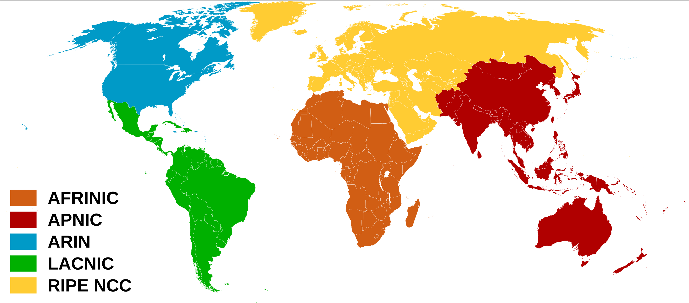
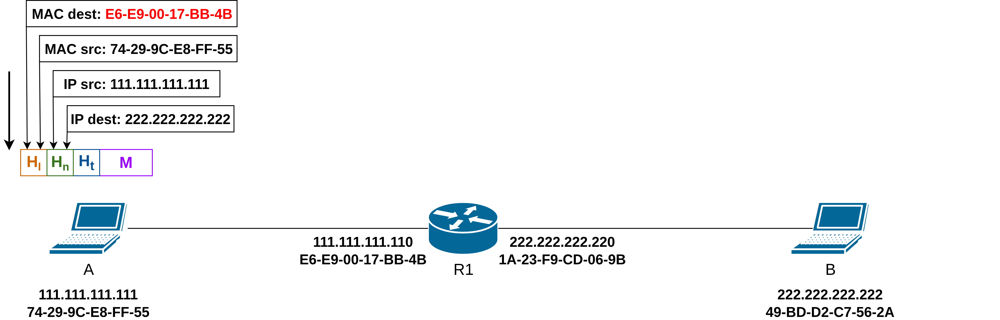
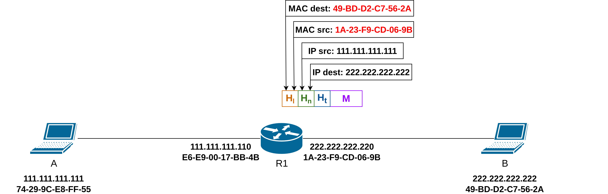

# Computer and Communication Networks : Network

Lecture 3

---
layout: default
---

# Content overview

- Network Layer
- IPv4 Address
- Types of IPv4 Addresses
- Network Segmentation
- Variable Length Subnet Mask (VLSM)
- How a Host Routes
- Introduction to Routing
- ARP (Cont.)
- Network Address Translation (NAT)
- What’s inside a router
---
layout: section
---

# Network Layer
---

# Services and protocols

IP provides services to allow end devices to exchange data.

Network layer protocols: IP version 4 (**IPv4**) and IP version 6 (**IPv6**).

The network layer performs operations:

<v-click>

- **addressing** end devices
  - Every device on a network is assigned an IP address.
  - This IP address is logical, not tied to the hardware (unlike MAC at Layer 2).
  - It allows communication between networks (not just within the same LAN).
</v-click>
<v-click>

- **encapsulation** 
  - A sender encapsulates layer 4 segments into packets, passes to link layer.
  - IP can use either an IPv4 or IPv6 packet and not impact the layer 4 segment.
  - IP packet will be examined by all layer 3 devices as it traverses the network.
  - The IP addressing does not change from source to destination.

*Note: NAT will change addressing, but will be discussed in a later.*
</v-click>
---

# Services and protocols

The network layer performs operations:

<v-click>

- **de-encapsulation**
  - A receiver delivers packets to transport layer protocol
</v-click>
<v-click>

- **routing** (only router)
  - Determines the path packets take from source to destination using routing algorithms.
  - Analogy: taking a trip -> process of planning trip from source to destination.
</v-click>
<v-click>

- **forwarding** (only router)
  - Moves packets from a device’s input interface to the appropriate output interface.
  - Analogy: taking a trip -> process of getting through single interchange.
</v-click>
--- 

# Characteristics - Connectionless

- IP does not establish a connection with the destination before sending the packet.
- There is no control information needed (synchronizations, acknowledgments, etc.)
- The destination will receive the packet when it arrives, but no pre-notifications are sent by IP.
- If there is a need for connection-oriented traffic, then another protocol will handle this (typically TCP at the transport layer).
---

# Characteristics - Best Effort

- IP will not guarantee delivery of the packet.
- IP has reduced overhead since there is no mechanism to resend data that is not received.
- IP does not expect acknowledgments.
- IP does not know if the other device is operational or if it received the packet.
---

# Characteristics - Media Independent

IP is **unreliable**:  
  - It cannot manage or fix undelivered or corrupt packets.
  - IP cannot retransmit after an error.
  - IP cannot realign out of sequence packets.
  - IP must rely on other protocols for these functions.

IP is **media independent**:
  - IP does not concern itself with the type of frame required at the data link layer or the media type at the physical layer.
  - IP can be sent over any media type: copper, fiber, or wireless.
  - The network layer will establish the Maximum Transmission Unit (MTU).
    - Network layer receives this from control information sent by the data link layer.
    - The network then establishes the MTU size.
---

# IPv4 Packet Header Format

---

# IPv4 Packet Header Fields

Significant fields in the IPv4 header:

- **Version** -> This will be for v4, as opposed to v6, a 4 bit field= 0100.
- **Header Length** -> Header Length as there can be options. Typical value 5 without options (32bit words ).
- **Total Length** -> Size of entire IP packet including header. Can go up to 65535 bytes.
- **Differentiated Services** -> Used for QoS: DiffServ – DS field or the older IntServ – ToS or Type of Service.
- **Header Checksum** -> Detect corruption in the IPv4 header.
- **Time to Live (TTL)** -> Layer 3 hop count. When it becomes zero the router will discard the packet.
- **Protocol** -> I.D.s next level protocol: ICMP, TCP, UDP, etc.
- **Source IPv4 Address** -> 32 bit source address.
- **Destination IPV4 Address** -> 32 bit destination address.
---
layout: section
---

# IPv4 Address
---

# Network and Host Portions

An IPv4 address is a 32-bit hierarchical address that is made up of a network portion and a host portion. 

A subnet mask is used to determine the network and host portions. 

The subnet mask is compared to the IPv4 address bit for bit, from left to right.

---

# The Prefix Length

A prefix length is a less cumbersome method used to identify a subnet mask address.

The prefix length is the number of bits set to 1 in the subnet mask. 

It is written in **“slash notation”** therefore, count the number of bits in the subnet mask and prepend it with **/** .

---

# Network, Host, and Broadcast Addresses

Within each network are three types of IP addresses:
- Network address
- Host addresses
- Broadcast address

---

# Unicast, Broadcast, and Multicast

---
layout: section
---

# Types of IPv4 Addresses
---

# Assignment of IP Addresses

The Internet Assigned Numbers Authority (IANA) manages and allocates blocks of IPv4 and IPv6 addresses to five Regional Internet Registries (RIRs). 

RIRs are responsible for allocating IP addresses to ISPs who provide IPv4 address blocks to smaller ISPs and organizations. 

---
layout: three-slots
---

# Legacy Classful Addressing

::left::

RFC 790 (1981) allocated IPv4 addresses in classes:
- Class **A (0.0.0.0/8 to 127.0.0.0/8)**
- Class **B (128.0.0.0 /16 – 191.255.0.0 /16)**
- Class **C (192.0.0.0 /24 – 223.255.255.0 /24)**
- Class **D (224.0.0.0 to 239.0.0.0)**
- Class **E (240.0.0.0 – 255.0.0.0)**

Classful addressing wasted many IPv4 addresses.

Classful address allocation was replaced with classless addressing which ignores the rules of classes (A, B, C). 

::right::

Class A -> networks: 128 and hosts: 16 777 214

Class B -> networks: 16 384 and hosts: 65 534

Class C -> networks: 2 097 152 and hosts: 254
---

# Public and Private IPv4 Addresses (RFC 1918)

**Public addresses** are globally routed between internet service provider (ISP) routers. 

**Private addresses:**
- used inside organizations for internal hosts.
- are not unique and can be used internally within any network
- are not globally routable

*Note: Private addresses are translated to public address (NAT), but will be discussed in a later.*

| Class | Network Address and Prefix | RFC 1918 Private Address Range |
|-------|----------------------------|--------------------------------|
| A     | 10.0.0.0/8                 | 10.0.0.0 – 10.255.255.255      |
| B     | 172.16.0.0/12              | 172.16.0.0 – 172.31.255.255    |
| C     | 192.168.0.0/16             | 192.168.0.0 – 192.168.255.255  |

---

#  Special Use IPv4 Addresses

**Loopback addresses:**
- 127.0.0.0 /8 (127.0.0.1 to 127.255.255.254)
- Commonly identified as only 127.0.0.1
- Used on a host to test if TCP/IP is operational.

**Link-Local addresses:**
- 169.254.0.0 /16 (169.254.0.1 to 169.254.255.254)
- Commonly known as the Automatic Private IP Addressing (APIPA) addresses or self-assigned addresses. 
- Used by Windows DHCP clients to self-configure when no DHCP servers are available.
---
layout: section
---

# Network Segmentation
---

# Broadcast Domains and Segmentation

Many protocols use broadcasts or multicasts (e.g., ARP use broadcasts to locate other devices, hosts send DHCP discover broadcasts to locate a DHCP server.)

Switches propagate broadcasts out all interfaces except the interface on which it was received. 

The only device that stops broadcasts is a router, because routers do not propagate broadcasts. 

Each router interface connects to a broadcast domain and broadcasts are only propagated within that specific broadcast domain.

---
layout: three-slots
---

# Problems with Large Broadcast Domains

::left::
A problem with a large broadcast domain is that these hosts can generate excessive broadcasts and negatively affect the network.

The solution is to reduce the size of the network to create smaller broadcast domains in a process called subnetting. 

Example:
- Dividing the network address 172.16.0.0 /16 into two subnets of 200 users each: 172.16.0.0 /24 and 172.16.1.0 /24.
  - Broadcasts are only propagated within the smaller broadcast domains. 

::right::

---

# Reasons for Segmenting Networks

Subnetting reduces overall network traffic and improves network performance.

It can be used to implement security policies between subnets.

Subnetting reduces the number of devices affected by abnormal broadcast traffic.

Subnets are used for a variety of reasons including by:
- location (e.g. floor...)
- group or function (e.g. administration, human resources, students, accounting...)
- device type (e.g. all hosts, all servers, all printers...)
---
layout: section
---

# Variable Length Subnet Mask (VLSM)
---

# Example - Topology

---

# Example - Step 1
Determine the supernet range:

<v-click>

Let’s identify the subnet mask needed for each network:
- **N1** + DGW + Network Address + Broadcast = 400 + 3 = 403 => 29 => 32-9 = **/23**
- **N2** + DGW + Network Address + Broadcast = 252 + 3 = 255 => 28 => 32-8 = **/24**
- **N3** + DGW + Network Address + Broadcast =  63 + 3 = 66  => 27 => 32-7 = **/25**
- **N4** (point-to-point) + Network Address + Broadcast =  2 + 2 = 4  => 22 => 32-2 = **/30**
</v-click>
---

# Example - Step 2

Determine the N1 (400 hosts) range:

---

# Example - Step 3

Determine the N2 (252 hosts) range:

---

# Example - Step 4

Determine the N3 (63 hosts) range:

---

# Example - Step 5

Determine the N4 (one P2P link) range:

---

# Example - Summary
| Network | Network Address | Addresses | Usable hosts | Mask | Broadcast | Host Range|
|---------|-----------------|-----------|--------------|------|-----------|-----------|
| N1 | 193.1.0.0/23 | 512 | 510 | 255.255.254.0 | 193.1.1.255 | 193.1.0.1 - 193.1.1.254 |
| N2 | 193.1.2.0/24 | 256 | 254 | 255.255.255.0 | 193.1.2.255 | 193.1.2.1 - 193.1.2.254 |
| N3 | 193.1.3.0/25 | 128 | 126 | 255.255.255.128 | 193.1.3.127 | 193.1.3.1 - 193.1.3.126 |
| N4 | 193.1.3.128/30 | 4 | 2 | 255.255.255.252 | 193.1.3.131 | 193.1.3.129 - 193.1.3.130 |
---
layout: section
---

# How a Host Routes
---

# Host Forwarding Decision

Packets are always created at the source.

Each host devices creates their own routing table.

A host can send packets to the following:
- Itself – 127.0.0.1 (IPv4), ::1 (IPv6)
- Local Hosts – destination is on the same LAN
- Remote Hosts – devices are not on the same LAN

---

# Host Forwarding Decision

The Source device determines whether the destination is local or remote.

Method of determination:

- IPv4 - Source uses its own IP address and Subnet mask, along with the destination IP address.
- Ipv6 - later.

Local traffic is dumped out the host interface to be handled by an intermediary device.

Remote traffic is forwarded directly to the default gateway on the LAN.

---

# Default Gateway

A router or layer 3 switch can be a default-gateway.

Features of a default gateway (DGW):

- It must have an IP address in the same range as the rest of the LAN.
- It can accept data from the LAN and is capable of forwarding traffic off of the LAN.
- It can route to other networks.

If a device has no default gateway or a bad default gateway, its traffic will not be able to leave the LAN.
---

# A Host Routes to the Default Gateway

The host will know the default gateway (DGW) either statically or through DHCP in IPv4.

A DGW is static route which will be a last resort route in the routing table.

All device on the LAN will need the DGW of the router if they intend to send traffic remotely.

---

# Host Routing Tables (Windows Example)

---
layout: section
---

# Introduction to Routing
---

# Router Packet Forwarding Decision

What happens when the router receives the frame from the host device?
1. Packet arrives on the Gigabit Ethernet 0/0/0 interface of router R1. R1 de-encapsulates the Layer 2 Ethernet header and trailer.
2. Router R1 examines the destination IPv4 address of the packet and searches for the best match in its IPv4 routing table. The route entry indicates that this packet is to be forwarded to router R2.
3. Router R1 encapsulates the packet into a new Ethernet header and trailer, and forwards the packet to the next hop router R2.

---

# Router Routing Table - Types of Routes

**Directly Connected** - These routes are automatically added by the router, provided the interface is active and has addressing.

**Remote** - These are the routes the router does not have a direct connection and may be learned:
  - **Manually** - with a static route
  - **Dynamically** - by using a routing protocol to have the routers share their information with each other

**Default Route** - This forwards all traffic to a specific direction when there is not a match in the routing table.

---

# Static Routing

- Must be configured manually.
- Must be adjusted manually by the administrator when there is a change in the topology.
- Good for small non-redundant networks.
- Often used in conjunction with a dynamic routing protocol for configuring a default route.

---

# Dynamic Routing

Dynamic Routes Automatically:
- Discover remote networks
- Maintain up-to-date information
- Choose the best path to the destination
- Find new best paths when there is a topology change

Dynamic routing can also share static default routes with the other routers.
---

# Example IPv4 Routing Table

The `show ip route` command shows the following route sources:
  - L - Directly connected local interface IP address
  - C - Directly connected network
  - S - Static route was manually configured by an administrator
  - O - OSPF, D - EIGRP

---
layout: section
---

# ARP (Cont.)
---

# Routing to another subnet: addressing

walkthrough: **sending a packet from A to B via R**
- focus on addressing – at IP (packet) and MAC layer (frame) levels
- assume that:
  - A knows B’s IP address
  - A knows IP address of first hop router, R (how?)
  - A knows R’s MAC address (how?)

---

# Routing to another subnet: addressing

- A creates IP packet with IP source A, destination B 
- A creates link-layer frame containing A-to-B IP packet
  - **R's** MAC address is frame’s destination

---

# Routing to another subnet: addressing

- frame sent from A to R
- frame received at R, level 2 header removed, passed up to IP

---

# Routing to another subnet: addressing

- R determines outgoing interface, passes packet with IP source A, destination B to link layer 
- R creates link-layer frame containing A-to-B IP packet. Frame destination address: B's MAC address
- transmits link-layer frame

---

# Routing to another subnet: addressing

- B receives frame, extracts IP packet destination B
- B passes packet up protocol stack to IP

---
layout: section
---

# Network Address Translation (NAT)
---
layout: three-slots
---
 
# NAT

**All devices** in local network share just **one IPv4 address** as far as outside world is concerned.

::left::
**All** packets **leaving** local network have **same** source NAT IP address: 138.76.29.7, but different source port numbers.

::right::
Packets with source or destination in this network have 192.168.0.0/24 address for  source, destination (as usual).
---

# NAT
All devices in local network have 32-bit addresses in a “private” IP address space (10/8, 172.16/12, 192.168/16 prefixes) that can only be used in local network
advantages:
- just one IP address needed from provider ISP for all devices
- can change addresses of host in local network without notifying outside world
- can change ISP without changing addresses of devices in local network
- security: devices inside local net not directly addressable, visible by outside world
---

# NAT with Port Rewriting (NAPT/PAT)

    
    
    
    

---

# NAT with Port Rewriting - Implementation

NAT router must (transparently):
- **outgoing packets**: replace (source IP address, port #) of every outgoing packet to (NAT IP address, new port #)
  - remote clients/servers will respond using (NAT IP address, new port #) as destination address
- **remember (in NAT translation table)** every (source IP address, port #)  to (NAT IP address, new port #) translation pair
- **incoming packets:** replace (NAT IP address, new port #) in destination fields of every incoming packet with corresponding (source IP address, port #) stored in NAT table
---
layout: section
---

# What’s inside a router
---

# Router architecture overview

High-level view of generic router architecture:

---

# Input port functions

Decentralized switching:
- using header field values, lookup output port using forwarding table in input port memory (“match plus action”)
- goal: complete input port processing at ‘line speed’
- input port queuing: if packets arrive faster than forwarding rate into switch fabric
- **destination-based forwarding:** forward based only on destination IP address (traditional)
---

# Longest prefix matching

When looking for forwarding table entry for given destination address, use **longest address prefix that matches destination address**.

| Destination Address Range | Link interface |
|:---------------------------|:----------------:|
|11001000  00010111  00010*** ********| 0 |
|11001000  00010111  00011000 ********| 1 |
|11001000  00010111  00011*** ********| 2 |

Example:
<v-click>
11001000  00010111  00011000  10101010 which interface?
</v-click>

<v-click>

**match link interface 1 and 2, but the output will be 1**
</v-click>
---

# Switching fabrics

- transfer packet from input link to appropriate output link
- switching rate: rate at which packets can be transfer from inputs to outputs
  - often measured as multiple of input/output line rate
  - N inputs: switching rate N times line rate desirable

---

# Input port queuing

- If switch fabric slower than input ports combined -> queueing may occur at input queues 
  - queueing delay and loss due to input buffer overflow!
- **Head-of-the-Line (HOL) blocking:** queued datagram at front of queue prevents others in queue from moving forward

---

# Output port queuing

- **Buffering** required when packets arrive from fabric faster than link transmission rate. **Drop policy:** which packets to drop if no free buffers?
  <v-click>

  - Packets can be lost due to congestion, lack of buffers
  </v-click> 
- **Scheduling discipline** chooses among queued packets for transmission
  <v-click>

  - Priority scheduling – who gets best performance, network neutrality
  </v-click> 
---

# Output port queuing

- buffering when arrival rate via switch exceeds output line speed
- **queueing (delay) and loss due to output port buffer overflow!**
---

# References
1. Cisco Networking Academy. CCNA: Introduction to Networks.
2. KUROSE, James F. and ROSS, Keith W. Computer Networking: a Top Down Approach – authors' website. [online]. University of Massachusetts Amherst, 2025 [accessed 2025-09-03]. Available from: https://gaia.cs.umass.edu/kurose_ross/index.php

*Some slides and figures in this presentation are adapted from Kurose & Ross course materials.  
   © 1993–2025 J.F. Kurose and K.W. Ross. All rights reserved.*

