# Computer and Communication Networks : 
## Transmission Control Protocol

Lecture 4

---
layout: default
---

<!-- note: Variant (b) – smoother narrative than one-to-one slide translation. Some original bullet points merged or clarified. -->

# TCP — Transmission Control Protocol

A practical, technical introduction to the transport layer with focus on TCP: connection establishment and teardown, reliable byte-stream delivery, timers and retransmissions, flow and congestion control, and selected extensions such as ECN and SACK.

---
layout: section
---

# Transport Layer in Context

Transport provides **end-to-end** services on top of the network layer. It offers **multiplexing/demultiplexing** by ports and may be **connection-oriented** (TCP) or **connectionless** (UDP).

<!-- note: OSI Application/Presentation/Session ≈ TCP/IP Application; Network ≈ Internet; Data Link + Physical ≈ Link. -->

---

# TCP in the TCP/IP Stack

- **TCP (Transmission Control Protocol)** provides a **reliable, ordered, byte-stream** service, **connection-oriented** with acknowledgments.  
- **UDP (User Datagram Protocol)** provides **connectionless, best-effort** delivery of individual datagrams.  
- Less common: **DCCP** (Datagram Congestion Control Protocol) for flows that need congestion control but not reliability.

<!-- note: Emphasize that applications choose between latency/overhead trade-offs. -->

---
layout: two-cols
---

## TCP Services

- **Reliable** delivery with positive ACKs and retransmissions  
- **Full-duplex**, point-to-point connection  
- **Flow control** (receiver window) and **congestion control** (cwnd)  
- **Stream orientation** (no message boundaries exposed to the app)  
- **Multiplexing** by <srcIP, srcPort, dstIP, dstPort>

::right::

## UDP at a Glance

- No connection setup; **stateless**  
- No reliability or ordering guarantees  
- Good for simple request/response, streaming, DNS, real-time media  
- App is responsible for any reliability/ordering if needed

---
title: "TCP Packet"
---

# TCP Segment Structure

The TCP header includes ports, sequence and acknowledgment numbers, flags, window size, checksum, urgent pointer, and optional fields (e.g., **MSS**, **Window Scale**, **SACK Permitted**, **SACK blocks**).

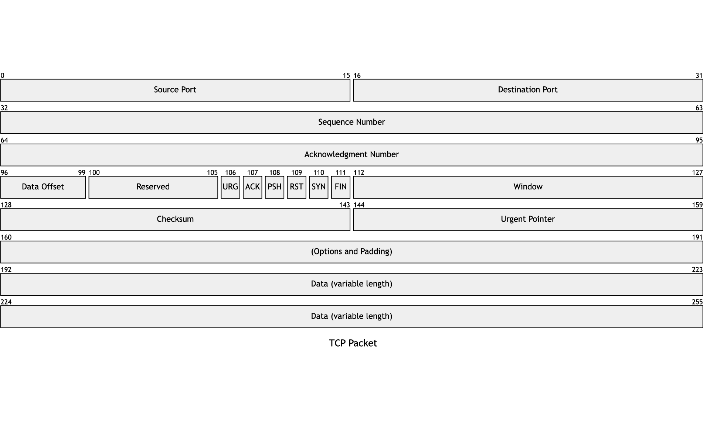

<!--
packet
0-15: "Source Port"
16-31: "Destination Port"
32-63: "Sequence Number"
64-95: "Acknowledgment Number"
96-99: "Data Offset"
100-105: "Reserved"
106: "URG"
107: "ACK"
108: "PSH"
109: "RST"
110: "SYN"
111: "FIN"
112-127: "Window"
128-143: "Checksum"
144-159: "Urgent Pointer"
160-191: "(Options and Padding)"
192-255: "Data (variable length)"
-->
<!-- note: RFC 9293 consolidates TCP specs. Options are variable-length and may affect performance (e.g., MSS during handshake, window scaling for high BDP paths). -->

---
layout: section
---

# Connection Establishment

---
layout: default
---

# The Three-Way Handshake (SYN, SYN+ACK, ACK)

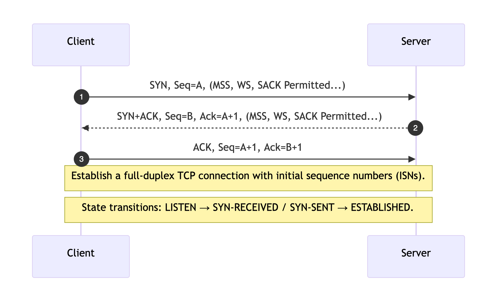

<!--
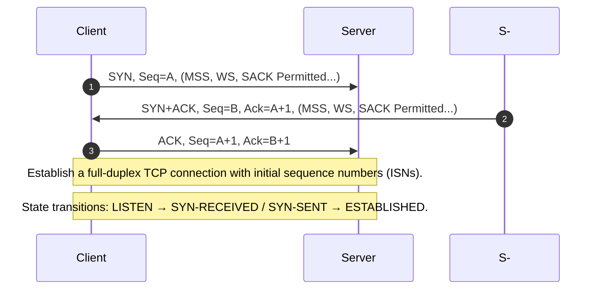
```mermaid
sequenceDiagram
    autonumber
    participant C as Client
    participant S as Server
    C->>S: SYN, Seq=A, (MSS, WS, SACK Permitted...)
    S- ->>C: SYN+ACK, Seq=B, Ack=A+1, (MSS, WS, SACK Permitted...)
    C->>S: ACK, Seq=A+1, Ack=B+1
    Note over C,S: Establish a full-duplex TCP connection with initial sequence numbers (ISNs).
    Note over C,S: State transitions: LISTEN → SYN-RECEIVED / SYN-SENT → ESTABLISHED.
```
-->

<!-- note: The SYN carries options such as MSS. Both sides advertise receive windows; scaling may also be negotiated here. -->

---

# TCP States Around Handshake

- **Server**: LISTEN → **SYN-RECEIVED** → **ESTABLISHED**  
- **Client**: **SYN-SENT** → **ESTABLISHED**  
- ISNs (A and B) protect against reordering and old duplicates; ACK confirms receipt of the peer’s ISN.

<!-- note: This directly maps to the classic “three-way handshake” diagrams used in protocol texts. -->

---

# Data segmentation

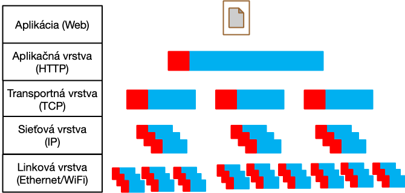

---

# Sequence and Acknowledgement numbers

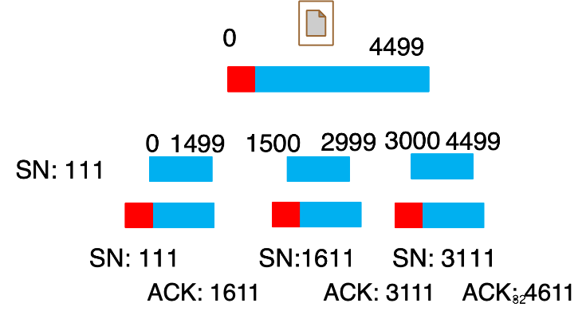
---

# Segmentation and Acknowledgement numbers

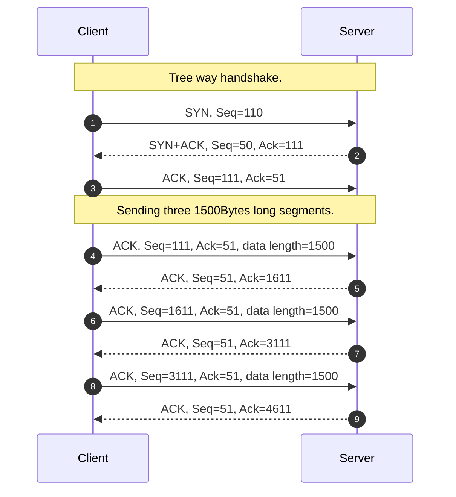
```mermaid {scale:0.6}
sequenceDiagram
    autonumber
    participant C as Client
    participant S as Server
    Note over C,S: Tree way handshake.
    C->>S: SYN, Seq=110
    S-->>C: SYN+ACK, Seq=50, Ack=111
    C->>S: ACK, Seq=111, Ack=51
    Note over C,S: Sending three 1500Bytes long segments.
    C->>S: ACK, Seq=111, Ack=51, data length=1500
    S-->>C: ACK, Seq=51, Ack=1611
    C->>S: ACK, Seq=1611, Ack=51, data length=1500
    S-->>C: ACK, Seq=51, Ack=3111
    C->>S: ACK, Seq=3111, Ack=51, data length=1500
    S-->>C: ACK, Seq=51, Ack=4611
```

---
layout: section
---

# Connection Termination

---

# Four-Segment Teardown

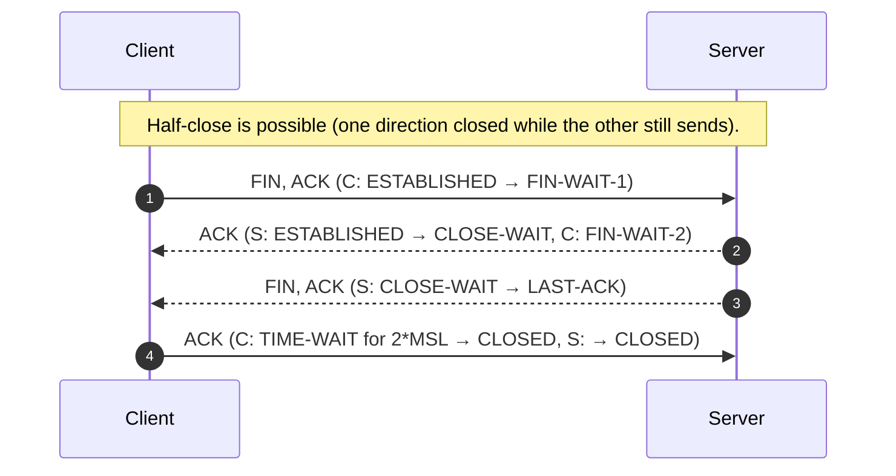
```mermaid
sequenceDiagram
    autonumber
    participant C as Client
    participant S as Server
    Note over C,S: Half-close is possible (one direction closed while the other still sends).
    C->>S: FIN, ACK  (C: ESTABLISHED → FIN-WAIT-1)
    S-->>C: ACK      (S: ESTABLISHED → CLOSE-WAIT, C: FIN-WAIT-2)
    S-->>C: FIN, ACK (S: CLOSE-WAIT → LAST-ACK)
    C->>S: ACK       (C: TIME-WAIT for 2*MSL → CLOSED, S: → CLOSED)
```

<!-- note: TIME-WAIT (2*MSL) ensures late segments are drained and prevents confusion of old connections. -->

---

# Four-Segment Teardown Example

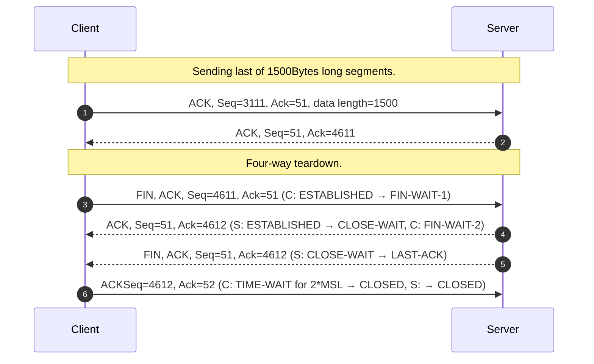
```mermaid {scale:0.75}
sequenceDiagram
    autonumber
    participant C as Client
    participant S as Server
    Note over C,S: Sending last of 1500Bytes long segments.
    C->>S: ACK, Seq=3111, Ack=51, data length=1500
    S-->>C: ACK, Seq=51, Ack=4611
    Note over C,S: Four-way teardown.
    C->>S: FIN, ACK, Seq=4611, Ack=51  (C: ESTABLISHED → FIN-WAIT-1)
    S-->>C: ACK, Seq=51, Ack=4612      (S: ESTABLISHED → CLOSE-WAIT, C: FIN-WAIT-2)
    S-->>C: FIN, ACK, Seq=51, Ack=4612  (S: CLOSE-WAIT → LAST-ACK)
    C->>S: ACKSeq=4612, Ack=52       (C: TIME-WAIT for 2*MSL → CLOSED, S: → CLOSED)
```

---
layout: section
---

## TCP state diagram

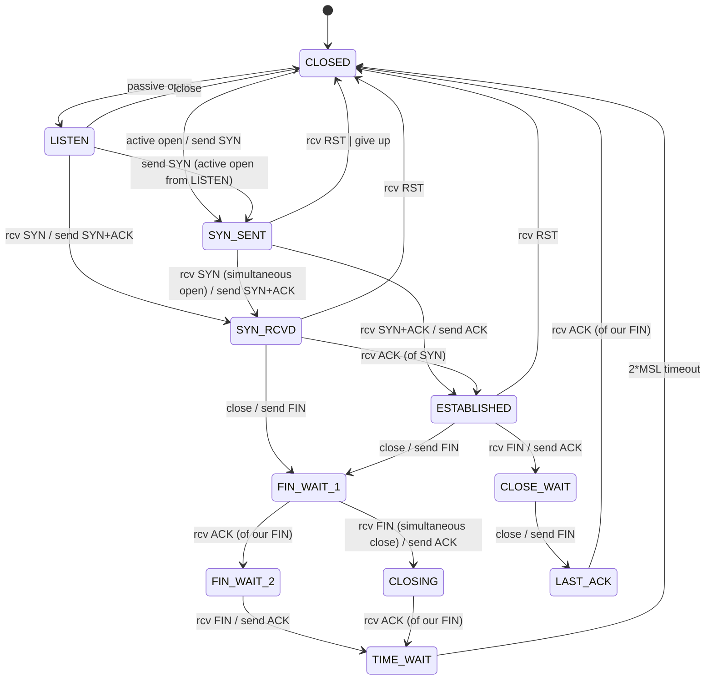
```mermaid {scale:0.48}
stateDiagram-v2
    direction TB

    %% States
    [*] --> CLOSED
    CLOSED --> LISTEN: passive open
    CLOSED --> SYN_SENT: active open / send SYN
    LISTEN --> SYN_RCVD: rcv SYN / send SYN+ACK
    LISTEN --> SYN_SENT: send SYN (active open from LISTEN)
    LISTEN --> CLOSED: close
    SYN_SENT --> ESTABLISHED: rcv SYN+ACK / send ACK
    SYN_SENT --> SYN_RCVD: rcv SYN (simultaneous open) / send SYN+ACK
    SYN_SENT --> CLOSED: rcv RST | give up
    SYN_RCVD --> ESTABLISHED: rcv ACK (of SYN)
    SYN_RCVD --> FIN_WAIT_1: close / send FIN
    SYN_RCVD --> CLOSED: rcv RST
    ESTABLISHED --> FIN_WAIT_1: close / send FIN
    ESTABLISHED --> CLOSE_WAIT: rcv FIN / send ACK
    ESTABLISHED --> CLOSED: rcv RST
    FIN_WAIT_1 --> FIN_WAIT_2: rcv ACK (of our FIN)
    FIN_WAIT_1 --> CLOSING: rcv FIN (simultaneous close) / send ACK
    FIN_WAIT_2 --> TIME_WAIT: rcv FIN / send ACK
    CLOSING --> TIME_WAIT: rcv ACK (of our FIN)
    CLOSE_WAIT --> LAST_ACK: close / send FIN
    LAST_ACK --> CLOSED: rcv ACK (of our FIN)
    TIME_WAIT --> CLOSED: 2*MSL timeout
```
---
layout: section
---

## TCP client state diagram

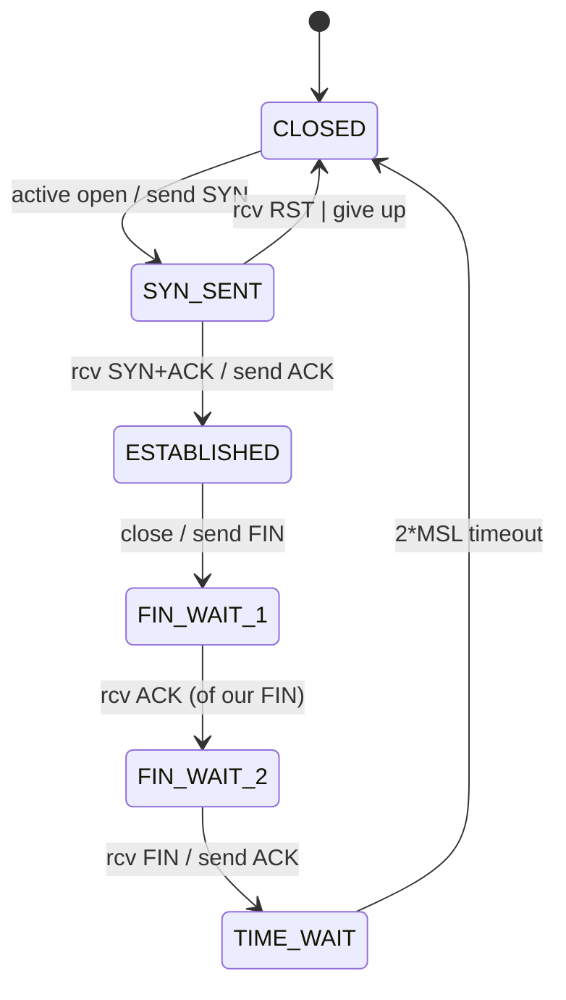
```mermaid {scale:0.6}
stateDiagram-v2
    direction TB

    %% States
    [*] --> CLOSED
    CLOSED --> SYN_SENT: active open / send SYN 
    SYN_SENT --> ESTABLISHED: rcv SYN+ACK / send ACK
    SYN_SENT --> CLOSED: rcv RST | give up
    ESTABLISHED --> FIN_WAIT_1: close / send FIN
    FIN_WAIT_1 --> FIN_WAIT_2: rcv ACK (of our FIN)
    FIN_WAIT_2 --> TIME_WAIT: rcv FIN / send ACK
    TIME_WAIT --> CLOSED: 2*MSL timeout
```

---
layout: section
---

## TCP client and server state diagram

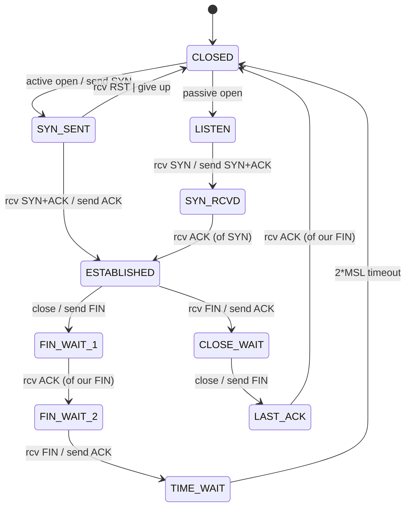
```mermaid {scale:0.6}
stateDiagram-v2
    direction TB

    %% States
    [*] --> CLOSED
    CLOSED --> SYN_SENT: active open / send SYN 
    CLOSED --> LISTEN: passive open
    LISTEN --> SYN_RCVD: rcv SYN / send SYN+ACK
    SYN_SENT --> ESTABLISHED: rcv SYN+ACK / send ACK
    SYN_SENT --> CLOSED: rcv RST | give up
    SYN_RCVD --> ESTABLISHED: rcv ACK (of SYN)
    ESTABLISHED --> FIN_WAIT_1: close / send FIN
    ESTABLISHED --> CLOSE_WAIT: rcv FIN / send ACK
    FIN_WAIT_1 --> FIN_WAIT_2: rcv ACK (of our FIN)
    FIN_WAIT_2 --> TIME_WAIT: rcv FIN / send ACK
    CLOSE_WAIT --> LAST_ACK: close / send FIN
    LAST_ACK --> CLOSED: rcv ACK (of our FIN)
    TIME_WAIT --> CLOSED: 2*MSL timeout
```

---
layout: section
---

## TCP state diagram

```mermaid {scale:0.48}
stateDiagram-v2
    direction TB

    %% States
    [*] --> CLOSED
    CLOSED --> LISTEN: passive open
    CLOSED --> SYN_SENT: active open / send SYN
    LISTEN --> SYN_RCVD: rcv SYN / send SYN+ACK
    LISTEN --> SYN_SENT: send SYN (active open from LISTEN)
    LISTEN --> CLOSED: close
    SYN_SENT --> ESTABLISHED: rcv SYN+ACK / send ACK
    SYN_SENT --> SYN_RCVD: rcv SYN (simultaneous open) / send SYN+ACK
    SYN_SENT --> CLOSED: rcv RST | give up
    SYN_RCVD --> ESTABLISHED: rcv ACK (of SYN)
    SYN_RCVD --> FIN_WAIT_1: close / send FIN
    SYN_RCVD --> CLOSED: rcv RST
    ESTABLISHED --> FIN_WAIT_1: close / send FIN
    ESTABLISHED --> CLOSE_WAIT: rcv FIN / send ACK
    ESTABLISHED --> CLOSED: rcv RST
    FIN_WAIT_1 --> FIN_WAIT_2: rcv ACK (of our FIN)
    FIN_WAIT_1 --> CLOSING: rcv FIN (simultaneous close) / send ACK
    FIN_WAIT_2 --> TIME_WAIT: rcv FIN / send ACK
    CLOSING --> TIME_WAIT: rcv ACK (of our FIN)
    CLOSE_WAIT --> LAST_ACK: close / send FIN
    LAST_ACK --> CLOSED: rcv ACK (of our FIN)
    TIME_WAIT --> CLOSED: 2*MSL timeout
```

---

# Timers & Retransmissions

## Core TCP Timers (overview)
- Connection establishment timer
- Delayed ACK timer 
- Persistence timer
- Retransmission timer
- Fin_Wait_2 timer
- Time_Wait timer (2MSL timer)
- Keepalive timer)

## What is the purpose?
- Creating reliable connection over non reliable 

---

# Timers & Retransmissions

## Core TCP Timers (overview)

## What is the purpose?
- Creating reliable connection over non reliable channel

<!-- note: Names align with classic descriptions: establishment, delayed ACK, persistence (ZWP), retransmission, FIN-WAIT-2, TIME-WAIT, keepalive. -->

---
layout: three-slots
---

## Core TCP Timers (overview)

::left::

```mermaid {scale:0.6}
stateDiagram-v2
    direction TB

    %% States
    [*] --> CLOSED
    CLOSED --> SYN_SENT: active open / send SYN 
    CLOSED --> LISTEN: passive open
    LISTEN --> SYN_RCVD: rcv SYN / send SYN+ACK
    SYN_SENT --> ESTABLISHED: rcv SYN+ACK / send ACK
    SYN_SENT --> CLOSED: rcv RST | give up
    SYN_RCVD --> ESTABLISHED: rcv ACK (of SYN)
    ESTABLISHED --> FIN_WAIT_1: close / send FIN
    ESTABLISHED --> CLOSE_WAIT: rcv FIN / send ACK
    FIN_WAIT_1 --> FIN_WAIT_2: rcv ACK (of our FIN)
    FIN_WAIT_2 --> TIME_WAIT: rcv FIN / send ACK
    CLOSE_WAIT --> LAST_ACK: close / send FIN
    LAST_ACK --> CLOSED: rcv ACK (of our FIN)
    TIME_WAIT --> CLOSED: 2*MSL timeout

```

::right::

- Connection establishment timer 
- Delayed ACK timer 
- Persistence timer
- Retransmission timer
- Fin_Wait_2 timer
- Time_Wait timer (2MSL timer) 
- Keepalive timer

---
layout: three-slots
---

## Core TCP Timers (overview)

::left::

```mermaid {scale:0.6}
stateDiagram-v2
    direction TB

    %% States
    [*] --> CLOSED
    CLOSED --> SYN_SENT: active open / send SYN 
    CLOSED --> LISTEN: passive open
    LISTEN --> SYN_RCVD: rcv SYN / send SYN+ACK
    SYN_SENT --> ESTABLISHED: rcv SYN+ACK / send ACK
    SYN_SENT --> CLOSED: rcv RST | give up
    SYN_RCVD --> ESTABLISHED: rcv ACK (of SYN)
    ESTABLISHED --> FIN_WAIT_1: close / send FIN
    ESTABLISHED --> CLOSE_WAIT: rcv FIN / send ACK
    FIN_WAIT_1 --> FIN_WAIT_2: rcv ACK (of our FIN)
    FIN_WAIT_2 --> TIME_WAIT: rcv FIN / send ACK
    CLOSE_WAIT --> LAST_ACK: close / send FIN
    LAST_ACK --> CLOSED: rcv ACK (of our FIN)
    TIME_WAIT --> CLOSED: 2*MSL timeout

```

::right::

- 
 Connection establishment timer 

Starts when a client sends a SYN packet to initiate a connection. If the timer expires before an acknowledgment is received, the sender retransmits the SYN packet. 

- 
 Fin_Wait_2 timer 

he "finwait2 timer" refers to the FIN_WAIT_2 timer in TCP/IP networking, which dictates how long a system waits before forcibly closing a connection that is in the FIN_WAIT_2 state.
- 
 Time_Wait timer (2MSL timer) 

Ensures the proper closure of a connection by keeping it in the TIME_WAIT state for twice the Maximum Segment Lifetime (2MSL).

<!-- The 2MSL timer is a TCP (Transmission Control Protocol) timer that ensures the proper closure of a connection by keeping it in the TIME_WAIT state for twice the Maximum Segment Lifetime (2MSL). Its primary purpose is to prevent old, delayed packets from a previous connection from being mistakenly accepted as part of a new connection with the same IP addresses and port numbers. The timer starts after a TCP connection is actively closed and its duration is set by the implementation, with common values being 60 seconds (for a 2MSL of 120 seconds). 

-->

---
layout: three-slots
---

## Core TCP Timers (overview)

::left::

 

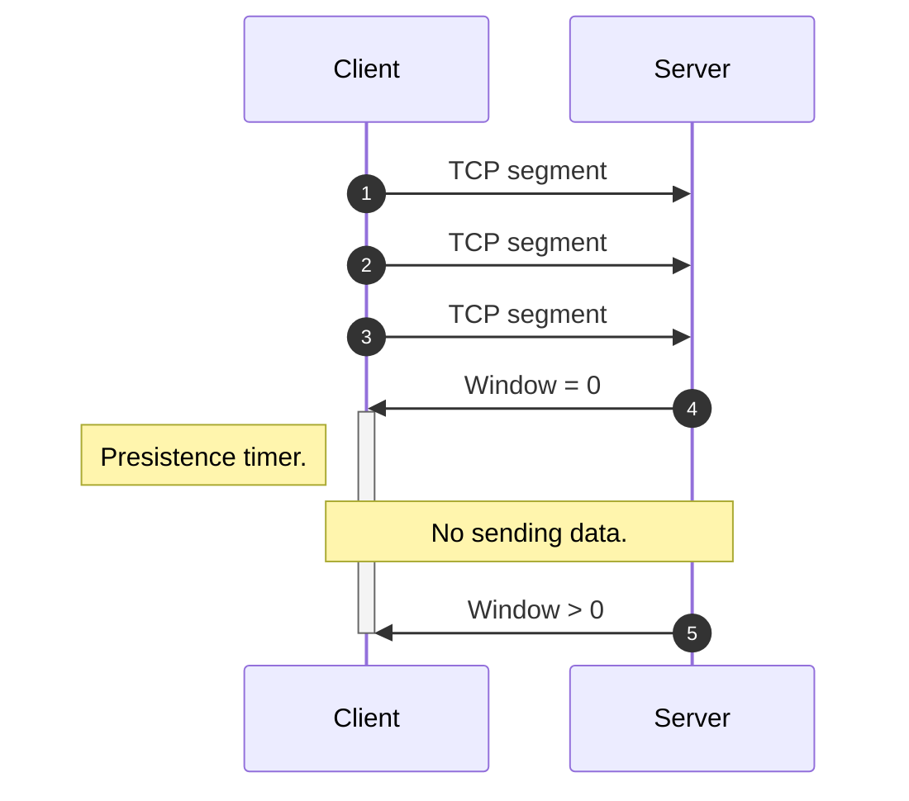
```mermaid {scale:0.75}
sequenceDiagram
    autonumber
    participant C as Client
    participant S as Server
    C->>S: TCP segment
    C->>S: TCP segment
    C->>S: TCP segment
    S->>C: Window = 0
    activate C
    Note left of C: Presistence timer.
    Note over C,S: No sending data.
    S->>C: Window > 0
    deactivate C

```

::right::
- Persistence timer

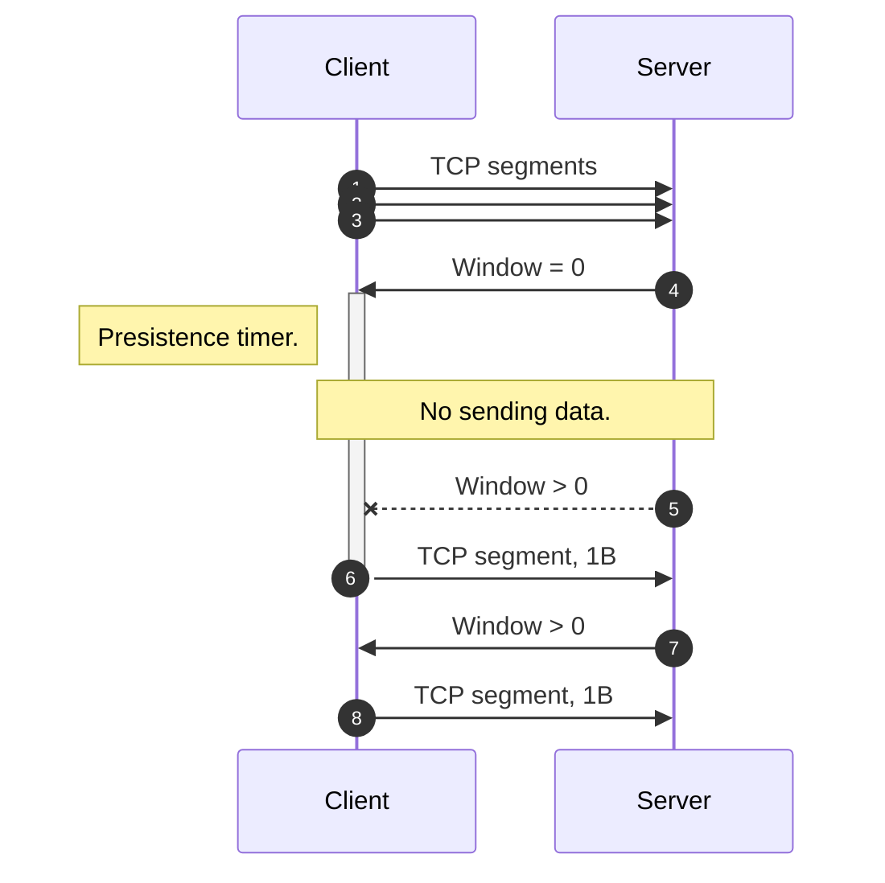
```mermaid {scale:0.75}
sequenceDiagram
    autonumber
    participant C as Client
    participant S as Server
    C->>S: TCP segments
    C->>S: 
    C->>S: 
    S->>C: Window = 0
    activate C
    Note left of C: Presistence timer.
    Note over C,S: No sending data.
    S--xC: Window > 0
    C->>S: TCP segment, 1B
    deactivate C
    S->>C: Window > 0
    C->>S: TCP segment, 1B
    
```

---

## Core TCP Timers (overview)
- Retransmission timer

---

## Core TCP Timers (overview)
- <s> Connection establishment timer </s>
- Delayed ACK timer 
- <s> Persistence timer </s>
- <s> Retransmission timer </s>
- <s> Fin_Wait_2 timer </s>
- <s> Time_Wait timer (2MSL timer) </s>
- Keepalive timer

---

# Measuring RTT and Setting RTO

- TCP estimates **RTT** per connection; a smoothed value and variance are used to compute **RTO**, so that timeouts adapt to network conditions.  
- On timeout, the **unacknowledged** segment(s) are retransmitted; **duplicate ACKs** can also trigger fast retransmit (beyond today’s scope).  
- Practical impact: too small RTO ⇒ spurious retransmissions; too large ⇒ slow loss recovery.

<!-- note: Demo in Wireshark: follow TCP stream, inspect round-trip timing and retransmissions. -->

---
layout: section
---

# Flow vs. Congestion Control

---
layout:default
---

# Flow Control (Receiver Window)

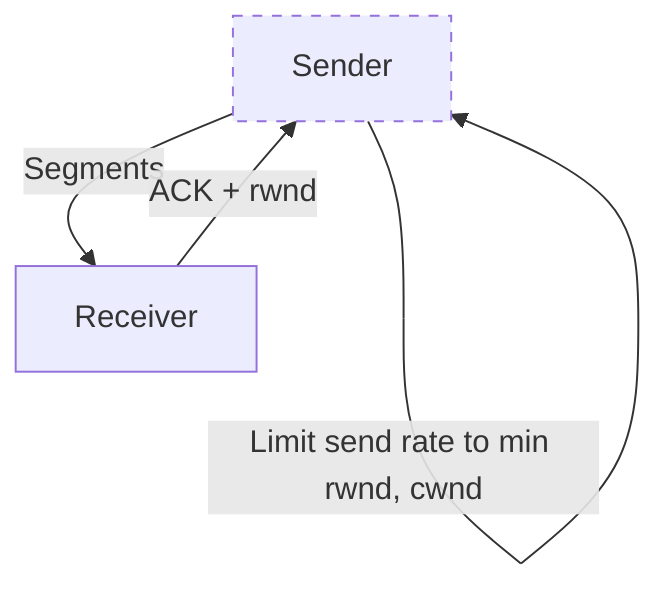
```mermaid
flowchart TB
    A[Sender] -- Segments --> B[Receiver]
    B -- ACK + rwnd --> A
    A:::note -->|Limit send rate to min rwnd, cwnd | A
    classDef note stroke-dasharray: 5 5;
```

- The receiver advertises **rwnd** (receive window) to avoid overrunning its buffer.  
- Sender must respect rwnd: in-flight bytes ≤ rwnd.  
- Zero-window situations trigger the **persistence timer** (probing for space).

---

# Congestion Control (Congestion Window)

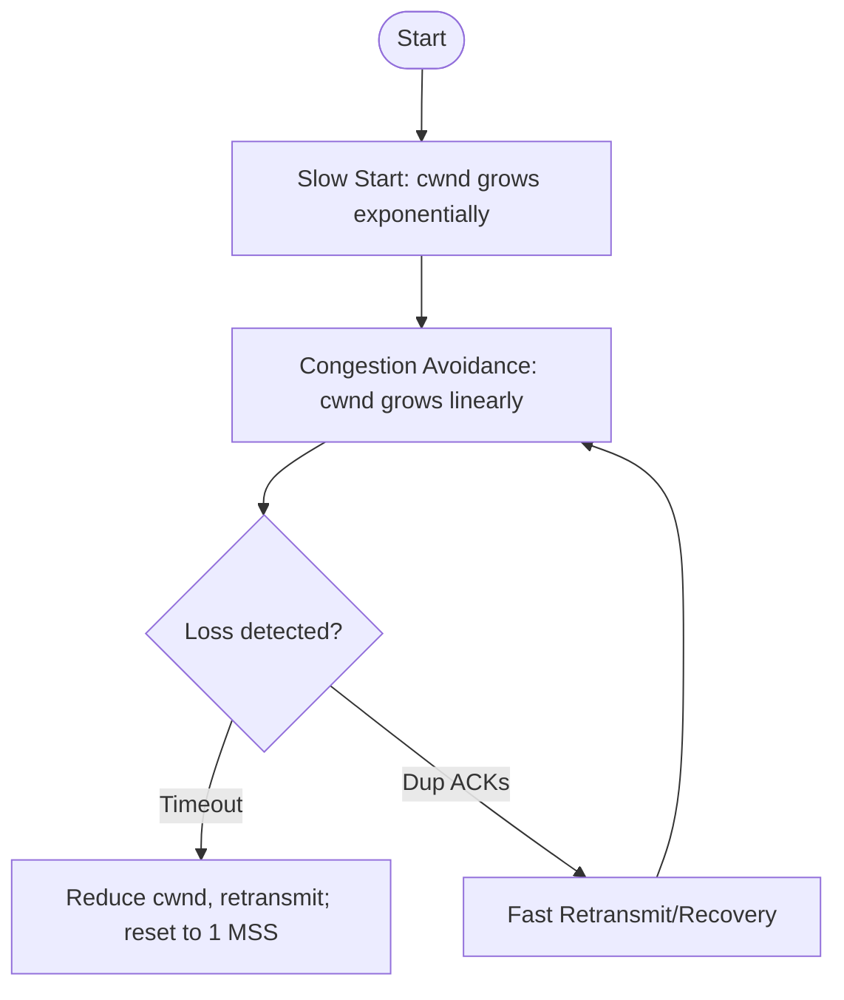
```mermaid {scale: 0.5}
flowchart TB 
    start([Start]) --> ss[Slow Start: cwnd grows exponentially]
    ss --> ca[Congestion Avoidance: cwnd grows linearly]
    ca --> loss{Loss detected?}
    loss -->|Timeout| reset[Reduce cwnd, retransmit; reset to 1 MSS]
    loss -->|Dup ACKs| fr[Fast Retransmit/Recovery]
    fr --> ca
```

- Sender maintains a **cwnd** reflecting its view of the path capacity.  
- Typical behavior: **slow start** initially, then **congestion avoidance**; on loss, reduce cwnd and recover.  
- Flow control (rwnd) and congestion control (cwnd) interact: effective window = min(rwnd, cwnd).

<!-- note: Modern TCP variants (CUBIC, BBR) refine growth/response; out of scope for this lecture. -->

---
layout: section
---

# Error Control (ARQ Family)

---
layout:default
---

# Feedback-Based ARQ

- **ACK-based (P-scheme)**, **NAK/REJ-based (N-scheme)**, or **combined (A-scheme)**.  
- **Block (idle)** vs. **continuous** sending strategies.  
- TCP uses continuous ARQ with selective mechanisms (SACK) when negotiated.

---

# Block ARQ — A-scheme (simple)

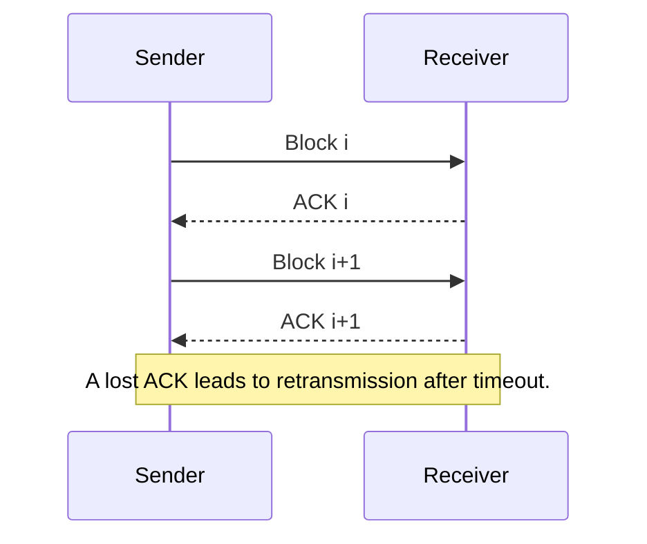
```mermaid
sequenceDiagram
    participant S as Sender
    participant R as Receiver
    S->>R: Block i
    R-->>S: ACK i
    S->>R: Block i+1
    R-->>S: ACK i+1
    Note over S,R: A lost ACK leads to retransmission after timeout.
```

---

# Continuous Selective ARQ — A-scheme

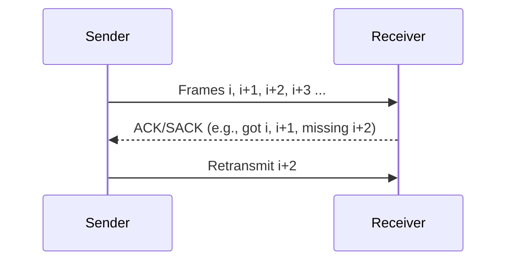
```mermaid
sequenceDiagram
    participant S as Sender
    participant R as Receiver
    S->>R: Frames i, i+1, i+2, i+3 ...
    R-->>S: ACK/SACK (e.g., got i, i+1, missing i+2)
    S->>R: Retransmit i+2
```

---

# Go-Back-N (Continuous, A-scheme)

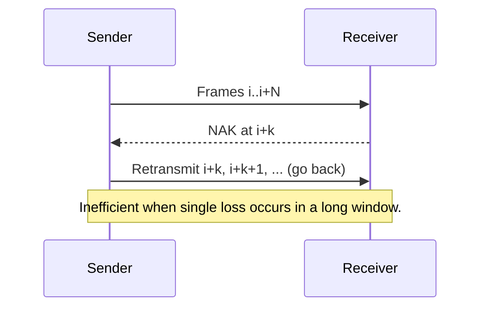
```mermaid
sequenceDiagram
    participant S as Sender
    participant R as Receiver
    S->>R: Frames i..i+N
    R-->>S: NAK at i+k
    S->>R: Retransmit i+k, i+k+1, ... (go back)
    Note over S,R: Inefficient when single loss occurs in a long window.
```

---
layout: section
---

# ECN and TCP Extensions

---

# ECN (Explicit Congestion Notification)

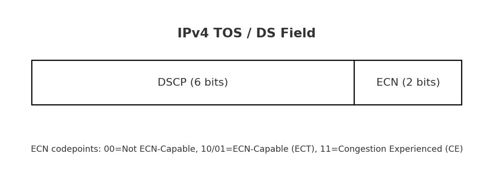

- Network marks congestion (**CE**) instead of dropping; endpoints must react (reduce cwnd).  
- TCP flags: **ECE** (ECN-Echo) and **CWR** (Congestion Window Reduced); **NS** (Nonce Sum, historic).  
- Benefits: can avoid loss when queues fill, improving latency under load.

<!-- note: ECN requires support in endpoints and along the path (or at least not remarking ECN bits). -->

---

# Common TCP Options

- **MSS** (Maximum Segment Size): negotiated in SYN to avoid IP fragmentation.  
- **Window Scale**: extends window beyond 65,535 bytes for high BDP paths.  
- **SACK Permitted** and **SACK blocks**: allow selective acknowledgment for efficient loss recovery.  
- **Timestamp option**: improves RTT estimation and PAWS (Protection Against Wrapped Sequence numbers).

<!-- note: Revisit in labs; observe options in SYN/SYN+ACK with Wireshark. -->

---
layout: default
---

# Worked Byte-Stream Example

- Application writes 4,500 bytes. TCP segments into ~3 × 1500B payloads (MSS-dependent).  
- Sequence numbers advance by bytes sent; ACK number = next expected byte.  
- After data exchange, teardown proceeds via FIN/ACK handshake and TIME-WAIT.

<!-- note: Connect to the earlier Slovak slide: SN=111, ACK transitions, three 1500B data segments. -->

---
layout: default
---

# Summary

**Key takeaways:**  
- TCP is a **reliable, ordered, full-duplex byte stream** on top of IP.  
- The **three-way handshake** establishes state and negotiates options.  
- **Timers** (RTT→RTO, persistence, delayed ACK, TIME-WAIT) govern reliability and liveness.  
- **Flow control** (rwnd) protects receivers; **congestion control** (cwnd) protects the network.  
- **Extensions** like ECN, SACK, window scaling improve robustness and performance.

<!-- note: For practice, analyze a PCAP of an HTTP transaction; locate SYN→SYN+ACK→ACK, options, and teardown. -->

---

# References (optional reading)

- RFC 9293: Transmission Control Protocol (TCP) — 2022 (consolidated TCP specification).  
- RFC 3168: The Addition of ECN to IP — 2001 (ECN semantics).  
- Stevens et al., TCP/IP Illustrated, Vol. 1.  
- IETF/TCPM WG drafts on modern congestion control (CUBIC, BBR) — background only.

<!-- note: External sources not strictly required for this lecture; the above are authoritative references. -->
