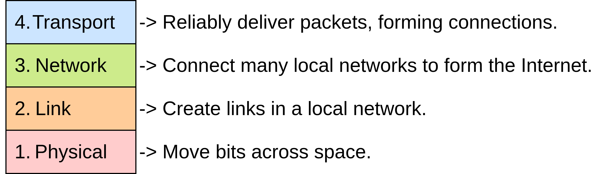
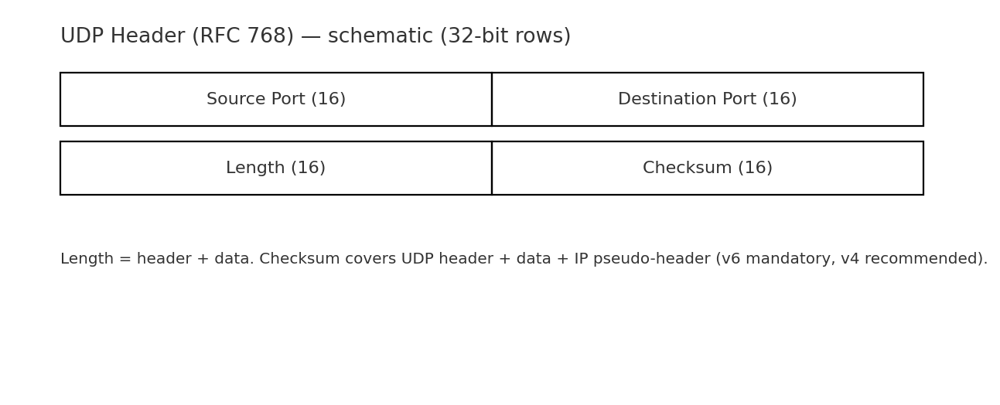
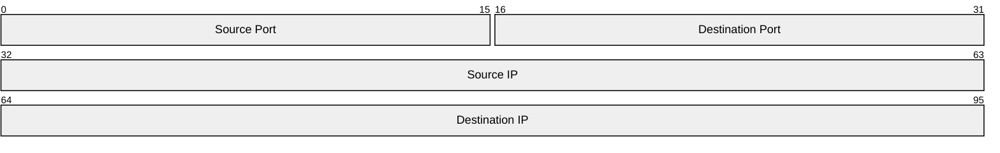
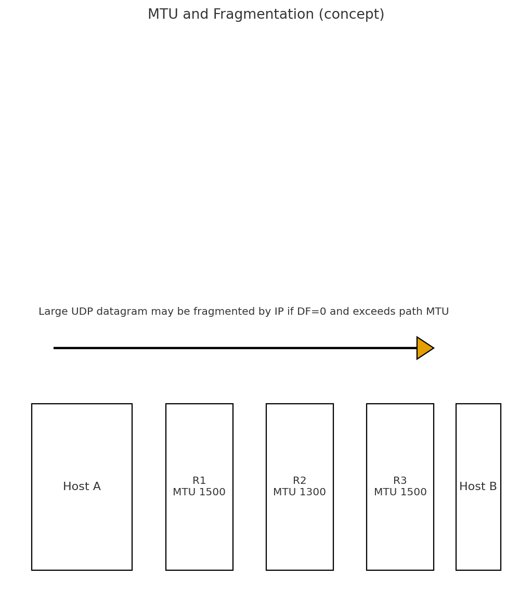
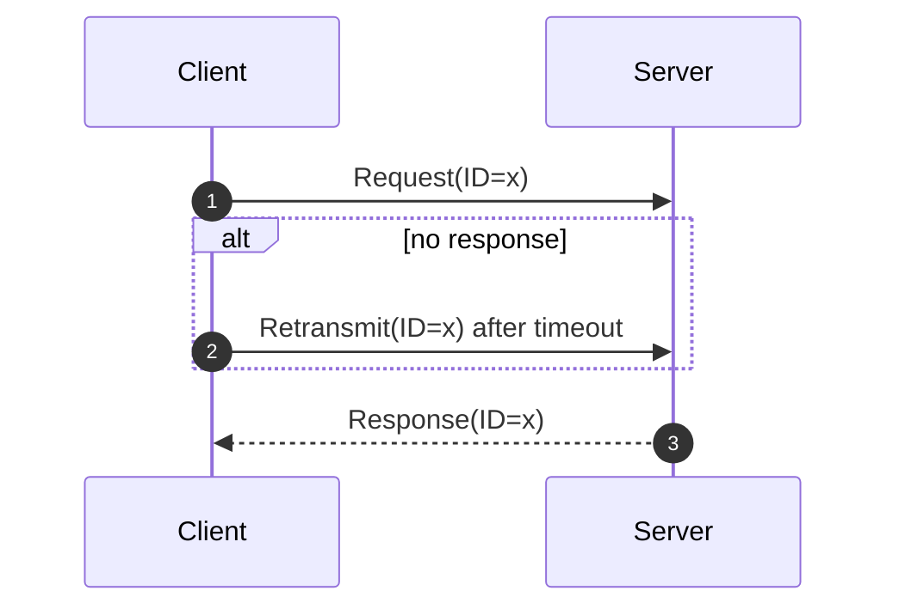
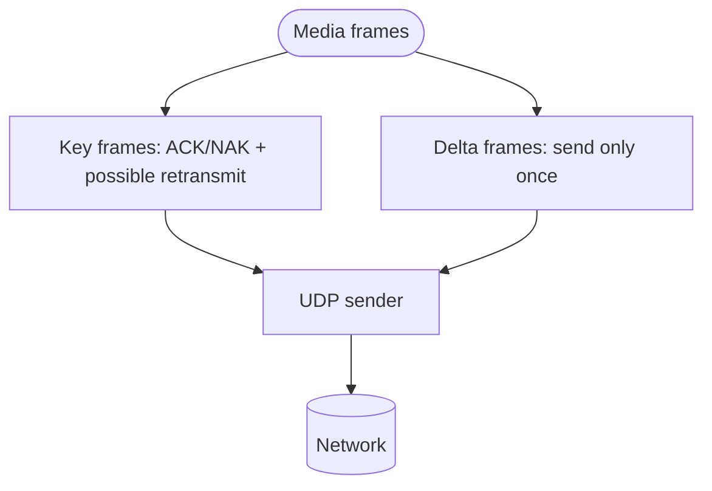

<!-- note: Variant (b). Clean narrative; diagrams via Mermaid where suitable; PNGs for header/MTU. -->

# Computer and Communication Networks : 
## User Datagram Protocol (UDP)

Lecture 4

A lightweight, connectionless transport for applications that value low overhead and latency over built-in reliability and ordering.

---
layout: default
---

# Transport layer
**Transport** layer builds on top of Layer 3 (global packet delivery).
- Adds extra mechanisms (e.g. re-sending lost packets) for reliable packet delivery.
- Splits up large data into packets to send them. Reassembles received packets.
- Instead of individual packets, can think about **flows** (aka **connections**): A stream of packets exchanged between two endpoints.

&nbsp;

---

# UDP in the TCP/IP Stack

- Sits above IP; provides **minimal** transport functions: ports, length, checksum.  
- **No connection state**: no handshake, no teardown.  
- **No reliability/order**: applications handle loss/reordering if they care; they also **pace** to be congestion-friendly.

---

# UDP Header (fixed 8 bytes)

- **Source Port**, **Destination Port**, **Length**, **Checksum**.  
- **Length** includes header + payload.  
- **Checksum** covers header + payload + **IP pseudo-header** (mandatory in IPv6; recommended in IPv4).

<!-- note: Pseudo-header ties checksum to IP addresses to detect misdelivery. -->

---

# IP pseudo-header (mandatory in IPv6; recommended in IPv4).

- For historical reasons
- Creating relationship between Source IP/Port and Destination IP/Port

---
layout: two-cols
---

## Multiplexing by Ports

- Demultiplexing via ⟨srcIP,srcPort,dstIP,dstPort⟩.  
- Examples: **53/UDP (DNS)**, **67/68 (DHCP)**, **123 (NTP)**, **161 (SNMP)**.  
- Servers often bind to a well-known port; clients use ephemeral ports.

::right::

## Connectionless Model

- Each datagram is handled independently.  
- Immediate send/receive without prior setup ⇒ **low startup latency**.  
- Fits request/response and streaming where occasional loss is acceptable.

---

# Path MTU and Fragmentation

- Datagram larger than path MTU may be **fragmented** by IP (if DF=0).  
- Loss of any fragment drops the whole datagram; avoid oversized messages.  
- Prefer **PMTUD/PLPMTUD** strategies and keep payloads conservative for Internet paths.

<!-- note: Many apps cap UDP payload to ~1200 bytes to leave headroom for IPv6/tunnels. -->

---
layout: two-cols
---

## Pros

- Minimal overhead; **low latency**.  
- Suits **multicast/broadcast** (where available).  
- Simple request/response semantics.

::right::

## Cons

- No built-in reliability, ordering, or congestion control.  
- Fragmentation risk for large datagrams.  
- App must implement pacing and any needed recovery logic.

---

# Typical Use-Cases

- **DNS**, **DHCP**, **NTP**, **SNMP**.  
- **RTP** media streams (voice/video).  
- **Gaming** and telemetry with custom light reliability.  
- User-space transports that layer their own security/CC above UDP.

---
layout: section
---

# Reliability on Top of UDP

---

# Lightweight Request/Response

- Add an **ID/sequence** to match responses and filter duplicates.  
- Use **RTT-based** timeout with bounded retries.  
- Consider integrity/authentication if needed.

---

# Selective Protection for Streams

- **Retransmit only key units** when RTT allows; otherwise use **FEC**.  
- Adapt rate to observed loss/latency to stay congestion-friendly.

---
layout: default
---

# Security & Operations

- Beware of **spoofing and amplification**; validate queries and cap response sizes.  
- Prefer **auth/encryption** at the application layer (or higher transport).  
- Monitor loss/latency and **pace** sends to avoid self-inflicted drops.

---
layout: default
---

# Summary

- UDP: **simple datagram transport** with port multiplexing and optional checksum.  
- No reliability/order/CC ⇒ app must add what it needs.  
- Keep datagrams **small** vs. path MTU, and be **congestion-friendly**.  
- Ideal for DNS, NTP, DHCP, SNMP, RTP, games, and lightweight telemetry.

---

# References (optional)

- RFC 768 — User Datagram Protocol.  
- Guidance on PMTUD/PLPMTUD for safe packet sizing.  
- Stevens et al., TCP/IP Illustrated, Vol. 1.
