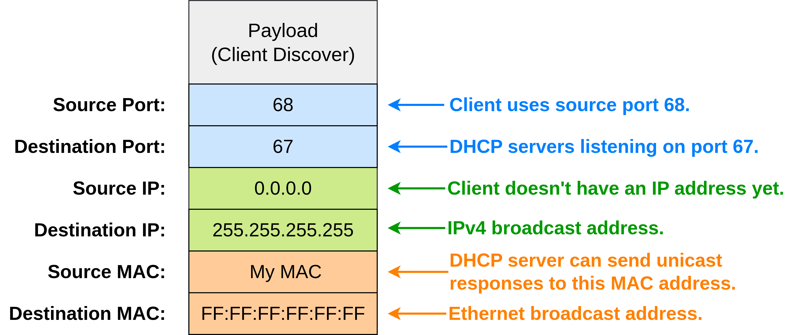
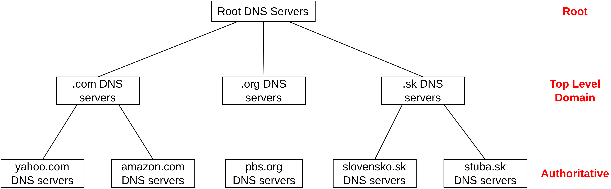

```mermaid {scale:0.60}
sequenceDiagram
    participant C as Client
    participant S as Server

    Note over C,S: Single TCP connection

    C->>S: GET /img1
    C->>S: GET /img2
    C->>S: GET /img3
    Note over C,S: Requests pipelined<br/>but responses must stay in order

    S-->>C: img1 (slow)
    S-->>C: img2 (fast but waits 😬)
    S-->>C: img3
    Note over C,S: ❌ Head-of-line blocking
```

```mermaid {scale:0.60}
sequenceDiagram
    participant C as Client
    participant S as Server

    Note over C,S: Single TCP connection, frames interleaved

    C->>S: GET /img1
    C->>S: GET /img2
    C->>S: GET /img3
    Note over C,S: All requests sent immediately ✅

    S-->>C: img2-frames
    S-->>C: img1-frames
    S-->>C: img3-frames
    Note over C,S: ✅ Independent streams<br/>No order constraint
```

```mermaid {scale:0.70}
sequenceDiagram
    participant C as Client
    participant S as Server

    C->>S: ClientHello
    S->>C: ServerHello
    S->>C: Server Certificate
    C->>S: Client Key Exchange
    Note over C,S: 🔑 Derive shared secret keys
```

```mermaid {scale:0.70}
sequenceDiagram
    participant C as Client
    participant S as Server

    C->>S: ClientHello
    S->>C: ServerHello
    S->>C: Server Certificate
    C->>S: Client Key Exchange
    Note over C,S: 🔑 Derive shared secret keys
    C->>S: ChangeCipherSpec / Finished
    S->>C: ChangeCipherSpec / Finished
```

```mermaid {scale:0.70}
sequenceDiagram
    participant C as Client
    participant S as Server

    C->>S: ClientHello
    S->>C: ServerHello
    S->>C: Server Certificate
    C->>S: Client Key Exchange
    Note over C,S: 🔑 Derive shared secret keys
    C->>S: ChangeCipherSpec / Finished
    S->>C: ChangeCipherSpec / Finished
    Note over C,S: 🔒 Encrypted communication begins
```

# Computer and Communication Networks : Application layer

Lecture 5

---
layout: default
---

# Content overview

- Application layer: overview
- DHCP
- DNS
- HTTP
- TLS
- A day in the life of a web request

---
layout: section
---

# Application layer: overview

---

# Some network apps

---
layout: three-slots
---

# Creating a network app

::left::
Write programs that:
- run on **different end systems**
- **communicate** over **network**
- e.g., web server software communicates with browser software

No need to write software for **network-core devices**:
- network-core devices **do not run user applications**
- keeping apps on **end systems** enables rapid development and deployment

::right::

---
layout: three-slots
---

# Client-server paradigm

::left::
**Server:** 
- always-on host
- permanent IP address
- often in data centers, for scaling

**Clients:**
- contact, communicate with server
- may be intermittently connected
- may have dynamic IP addresses
- do not communicate directly with each other
- e.g., HTTP, IMAP, FTP

::right::

---
layout: three-slots
---

# Peer-peer architecture

::left::
- no always-on server
- arbitrary end systems directly communicate
- peers request service from other peers, provide service in return to other peers
  - self scalability – new peers bring new service capacity, as well as new service demands
- peers are intermittently connected and change IP addresses
- complex management
- e.g., P2P file sharing [BitTorrent], Ethereum ...

::right::

---

# Processes communicating

**Process:** program running within a host

- Within the **same host** -> two processes communicate using **inter-process communication (IPC)**  
  *(defined by the operating system)*.
- In **different hosts** -> processes communicate by **exchanging messages** over the network.

**Clients and Servers**
- **Client process:** initiates communication.
- **Server process:** waits to be contacted.

*Note: applications with P2P architectures have client processes & server processes.*
---

# Sockets

- Process sends/receives messages to/from its socket.
- Socket analogous to door:
  - sending process shoves message out door
  - sending process relies on transport infrastructure on other side of door to deliver message to socket at receiving process
  - two sockets involved: one on each side.

---

# Addressing processes

To receive messages, process must have **identifier**:

- Host device has unique 32-bit IP address.
- Does  IP address of host on which process runs suffice for identifying the process?
    <v-click>
  
    - **No, many processes can be running on same host.**
    </v-click>
<v-click>

**Identifier** includes both **IP address** and **port numbers** associated with process on host:

- e.g., port numbers:
  - HTTP server 80
  - mail server 25
- to send HTTP message to fiit.stuba.sk web server:
  - IP address: 147.175.154.48
  - port number: 443
</v-click>
---

# An application-layer protocol defines:

- **Types of messages exchanged:** e.g., request, response...
- **Message syntax:** what fields in messages & how fields are delineated
- **Message semantics:** meaning of information in fields
- **Rules** for when and how processes send & respond to messages.
- **Open protocols:**
  - defined in RFCs, everyone has access to protocol definition
  - allows for interoperability
  - e.g., HTTP, SMTP
- **Proprietary protocols:**
  - e.g., Zoom
---

# What transport service does an app need?
<v-click>

**Data Integrity:**
- some apps (e.g., file transfer, web) need 100% reliability; others (e.g., audio/video) can tolerate some loss.
</v-click>
<v-click>

**Timing:**
- some apps (e.g., Internet telephony, interactive games) require low delay to be "effective".
</v-click>
<v-click>

**Throughput:**
- some apps (e.g., multimedia) need minimum throughput; others (elastic apps) adapt to whatever bandwidth is available.
</v-click>
<v-click>

**Security:**
- encryption, data integrity...
</v-click>
---
layout: section
---

# Dynamic Host Configuration Protocol (DHCP)

---

# Joining a New Network

When connecting to a new Ethernet network, a host needs to learn:
- **Subnet mask:** What range of addresses are local?
- **Default gateway:**  Where is the router (to reach non-local networks)?  
- **DNS server:** Where is the recursive resolver?
- **IP address:** What address can I use on this network?

*Note: The host already has a **MAC address** (built into hardware).*

Manual vs. Automatic Configuration:
- We **could** configure all this information manually.
  - But we'd have to **reconfigure every time** we join a different network. 
  - Therefore, we want an **automatic protocol** to obtain these parameters.

*Note: Manual configuration is fine for routers, which rarely move.*
---

# DHCP Handshake

```mermaid {scale:0.65}
sequenceDiagram
    participant C as Client (UDP 68)
    participant S as DHCP Server (UDP 67)

    Note over C: No IP yet (0.0.0.0), uses broadcast
    Note over C: Broadcast: is there a DHCP server out there?
    C->>S: DHCP DISCOVER (broadcast)
    Note over S: Unicast: I’m a DHCP server! Here’s an IP address you can use.
    S->>C: DHCP OFFER (IP, subnet mask, router, DNS, lease time, etc.)
    Note over C: Broadcast: OK. I would like to use this IP address!
    C->>S: DHCP REQUEST (requests offered IP)
    Note over S: Unicast: OK. You’ve got that IP address!
    S->>C: DHCP ACK (lease confirmed + options)
```

---

# DHCP Servers

DHCP servers offer configurations to new hosts.
- Listen on UDP port 67 for requests.

DHCP servers are configured with required information:
- Subnet mask, gateway router IP address, DNS resolver IP address.
- A pool of usable IP addresses.
- DHCP is extensible to provide other information.

Where are the DHCP servers?
- In a small network: Your home router.
- In a larger network: Could be a separate machine.
- Must be in same local network as the clients.
  - In larger networks, router could relay requests to a remote DHCP server

---

# Leasing IP Addresses

DHCP servers temporarily lease IP addresses to hosts.
- Host can only use that IP address for a limited time (hours or days).
- Host must renew the lease to keep using the address.
- Servers don't offer the same address to other clients if leased.
  - Avoids two hosts getting the same address.
---

# DHCP Implementation

DHCP is a Layer 7 protocol, running on top of UDP/IP.

---
layout: section
---

# Domain Name System (DNS)
---

# DNS: Overview

An Internet protocol for translating **human-readable domain names** into **IP addresses**:
- You want to send a packet to a certain domain (e.g. you type a domain into your browser).
- Your computer performs a **DNS lookup** to find the corresponding IP address.
- Once resolved, your computer sends packets to that IP address to reach the destination.

Distributed database implemented in hierarchy of many name servers:
- name server -> A server on the Internet responsible for answering DNS queries.
  - It stores mappings between domain names and IP addresses.
  - e.g., there's a name server with name fiit.stuba.sk and 147.175.154.48
---

# DNS: Services
- hostname-to-IP-address translation
- host aliasing
  - canonical, alias names
- mail server aliasing
- load distribution
  - replicated Web servers: many IP addresses correspond to one name
---

# DNS: a distributed, hierarchical database

Client wants IP address for www.amazon.com; 1st approximation:
- client queries root server to find .com DNS server
- client queries .com DNS server to get amazon.com DNS server
- client queries amazon.com DNS server to get  IP address for www.amazon.com

---

# Top-Level Domain, and authoritative servers

Top-Level Domain (TLD) servers:
- responsible for .com, .org, .net, .edu, .aero, .jobs, .museums, and all top-level country domains, e.g.: .cn, .uk, .fr, .ca, .jp
- Network Solutions: authoritative registry for .com, .net TLD

Authoritative DNS servers: 
- organization’s own DNS server(s), providing authoritative hostname to IP mappings for organization’s named hosts 
- can be maintained by organization or service provider
---

# Local DNS name servers

When host makes DNS query, it is sent to its local DNS server:
- Local DNS server returns reply, answering:
  - from its local cache of recent name-to-address translation pairs (possibly out of date!)
  - forwarding request into DNS hierarchy for resolution
- each ISP has local DNS name server; to find yours: 
  - MacOS: % scutil --dns
  - Windows: >ipconfig /all

Local DNS server doesn’t strictly belong to hierarchy.
---

# DNS name resolution: iterated query
- contacted server replies with name of server to contact
- “I don’t know this name, but ask this server”

---

# DNS name resolution: recursive query

- The client sends one query to a recursive resolver (e.g., ISP DNS, 8.8.8.8).
- The recursive resolver performs all further DNS lookups (root → TLD → authoritative).
- The client only receives the final answer (e.g., IP address).
  

---

# Caching DNS Information

- once (any) name server learns mapping, it caches mapping, and immediately returns a cached mapping in response to a query
  - caching improves response time
  - cache entries timeout (disappear) after some time (TTL)
  - TLD servers typically cached in local name servers
- cached entries may be out-of-date
  - if named host changes IP address, may not be known Internet-wide until all TTLs expire!
  - best-effort name-to-address translation!
---
layout: three-slots
---

# DNS records

DNS: distributed database storing resource records (RR)
- RR format: (name, value, type, ttl)

Type:
::left::
- **type=A**
   - name is hostname
   - value is IP address
- **type=NS**
  - name is domain (e.g., foo.com)
  - value is hostname of authoritative name server for this domain

::right::
- **type=CNAME**
  - name is alias name for some “canonical” (the real) name
  - www.ibm.com is really servereast.backup2.ibm.com
  - value is canonical name
- **type=MX**
  - value is name of SMTP mail server associated with name
---

# DNS Header

---
layout: section
---

# Hypertext Transfer Protocol (HTTP)
---
layout: three-slots
---

# Web and HTTP

First, a quick review…
- web page consists of objects, each of which can be stored on different Web servers
- object can be HTML file, JPEG image, Java applet, audio file,…
- web page consists of base HTML-file which includes several referenced objects, each addressable by a URL (Uniform Resource Locator), e.g.,

https://www.fiit.stuba.sk/harmonogram-studia.html?page_id=4941#harmonogram-akademickeho-roka-kalendar

| Part | Value | Description |
|------|-------|-------------|
| **Scheme** | *(not shown)* | Typically `https` or `http` when used in a browser |
| **Separator** | *://* |  |
| **Host / Domain** | `www.fiit.stuba.sk` | Server name |
| **Path** | */harmonogram-studia.html* | Defaults to `/` |
| **Port** | *(implicit)* | Default: 443 (HTTPS) or 80 (HTTP) |
| **Query** | *?page_id=4941* | Optional parameters |
| **Fragment** | *#harmonogram-akademickeho-roka-kalendar* | Jump to specific section on the page |

---

# HTTP overview

- Web’s application-layer protocol
- client/server model:
  - client: browser that requests, receives, (using HTTP protocol) and “displays” Web objects 
  - server: Web server sends (using HTTP protocol) objects in response to requests
- HTTP uses TCP:
  - Client and server run a TCP handshake, and send data over the bytestream.
  - HTTP messages (application-layer protocol messages) exchanged between browser (HTTP client) and Web server (HTTP server)
  - TCP connection closed
  - Server listens for HTTP on well-known port 80. *(A later secure version uses 443.)*
---

# HTTP Request / Response

---

# HTTP Request (Request line)

The request syntax is in human-readable plaintext (can be typed by a human).

**Version:**
 What HTTP version we're using.

**URL:** The resource we want to interact with.
- Intuition: The filepath of a file on some remote server.

**Method:** What we want to do with that resource.

---

# HTTP methods
- GET: Send me this resource. Originally, this was the only method.
- POST: Send data to the server (e.g. user submits a form).
- PUT: Uploads new file (object) to server.
- HEADER: Requests headers (only) that would be returned if specified URL were requested with an HTTP GET method (check if a resource exists).
- Other methods for manipulating content on the server, not just retrieving it: CONNECT, DELETE, OPTIONS, PATCH, TRACE, etc.

---

# HTTP Response (Status line)

**Version:** What HTTP version we're using.

**Status code:** A number, telling us what happened with the request.

**Description:** A description of the status code.

---

# HTTP Responses – Status Codes

Status codes are used by the server to propagate information about the result of the request to the client.

Codes are classified into various categories, according to numeric value:
- 100s: Informational responses.
- 200s: Successful responses.
  - 200 OK - Request was successful.
- 300s: Redirection messages.
  - 301 Moved Permanently
  - 302 Found - Moved temporarily.
- 400s: Client error.
  - 404 File Not Found -  You are requesting a file that doesn't exist.    
- 500s: Server error.
  - 500 Internal Server Error - Server hit an error processing your request.
---
layout: three-slots
---

# HTTP 1.0 / HTTP1.1 (Pipelining)

::left::

::right::

---
layout: three-slots
---

# HTTP 1.1 (Pipelining) / HTTP 2(Multiplexing)

::left::

::right::

---
layout: section
---

# Transport Layer Security (TLS)
---

# TCP is Vulnerable

An attacker can read or modify TCP packets (e.g., a malicious router or someone sniffing the wire).

An attacker can pretend to be a legitimate server:
- You look up www.bank.com in DNS.
- The attacker spoofs the DNS reply, redirecting it to their own IP (e.g., 6.6.6.6).
- When you connect, you unknowingly communicate with the attacker’s server instead of the real one.

---
layout: three-slots
---

# Secure Bytestreams

::left::
TLS adds security on top of TCP.

Relies on Layer 4 bytestream.

Provides a secure bytestream to Layer 7.

Same abstraction, but data in the bytestream is now encrypted.

HTTPS runs on top of TLS. (Uses port 443.)

HTTP runs on top of TCP. (Uses port 80.)

*Note: It's Layer 4.5 because 5 and 6 are obsolete, and unrelated to security.*

::right::

---

# TLS Handshake

TLS uses cryptography to protect communication over the TCP bytestream:
- Messages are encrypted to ensure privacy.
- Messages are authenticated and tamper-proof (using message authentication codes).

TLS begins with a handshake that:
- Exchanges secret keys for encryption, and
- Verifies the server’s identity to prevent impersonation.

The handshake and all encrypted data run over the TCP bytestream - no need to worry about individual packets!

---
layout: three-slots
---

# TLS Handshake

::left::
Step 1: Client and server exchange hellos.

Exchange random numbers, to ensure that every handshake results in different keys.
- Don't want to use the same key every time (e.g. if attacker hacks us and learns the key).

Agree on which cryptographic schemes to use.
- Client sends a list of schemes it can use.
- Server picks one.

::right::

---
layout: three-slots
---

# TLS Handshake

::left::
Step 2: Server sends certificate of authenticity.
- Allows client to verify it's talking to the real server, and not an impersonator.
- Some additional steps needed to verify. Not described here.

::right::

---
layout: three-slots
---

# TLS Handshake

::left::
Step 3: Secret exchange.
- Client and server use cryptography to derive a secret key that only the two of them know.

Example: Use RSA public-key encryption.
- Client encrypts secret with server's public key.
- Server can use private key to learn the secret.
- Attacker cannot learn the secret (doesn't know server's private key).

::right::

---
layout: three-slots
---

# TLS Handshake

::left::
Step 4: Secret key derivation.
- Server and client each derive key based on random numbers and the shared secret.

Derivation is done locally and independently by the client and server.
- No messages sent over network in this step!

::right::

---
layout: three-slots
---

# TLS Handshake

::left::
Step 5: Exchange acknowledgments.
- Use cryptography to make sure client and server derived the same secret keys.

::right::

---
layout: three-slots
---

# TLS Handshake

::left::
After the handshake, all future messages are protected by the secret keys.
- Encrypted and tamper-proof.
- Applications can send data over the secured bytestream.

::right::

---
layout: section
---

# A day in the life of a web request
---

# A day in the life: scenario

A student arrives home and connects his laptop to the home network. He requests the faculty web page to check the schedule for the next day.

*Note: We'll assume we don't need to turn on the Internet from scratch. Routers' forwarding tables already populated.*

---

# A day in the life: DHCP

We connect to the Ethernet network and make a DHCP request.

The router responds with: IP address, subnet mask, default gateway, DNS server.

---

# A day in the life: ARP

We're about to send some non-local packets, e.g. DNS request to 8.8.8.8.

We need to find the router on our local network. We can use ARP!

---

# A day in the life: DNS Lookup

We can now build a DNS request packet, to find the IP address of www.fiit.stuba.sk.

---

# A day in the life: DNS Lookup

*Note: NAT might rewrite headers, but we never see this.*

*Note: Recursive resolver might have to ask other name servers.*

---

# A day in the life: Connect to Website

Now that we know fiit.stuba.sk's IP address, we can send packets there.

A 3-way handshake establishes the TCP connection.

---

# A day in the life: Connect to Website

We can now build an HTTP request packet.

---

# A day in the life: Connect to Website

Server sends an HTTP response with an HTML page.

Page might trigger further HTTP requests, pipelined in the same TCP connection.

*Note: TCP provides a bytestream abstraction, so each HTTP request/response could be multiple packets.*
---

# A day in the life: Connect to Website

HTTP messages end in newlines. Lets us separate messages in the bytestream.

Headers (e.g. Content-Length) tell us how much memory to allocate for the payload.

---

# A day in the life: Connect to Website

TCP connection stays open for pipelining requests.

Eventually, client or server decides to close the connection.

---

# Operating system view

Layer 1–2 are implemented on the Network Interface Card (NIC), in hardware.

Layers 3–4 are implemented in the operating system (OS), in software.

Layer 7 are the applications running on top of the OS, in software.

---

# Operating system view

Step 1: DHCP.
- Done in the operating system (OS). Application (browser) doesn't need to know.

Step 2: ARP.
- Also done in the OS.

Step 3: DNS lookup.
- Browser calls getaddrinfo to make the OS perform the lookup.

Step 4: Connect to website.
- Browser opens a TCP connection.
- Browser sends HTTP requests and receives HTTP responses over the bytestream.
- OS implements TCP, e.g. splitting/reordering packets.

--- 

# References
1. KAO, Peyrin. CS 168 Textbook: Introduction to the Internet: Architecture and Protocols. [online]. University of California, Berkeley, 2024 [accessed 2025-09-03]. Available from: https://textbook.cs168.io/
2. KUROSE, James F. and ROSS, Keith W. Computer Networking: a Top Down Approach – authors' website. [online]. University of Massachusetts Amherst, 2025 [accessed 2025-09-03]. Available from: https://gaia.cs.umass.edu/kurose_ross/index.php

 

## License

This presentation incorporates material from two sources:

- Portions adapted from **[Peyrin Kao / UC Berkeley]**,
  licensed under [CC BY-SA 4.0](https://creativecommons.org/licenses/by-sa/4.0/).

- Some slides and figures adapted from **J.F. Kurose and K.W. Ross**,  
*Computer Networking: A Top-Down Approach*.  
  © 1993–2025 J.F. Kurose and K.W. Ross. All rights reserved.  
  Used for educational purposes with attribution.
